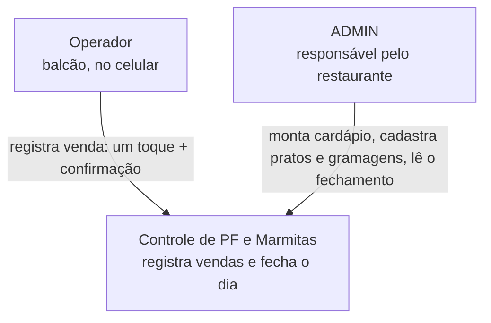
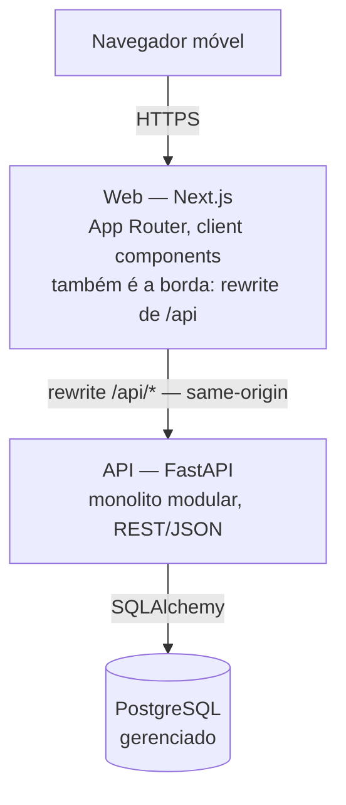
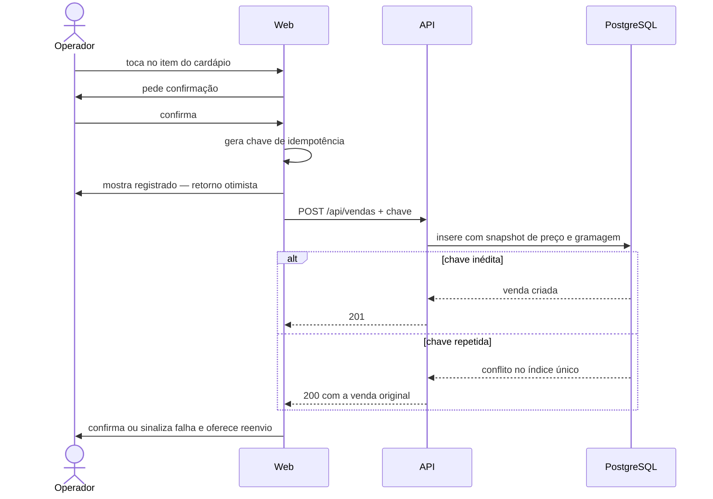

# Proposta Arquitetural — Controle de PF e Marmitas

> Cliente: projeto próprio · Documento gerado em 2026-09-22 · Versão 0.1
>
> Nome do sistema é provisório.

## 1. Sumário executivo

Estamos construindo um sistema para o responsável por um restaurante saber, ao fim de cada dia, **quantos pratos feitos e marmitas foram vendidos e quanta proteína isso consumiu** — e, com o histórico acumulado, planejar a reposição dos meses seguintes.

A frase que justifica toda a arquitetura: **o clique de registro é o produto.** Tudo o mais — cadastro de pratos, dashboard, projeção — acontece fora do horário de pico, com o dono sentado, sem pressa. O registro acontece com o salão cheio, no celular, em segundos. Por isso a arquitetura é deliberadamente pequena: um backend único, um banco único, nenhuma fila, nenhum serviço externo no caminho do clique. Cada peça que não existe é uma peça que não falha no almoço.

A segunda decisão de fundo é que **a venda é um fato histórico, não um registro editável.** Preço e gramagem de proteína ficam congelados no instante do clique. Quando o dono reajustar o valor do PF em novembro, o fechamento de outubro continua correto. Sem isso, o relatório mente — e um relatório que mente é pior do que relatório nenhum.

**Principais riscos e mitigações:**

| Risco | Mitigação |
|---|---|
| Venda duplicada por toque repetido ou reenvio | Chave de idempotência gerada no clique (ADR-004) |
| Venda registrada errada no pico | Cancelamento lógico em um toque, sem apagar o histórico (ADR-004) |
| Fechamento contando o dia errado, silenciosamente | Instante em UTC, dia operacional em `America/Sao_Paulo`, com teste de aceite dedicado (ADR-005) |
| Queda de rede durante o almoço | Aceita conscientemente — ver Dívida 2 |

Não há restrição de custo ou prazo declarada. Esta proposta **não estima esforço nem cronograma** — ver seção 12.

---

## 2. Contexto e objetivos de negócio

### 2.1 Problema

Hoje o controle do que foi vendido é informal. No fim do dia o responsável não tem número confiável de quantos PFs e quantas marmitas saíram, e **não tem ideia de quanta proteína foi consumida** — o insumo mais caro e o mais fácil de faltar ou sobrar.

A consequência é compra no escuro: ou compra demais e joga fora, ou compra de menos e perde venda. Nenhum dos dois aparece em lugar nenhum, então o erro se repete todo mês.

Existe uma dor secundária, mais silenciosa: sem histórico, não há como saber **quais pratos puxam venda**. O cardápio é decidido por intuição.

### 2.2 Objetivos de negócio

- Ao fechar o dia, saber a quantidade exata de PFs e marmitas vendidos, por prato
- Ao fechar o dia, saber a estimativa de proteína consumida, por tipo de proteína
- Acumular histórico confiável que, nos meses seguintes, sustente projeção de consumo e decisão de cardápio
- Não atrapalhar o atendimento: registrar uma venda precisa custar um toque e uma confirmação

### 2.3 Não-objetivos

Explicitamente **fora** deste sistema:

- **Não é sistema de pedidos.** Não há comanda, mesa, fila de cozinha ou status de preparo
- **Não emite documento fiscal.** Sem NFC-e, SAT, cupom
- **Não processa pagamento.** Não sabe se foi dinheiro, Pix ou cartão
- **Não faz delivery** nem integra com iFood, Rappi e afins
- **Não controla estoque de insumos em geral.** Arroz, feijão, salada e embalagem estão fora — só proteína é rastreada, porque só ela justifica o esforço
- **Não funciona offline** (ver Dívida 2)
- **Não é multi-estabelecimento operacional agora** — ver ADR-003

### 2.4 Usuários e cargas esperadas

| Perfil | Quem é | O que faz | Quantos |
|---|---|---|---|
| **ADMIN** | o responsável / dono | monta o cardápio do dia, cadastra pratos e proteínas, define gramagens e preços, lê o dashboard | 1, eventualmente 2 |
| **Operador** | quem está no balcão | registra a venda: um toque no item, uma confirmação | 1 a 3 |

**Carga:** dezenas a poucas centenas de vendas por dia, concentradas na janela do almoço. No pico, a ordem de grandeza é de alguns registros por minuto — não por segundo.

Isso é importante o bastante para repetir: **a carga deste sistema é desprezível.** Nenhuma decisão aqui é tomada por causa de volume. Todas são tomadas por causa de simplicidade operacional, integridade do dado e custo de manutenção por um desenvolvedor sozinho.

**Dispositivo:** celular, em pé, uma mão. Mobile first não é preferência estética — é a única forma de uso que importa no caminho crítico.

---

## 3. Atributos de qualidade prioritários

Quatro atributos dirigem as decisões. Os demais são atendidos pelo padrão da plataforma escolhida e não motivaram nenhuma decisão.

### 3.1 Usabilidade sob pressão (atributo dominante)

- **Meta concreta**: registrar uma venda em no máximo dois toques — item e confirmação — com retorno visual em menos de um segundo na conexão móvel do local. Alvo de zero erro de registro por toque acidental.
- **Por quê é prioritário**: se registrar for mais lento do que atender, o operador simplesmente para de registrar. Um sistema não usado no pico produz um fechamento falso, que é pior do que nenhum fechamento.
- **Como a arquitetura atende**: o app autenticado é renderizado no cliente, sem ida ao servidor para pintar tela (ADR-002); o registro é uma única chamada REST contra um backend sem dependência externa no caminho (ADR-001); o retorno é otimista, com reconciliação (seção 7.1).

### 3.2 Integridade do fechamento

- **Meta concreta**: o número do fim do dia é auditável e reproduzível. Nenhuma venda duplicada, nenhum total que mude retroativamente quando um preço ou gramagem for editado, nenhuma venda atribuída ao dia errado.
- **Por quê é prioritário**: é o objetivo de negócio inteiro. Todo o valor do sistema — e as projeções futuras — repousa sobre esse número.
- **Como a arquitetura atende**: venda append-only com snapshot de preço e gramagem e cancelamento lógico (ADR-004); idempotência por chave de clique (ADR-004); contrato explícito de fuso e dia operacional (ADR-005); transações ACID no PostgreSQL.

### 3.3 Manutenibilidade por um desenvolvedor sozinho

- **Meta concreta**: um desenvolvedor consegue entender, alterar e publicar o sistema inteiro sem depender de ninguém. Qualquer bug é diagnosticável lendo um log e uma tabela.
- **Por quê é prioritário**: não há time, não há SRE, não há plantão. Complexidade que exige duas pessoas para operar é complexidade que não vai ser operada.
- **Como a arquitetura atende**: monolito modular com deploy único (ADR-001); nenhuma fila, nenhum cache, nenhum worker; consultas agregadas diretas em vez de pipeline analítico (ADR-007).

### 3.4 Custo de operação compatível com um restaurante pequeno

- **Meta concreta**: o sistema roda inteiramente dentro dos tiers gratuitos dos provedores durante o estágio de estudo, e o primeiro degrau pago é modesto o bastante para um restaurante absorver.
- **Por quê é prioritário**: há intenção declarada de vender o sistema. Uma arquitetura que só fecha a conta com volume de SaaS maduro é invendável para o primeiro cliente.
- **Como a arquitetura atende**: três peças hospedáveis em tiers gratuitos; nenhum componente cobrado por hora ociosa; PostgreSQL gerenciado em vez de administrado.

---

## 4. Restrições

| Categoria | Restrição | Origem |
|---|---|---|
| Stack — backend | Python com FastAPI | Declarada pelo desenvolvedor |
| Stack — banco | PostgreSQL | Declarada pelo desenvolvedor |
| Stack — frontend | React ou Next.js, com preferência declarada por Next.js | Declarada; resolvida como decisão em ADR-002 |
| Uso | Mobile first — o uso principal é no celular | Declarada |
| Time | Um desenvolvedor, sem operação dedicada | Contexto do projeto |
| Conectividade | Registro sempre online; sem suporte offline | Decidida na entrevista |
| Horizonte | Entregar como projeto final de mentoria sem plantar impedimento a colocar em produção logo em seguida | Decidida na entrevista |

Não há restrição regulatória relevante: o sistema não guarda dado de cliente final, apenas credenciais dos poucos operadores. Não há restrição de cloud, de budget declarado nem de prazo contratual.

---

## 5. Decisões arquiteturais

### ADR-001: Monolito modular em FastAPI, com deploy único

- **Contexto**: o domínio tem quatro capacidades bem separadas — identidade, catálogo, vendas e relatórios — mas um único time de uma pessoa, carga desprezível e nenhuma necessidade de escalar partes independentemente. O atributo dominante é manutenibilidade por um desenvolvedor sozinho (3.3).
- **Decisão**: adotamos um **monolito modular**. Um único processo FastAPI, um único artefato de deploy, organizado internamente em módulos por capacidade de negócio, cada um com a mesma estrutura interna: `router` (HTTP) → `service` (regra) → `repository` (persistência). Módulos conversam por chamada de função entre serviços, nunca por acesso direto ao repositório alheio.
- **Justificativa**: o isomorfismo é direto — CRUD com regras de negócio moderadas, deploy unificado, time pequeno. Os módulos existem para dar fronteira de raciocínio e facilitar a quebra em tarefas do plano de execução, não para permitir deploy independente, que ninguém pediu. Separar em serviços agora traria rede, observabilidade distribuída e consistência eventual para resolver problemas que este sistema não tem.
- **Alternativas consideradas**:
  - **Microsserviços** — descartada porque não há time para operar, não há necessidade de escala independente e a carga é de poucos registros por minuto no pico. Seria custo operacional puro.
  - **Serverless por função** — descartada porque o cold start bate exatamente no atributo dominante: o primeiro clique do almoço não pode esperar. Além disso fragmenta o código sem ganho de custo real nesse volume.
  - **Monolito em camadas sem módulos** — descartada porque as fronteiras de capacidade são o que permite ao plano de execução gerar tarefas independentes e ao review saber onde uma regra deveria morar.
- **Consequências**:
  - Positivas: um `docker build`, um deploy, um log para ler. Transação ACID atravessa qualquer operação sem coordenação distribuída. Refatorar fronteira entre módulos é mover arquivo, não renegociar contrato.
  - Negativas: escala apenas verticalmente e por réplicas do processo inteiro. Um módulo que virar pesado carrega os outros junto. Nada disso importa no horizonte visível, mas a fronteira dos módulos precisa ser respeitada com disciplina, porque nada no runtime a impõe.

### ADR-002: Next.js como frontend, com o app autenticado renderizado no cliente

- **Contexto**: havia dúvida declarada entre React puro e Next.js. O app autenticado é uma tela de botões grandes, altamente interativa, atrás de login, sem qualquer valor de SEO — o cenário onde a renderização no servidor não entrega nada. Ao mesmo tempo, há intenção declarada de vender o sistema, o que implica em algum dia existir página pública: apresentação, preço, contato.
- **Decisão**: adotamos **Next.js com App Router**. As telas do app autenticado são **client components**, sem renderização no servidor. A capacidade de renderizar no servidor fica reservada às páginas públicas, quando existirem. O Next.js também atua como borda da aplicação, reescrevendo `/api/*` para o backend FastAPI (ver ADR-006).
- **Justificativa**: o que decide não é o app — para o app, React com Vite seria ligeiramente mais simples e mais barato de operar. O que decide é o **caminho para o produto vendável**, que é um objetivo declarado: Next.js cobre app autenticado e site público no mesmo projeto, com o mesmo deploy e os mesmos componentes de UI. Chegar lá com uma SPA significaria adicionar um segundo projeto frontend depois. A segunda razão é a borda: o rewrite nativo torna a API same-origin, o que viabiliza a sessão por cookie httpOnly sem CORS nem token em JavaScript (ADR-006).
- **Alternativas consideradas**:
  - **React com Vite, SPA estática** — tecnicamente a opção mais enxuta para o app de hoje: build estático, um runtime a menos, servível pelo próprio FastAPI. Descartada porque não cobre a página pública e porque exigiria construir a borda de autenticação na mão.
  - **Next.js com renderização no servidor também no app autenticado** — descartada porque adiciona uma ida ao servidor no caminho do clique, atacando diretamente o atributo dominante (3.1), em troca de nenhum benefício: não há SEO nem primeiro carregamento crítico atrás do login.
  - **Backend servindo templates Jinja, sem frontend separado** — descartada porque a interatividade do registro com confirmação e retorno otimista ficaria desconfortável, e porque fecha a porta do site público moderno.
- **Consequências**:
  - Positivas: um único projeto frontend cobre app e futura vitrine. Borda de autenticação resolvida por configuração. Deploy em tier gratuito é trivial. Ecossistema grande, o que importa para um desenvolvedor sozinho.
  - Negativas / dívidas plantadas: introduz um segundo runtime — Node ao lado do Python — e portanto um segundo deploy, um segundo conjunto de dependências e uma segunda superfície de atualização. O App Router tem curva de aprendizado real; a regra de manter o app autenticado em client components existe justamente para não pagar essa curva no caminho crítico.

### ADR-003: Chave de estabelecimento presente desde a primeira migration

- **Contexto**: o sistema nasce para um restaurante, mas há intenção declarada de transformá-lo em produto para outros. A pergunta é quando pagar por isso.
- **Decisão**: toda tabela de domínio carrega `estabelecimento_id` desde a primeira migration, com um único estabelecimento semeado. Todo acesso a dado passa por um filtro obrigatório de estabelecimento na camada de repositório. **Não construímos** agora: onboarding, cobrança, troca de estabelecimento na interface, convite de usuário ou isolamento físico de dados.
- **Justificativa**: a assimetria de custo é grande e conhecida. Colocar a coluna hoje custa uma coluna e um filtro. Colocá-la depois, com dado em produção, custa migration de dados, revisão de toda consulta já escrita e auditoria de vazamento entre clientes — exatamente o tipo de retrabalho que a resposta "SaaS talvez depois" quis evitar. Já construir tenancy completa agora seria o erro oposto: pagar por um segundo cliente que ainda não existe.
- **Alternativas consideradas**:
  - **Nenhuma noção de estabelecimento** — descartada pela assimetria acima: economiza pouco hoje e cobra caro no primeiro cliente pagante.
  - **Multi-tenancy completa desde já**, com isolamento por schema ou Row Level Security e onboarding — descartada porque encarece auth, migrations e todas as consultas para atender um requisito hipotético.
- **Consequências**:
  - Positivas: virar multi-estabelecimento vira trabalho de produto — telas e cobrança — e não cirurgia no modelo de dados. A disciplina de filtrar por estabelecimento nasce junto com o código, em vez de ser retrofitada.
  - Negativas: há uma coluna sem utilidade imediata em todas as tabelas, e todo repositório carrega um filtro que hoje sempre casa com o mesmo valor. É preciso disciplina de review para que nenhuma consulta nova esqueça o filtro — uma consulta esquecida só vira bug visível quando o segundo estabelecimento existir, que é o pior momento possível para descobrir.

### ADR-004: A venda é um fato imutável — append-only, com snapshot e cancelamento lógico

- **Contexto**: a venda é a única escrita no caminho crítico e a base de todo relatório. Três riscos concretos a cercam: toque duplicado no pico, registro errado que precisa ser desfeito, e edição futura de preço ou gramagem que alteraria retroativamente um fechamento já dado como certo.
- **Decisão**: a tabela de vendas é **append-only**. Nenhum `UPDATE` de valor, nenhum `DELETE`. Concretamente:
  1. **Snapshot** — no instante do registro, a venda copia o preço praticado e a gramagem de proteína vigentes. Ela não referencia esses valores; ela os guarda.
  2. **Cancelamento lógico** — desfazer uma venda grava `cancelada_em` e `cancelada_por`. A linha permanece. Todo relatório filtra `cancelada_em IS NULL`.
  3. **Idempotência** — o cliente gera um identificador único no momento do clique e o envia junto. O backend mantém índice único sobre ele; reenvio devolve a venda já criada em vez de criar outra.
- **Justificativa**: sustenta diretamente a integridade do fechamento (3.2). O snapshot é o que garante que reajustar o PF em novembro não mexa no fechamento de outubro — sem ele, o relatório histórico é ficção. O cancelamento lógico preserva a auditoria: "o operador registrou e desfez" é informação, e apagar a linha destrói a única evidência de que o erro aconteceu. A idempotência é o que torna seguro o retorno otimista da interface: o frontend pode reenviar em caso de dúvida de rede sem risco de contar duas vezes.
- **Alternativas consideradas**:
  - **Venda editável, com `DELETE` para desfazer** — descartada porque destrói auditoria e torna qualquer divergência de fechamento indiagnosticável depois do fato.
  - **Referenciar preço e gramagem por chave estrangeira**, sem cópia — descartada porque acopla o passado ao presente: toda edição de cadastro reescreveria silenciosamente o histórico. É o modo de falha mais grave possível neste sistema, porque é invisível.
  - **Versionamento temporal do cadastro**, com vigência por período, em vez de snapshot na venda — descartada por complexidade desproporcional: resolve o mesmo problema com consultas muito mais difíceis de escrever e de revisar.
  - **Event sourcing** — descartada como over-engineering. O snapshot entrega o benefício de auditoria que importa aqui, sem projeção nem replay.
- **Consequências**:
  - Positivas: fechamento reproduzível e explicável linha a linha. Retorno otimista na interface fica seguro. Cancelamento vira dado analisável — quantos erros de registro acontecem, e com quem.
  - Negativas: a tabela cresce monotonicamente, inclusive com linhas canceladas, e **toda** consulta precisa lembrar do filtro de cancelamento. Uma consulta que esqueça infla o número silenciosamente. A mitigação é concentrar as consultas no módulo de relatórios em vez de espalhá-las.

### ADR-005: Instante em UTC, dia operacional em `America/Sao_Paulo`

- **Contexto**: o produto inteiro é um número por dia. Se a fronteira do dia estiver errada, o número está errado — e erra de forma silenciosa, sem exceção, sem log, sem ninguém perceber até alguém conferir na mão.
- **Decisão**: o instante da venda é gravado em coluna `timestamptz`, sempre em UTC, gerado pelo servidor — nunca pelo relógio do celular. O **dia operacional** é definido como a data civil desse instante convertida para `America/Sao_Paulo`. Toda agregação por dia usa essa conversão explicitamente, e o fuso é uma constante única na aplicação, não repetida em cada consulta.
- **Justificativa**: separa o fato físico — o instante — da interpretação de negócio — a que dia ele pertence. Confiar no relógio do dispositivo permitiria que um celular desajustado jogasse vendas para o dia anterior. Deixar o fuso implícito faria o número mudar conforme o servidor mudasse de região, que é exatamente o tipo de armadilha que provedores gratuitos preparam ao rodar tudo em UTC por padrão. O horário de verão brasileiro está suspenso, mas o contrato explícito protege contra sua eventual volta.
- **Alternativas consideradas**:
  - **Gravar data local sem fuso** — descartada por ser ambígua e irrecuperável: uma vez perdido o fuso, não há como reconstruir o instante.
  - **Confiar no horário enviado pelo cliente** — descartada porque o relógio do celular não é confiável e porque abriria caminho para registrar venda em data arbitrária.
  - **Configurar o banco inteiro em horário de Brasília** — descartada porque esconde o problema em vez de resolvê-lo, e quebra ao mudar de provedor.
- **Consequências**:
  - Positivas: o corte do dia é uma decisão explícita, testável e única. O sistema já nasce pronto para outro fuso, caso o produto saia da região.
  - Negativas: todo relatório precisa converter, o que é fácil de esquecer em consulta nova. O PRD precisa formalizar isso como regra de negócio e o plano de execução precisa de um teste de aceite específico para a virada do dia — não é algo que o teste feliz pegue.

### ADR-006: Sessão por cookie httpOnly, com a API servida same-origin

- **Contexto**: os usuários operam de celular, de pé, em pressa. Login que expira no meio do almoço é um incidente de negócio. Ao mesmo tempo, o sistema controla dado financeiro do estabelecimento e vai para a internet pública.
- **Decisão**: a autenticação é por **sessão em cookie httpOnly**, `Secure` e `SameSite=Lax`, emitido pelo FastAPI. O Next.js reescreve `/api/*` para o backend, de modo que o navegador enxerga uma única origem. Nenhum token trafega ou é armazenado em JavaScript acessível. A sessão do operador é **longa e renovada em uso**; a do ADMIN é mais curta, porque é ela que pode alterar preço e cadastro. Senha com hash **bcrypt**, usando o pacote da pyca diretamente, sempre chamado via `asyncio.to_thread` — nunca direto no endpoint, pela razão descrita na nota de acesso assíncrono em 6.2 e nos riscos da seção 10. O `passlib`, que o tutorial clássico do FastAPI popularizou, fica de fora: está sem manutenção ativa e já acumulou incompatibilidade com as versões recentes do `bcrypt`.
- **Justificativa**: cookie httpOnly remove a classe inteira de roubo de token por script injetado, que é o risco realista de um app web. O rewrite é o que torna isso simples: same-origin dispensa CORS com credenciais e dispensa `SameSite=None`, ambos fáceis de configurar errado. A assimetria de duração entre os perfis segue o dano potencial: um operador com sessão longa pode, no pior caso, registrar vendas falsas — recuperável, porque é auditável; um ADMIN comprometido altera preços e cadastro, o que contamina o histórico.
- **Alternativas consideradas**:
  - **JWT em `localStorage`** — descartada por ficar legível a qualquer script na página, e por tornar a revogação de sessão um problema que exige lista de bloqueio.
  - **Frontend e API em domínios distintos, com CORS e cookie `SameSite=None`** — descartada por ampliar a superfície de erro de configuração sem ganho, já que o rewrite está disponível de graça.
  - **Provedor de identidade externo** — descartada porque são poucos usuários internos, sem necessidade de federação, e porque colocaria uma dependência externa no caminho de entrada.
- **Consequências**:
  - Positivas: a postura de autenticação sai correta por configuração, não por disciplina. Sem CORS, sem token no cliente, sem refresh manual.
  - Negativas: acopla o frontend ao papel de borda — chamar a API de fora do navegador, num script ou app nativo futuro, exigirá um caminho de autenticação adicional. Também torna o Next.js parte do caminho crítico da requisição, e não apenas do carregamento da página.

**Nota sobre onde vive o estado da proteção do login.** As duas camadas do limite de tentativas guardam estado em lugares deliberadamente diferentes, e a distinção importa no dia em que este sistema escalar:

- O **bloqueio por conta** é persistido no banco, como atributos da própria conta. Isso o torna imune a reinício da aplicação — hoje, em memória, todo deploy liberaria quem estivesse bloqueado — e imune a múltiplas réplicas, já que o banco é compartilhado por todas. É também a camada que realmente defende contra adivinhação de senha.
- O **limite de ritmo por origem** é efêmero por natureza: contar requisições por segundo não se persiste. Ele fica na **borda** — no Next.js ou na plataforma de hospedagem — e não no processo da API.

Essa segunda escolha não é arbitrária. Se a contagem por origem vivesse na memória do processo Python, ela funcionaria perfeitamente enquanto houvesse um único container, e **afrouxaria em silêncio** ao subir o segundo: cada réplica contaria em separado, um limite de 5 viraria 10, sem erro, sem log e sem nada quebrar visivelmente. Mantendo a camada na borda, o problema deixa de existir ou passa a ser do provedor. Se um dia for necessário trazê-la para dentro da API, ela precisará de estado compartilhado — e aí a decisão entra em conflito com o ADR-001, que escolheu não operar nenhuma peça além de API e banco.

### ADR-007: Relatórios por consulta agregada direta no PostgreSQL

- **Contexto**: o fechamento diário e, depois, as projeções mensais são leituras agregadas. A tentação é montar desde já uma estrutura analítica — tabela de fatos, agregado materializado, processo noturno.
- **Decisão**: relatórios e dashboard são **consultas agregadas executadas diretamente sobre a tabela de vendas**, com índices apropriados sobre estabelecimento, instante e prato. Sem tabela de agregado, sem view materializada, sem job noturno, sem ferramenta de BI.
- **Justificativa**: o volume torna a discussão vazia. Algumas centenas de linhas por dia significam uma tabela na casa das dezenas de milhares de linhas ao fim de um ano — o PostgreSQL agrega isso com índice em tempo irrelevante. Toda estrutura pré-agregada seria, hoje, apenas mais um lugar onde o número pode divergir do fato, e mais um processo que pode falhar calado durante a noite. Manter uma única fonte de verdade sustenta a integridade do fechamento (3.2) e a manutenibilidade (3.3).
- **Alternativas consideradas**:
  - **Tabela de fechamento diário materializada** — descartada por prematura: introduz o risco de divergir da tabela de vendas em troca de um ganho de performance que não é necessário. Fica registrada como Dívida 4, com gatilho explícito.
  - **Ferramenta de BI externa** — descartada por adicionar custo, um segundo lugar para definir a mesma regra de negócio, e uma dependência externa sobre dado financeiro.
- **Consequências**:
  - Positivas: uma única definição de cada número, viva no código, testável. Nenhum processo em segundo plano para monitorar. O relatório nunca está desatualizado.
  - Negativas: a lógica de agregação fica em SQL ou no ORM, e precisa ser testada com o mesmo rigor de regra de negócio, porque é exatamente isso. Quando a projeção mensal chegar, as consultas ficarão mais pesadas e o gatilho da Dívida 4 precisa ser observado.

---

## 6. Visão arquitetural

> **Níveis utilizados**: Context (1) + Container (2). O Nível 3 foi omitido: o sistema tem três containers, e o único internamente não-trivial — a API — é composto por quatro módulos de estrutura idêntica. Um diagrama de componentes repetiria quatro vezes a mesma forma. A seção 6.3 descreve essa estrutura em texto, que é o formato útil para gerar tarefas no plano de execução.

### 6.1 Contexto (C4 — Nível 1)

O diagrama tem uma caixa e nenhum sistema vizinho, e isso é a informação relevante: **o sistema não depende de ninguém para funcionar.** Não há gateway de pagamento, emissor fiscal, ERP ou marketplace no caminho. Essa ausência é o que permite ao registro de venda ser rápido e previsível — não há chamada externa que possa demorar ou cair durante o almoço.

Os dois atores estão separados porque têm perfis de uso opostos: o operador usa uma única tela, sob pressão, dezenas de vezes por dia; o ADMIN usa várias telas, sem pressa, poucas vezes por semana. Essa assimetria justifica tanto a decisão de manter o app no cliente (ADR-002) quanto a diferença de duração de sessão (ADR-006).

### 6.2 Containers (C4 — Nível 2)

**Web — Next.js**

Responsabilidade: servir o app autenticado e, no futuro, as páginas públicas; atuar como borda, reescrevendo `/api/*` para a API. Tecnologia: Next.js com App Router, TypeScript, telas do app como client components. Justificativa em ADR-002 e ADR-006. Deploy: plataforma de hospedagem de Next.js, em tier gratuito no estágio inicial.

A interface é mobile first de verdade: alvos de toque grandes o bastante para o polegar, contraste que sobrevive à luz do salão, e a tela de registro sem rolagem — todos os itens do cardápio do dia visíveis de uma vez. O detalhamento de telas e estados é trabalho da fase de protótipo, não desta proposta.

**API — FastAPI**

Responsabilidade: toda a regra de negócio, autenticação e persistência. Tecnologia: Python com FastAPI, SQLAlchemy 2.0 e Alembic para migrations. Deploy: container único.

Duas escolhas dentro deste container merecem registro, ainda que não cheguem a ser decisões arquiteturais:

- **Acesso assíncrono ao banco** — SQLAlchemy 2.0 em modo async sobre `asyncpg`, com `AsyncSession` e endpoints declarados como `async def`. É honesto registrar que **o volume não exige isso**: com poucos registros por minuto no pico, o modo síncrono em pool de threads atenderia igual. A escolha é deliberada por dois motivos que não são de carga. Primeiro, é o caminho idiomático do FastAPI — a documentação, as bibliotecas e as respostas que um desenvolvedor sozinho vai encontrar assumem async, e nadar contra isso custa atrito em toda dúvida. Segundo, converter um código síncrono maduro para async depois não é ajuste local: contamina sessão, repositórios, serviços e testes de uma vez. Nascer async evita uma conversão que ninguém quer fazer com o sistema em produção.
  A contrapartida é real e precisa de disciplina: qualquer chamada bloqueante dentro de um `async def` trava o event loop **inteiro** — e o caso concreto que este sistema tem é o hash de senha do ADR-006, que é deliberadamente lento por projeto. Chamadas desse tipo vão para um executor, nunca direto no endpoint. Ver o risco correspondente na seção 10.
- **Alembic desde a primeira tabela**, inclusive durante o desenvolvimento. É o que sustenta o "produção depois" do horizonte escolhido: um banco criado por `create_all` não tem caminho de evolução quando houver dado de alguém dentro.

**PostgreSQL**

Responsabilidade: única fonte de verdade. Restrição declarada (seção 4), e adequada: o sistema depende de transação ACID no registro da venda e de agregação relacional no fechamento — exatamente o que um banco relacional faz bem. Modo: instância gerenciada por provedor, não administrada por nós, pelo atributo 3.3.

### 6.3 Estrutura de módulos da API

Quatro módulos, todos com a mesma estrutura interna — `router` → `service` → `repository` — conforme ADR-001:

| Módulo | Responsabilidade | Fronteira |
|---|---|---|
| `identidade` | usuários, perfis ADMIN e Operador, autenticação, sessão | não conhece nada de cardápio ou venda |
| `catalogo` | proteínas, pratos com gramagem, itens do cardápio com preço, definição do cardápio vigente | não conhece venda |
| `vendas` | registro idempotente, cancelamento lógico, snapshot de preço e gramagem | lê do `catalogo` via serviço, nunca via repositório |
| `relatorios` | fechamento do dia, consumo de proteína, base para projeções futuras | só lê; nunca escreve |

**Esqueleto de domínio** — o detalhe fecha no PRD, mas estas entidades são o que torna as ADRs concretas:

- `Estabelecimento` — semeado com um único registro (ADR-003)
- `Usuario` — perfil ADMIN ou Operador
- `Proteina` — frango, carne bovina, peixe
- `Prato` — nome, proteína e **gramas por porção**. Conforme decidido na entrevista, a gramagem é **fixa por prato**: um mesmo prato consome a mesma proteína vendido como PF ou como marmita
- `ItemCardapio` — o botão que o operador toca. É o par prato × formato, onde formato é PF ou Marmita, com **preço próprio** — é aqui que PF e marmita se diferenciam
- `Venda` — item, preço e gramagem congelados, instante em UTC, quem registrou, chave de idempotência, campos de cancelamento

A separação entre `Prato` e `ItemCardapio` é o que permite atender ao requisito de "marmita custa diferente do PF" mantendo a gramagem única. É também onde a Dívida 1 vive: no dia em que a marmita passar a levar mais proteína que o PF, a gramagem precisa descer de `Prato` para `ItemCardapio`.

---

## 7. Fluxos críticos

### 7.1 Registro de venda

É o único fluxo do sistema que merece diagrama — é o caminho crítico inteiro, e três decisões convergem nele.

O retorno otimista — a interface confirmar antes da resposta do servidor — é o que entrega a meta de 3.1. Ele só é seguro porque a chave de idempotência nasce no clique, e não no servidor: se a rede oscilar e a interface reenviar, a segunda tentativa encontra a mesma chave e devolve a mesma venda. Sem ADR-004, o retorno otimista seria uma fábrica de venda duplicada.

A confirmação antes do envio atende ao requisito de toque acidental que motivou o pedido original. Ela é de interface, não de arquitetura — mas é o que permite que o cancelamento (ADR-004) seja exceção e não rotina.

Como o registro é sempre online, uma falha de rede **sinaliza**: a interface não pode silenciar o erro, porque a venda não entrou. Esse é o preço consciente da escolha "sempre online", e é o que a Dívida 2 descreve.

---

## 8. Trade-offs assumidos

- **Simplicidade operacional × autonomia de deploy**: priorizamos simplicidade. Um monolito com deploy único é o que um desenvolvedor sozinho consegue operar bem. Abrimos mão de escalar ou publicar módulos independentemente — capacidade que ninguém pediu e que custaria rede e observabilidade distribuída.

- **Um runtime × caminho para o produto**: escolhemos pagar por dois runtimes — Node e Python — quando um bastaria para o app de hoje. A contrapartida é que o site público, que a intenção comercial vai exigir, já tem onde nascer. Este é o trade-off menos confortável da proposta, e é honesto reconhecer que, se a ambição de vender for abandonada, React com Vite passa a ser a escolha melhor.

- **Fidelidade do consumo de proteína × simplicidade do cadastro**: priorizamos simplicidade, conforme decidido na entrevista. Gramagem fixa por prato significa que o ADMIN cadastra um número por prato, e não um por combinação de prato e formato. Em troca, se a marmita levar mais proteína que o PF, a estimativa fica sistematicamente enviesada. Dívida 1.

- **Disponibilidade × custo**: priorizamos custo. Não há redundância, não há failover, não há réplica. Uma indisponibilidade no almoço dói, mas o fallback existe e é conhecido: papel e caneta, lançados depois. Redundância custaria mais do que o problema que evita, neste estágio.

- **Integridade × velocidade de escrita**: priorizamos integridade sem hesitar. Transação ACID, índice único de idempotência e snapshot custam microssegundos num volume desta ordem. Não há nada a ganhar afrouxando aqui.

- **Preparo para multi-tenant × enxugar o modelo**: priorizamos o preparo mínimo — uma coluna e um filtro — contra a alternativa de nada ou de tudo. É a aposta explícita de ADR-003.

---

## 9. Dívidas técnicas conscientes

**Dívida 1 — Gramagem de proteína fixa por prato**
- *O que é*: um prato consome a mesma gramagem vendido como PF ou como marmita.
- *Quando vira problema*: assim que os tamanhos divergirem de verdade na cozinha — tipicamente quando entrar uma marmita grande. A estimativa passa a errar sempre para o mesmo lado, o que é pior que erro aleatório, porque a projeção mensal amplifica o viés.
- *Como pagar*: mover a gramagem de `Prato` para `ItemCardapio`. É uma migration com cópia de valor e o ajuste do snapshot no registro da venda. O histórico anterior permanece correto justamente porque a venda guardou a gramagem praticada (ADR-004).

**Dívida 2 — Sem funcionamento offline**
- *O que é*: sem rede, não há registro. O operador precisa esperar ou anotar.
- *Quando vira problema*: se a conexão do salão se mostrar instável no uso real, ou no primeiro cliente cujo estabelecimento tenha sinal ruim — um risco concreto para quem pretende vender o sistema.
- *Como pagar*: fila local no dispositivo com reenvio automático. O custo é baixo **porque a idempotência já existe** (ADR-004): a fila só precisa reenviar, sem lógica de deduplicação própria. É a dívida mais barata de pagar das quatro, e isso é intencional.

**Dívida 3 — Multi-tenancy apenas no modelo de dados**
- *O que é*: a coluna existe e é filtrada, mas não há onboarding, cobrança, convite de usuário nem isolamento de backup por estabelecimento.
- *Quando vira problema*: no segundo estabelecimento — e principalmente no primeiro que **pague**, quando isolamento deixa de ser higiene e vira obrigação contratual.
- *Como pagar*: módulo de tenancy com onboarding e cobrança, mais Row Level Security no PostgreSQL como rede de segurança contra consulta que esqueça o filtro. Até lá, o review de cada tarefa que toque em repositório precisa verificar o filtro explicitamente.

**Dívida 4 — Sem camada de agregação**
- *O que é*: todo relatório varre a tabela de vendas.
- *Quando vira problema*: quando a projeção mensal precisar cruzar anos de histórico, ou quando o dashboard passar a somar vários estabelecimentos. O sintoma será o dashboard do ADMIN ficando lento — nunca o registro de venda, que não passa por aqui.
- *Como pagar*: tabela de fechamento diário, escrita de forma incremental e reconciliável contra a tabela de vendas. Só vale a pena quando houver número medido mostrando a lentidão.

---

## 10. Riscos e mitigações

| Risco | Impacto | Probabilidade | Mitigação |
|---|---|---|---|
| Fechamento conta o dia errado por fuso, silenciosamente | Alto | Média | ADR-005, com fuso centralizado em constante única e teste de aceite dedicado à virada do dia — cenário que o teste feliz não pega |
| Consulta nova esquece o filtro de cancelamento e infla o número | Alto | Média | Concentrar toda agregação no módulo `relatorios` (ADR-007) e incluir o item no checklist de review |
| Consulta nova esquece o filtro de estabelecimento | Alto | Baixa hoje, alta quando houver o segundo | Filtro na camada de repositório, nunca no serviço; item fixo de review; Row Level Security quando a Dívida 3 for paga |
| Operador registra errado e não consegue desfazer rápido | Médio | Alta | Cancelamento em um toque na própria tela de registro (ADR-004); a confirmação prévia reduz a frequência |
| Conexão cai no pico e a venda se perde | Médio | Média | Falha sinalizada de forma inequívoca, com reenvio manual seguro pela idempotência; Dívida 2 registrada com caminho de pagamento barato |
| Banco em tier gratuito hiberna e o primeiro clique do almoço demora | Médio | Alta | Verificar a política de hibernação do provedor antes de escolher; manter verificação de saúde periódica; ao ir para produção, preferir provedor sem suspensão por ociosidade |
| **`/login` como vetor de negação de serviço.** O endpoint é aberto à internet e o hash é caro por projeto. Sem sair do event loop, uma sequência de tentativas de login — inclusive todas erradas, já que o hash roda igual — mantém o loop ocupado e congela o registro de vendas para todos | Alto | Média | `asyncio.to_thread` no hash (ADR-006), mais limite de tentativas por origem, a ser formalizado como regra no PRD |
| **Agregação de relatório feita em Python** em vez de no SQL. É o candidato mais provável a travar o loop neste projeto, e por segundos, não milissegundos: o ADMIN abrindo o dashboard no meio do almoço pararia o registro de vendas | Alto | Média | Manter `GROUP BY` e somatórios no banco (ADR-007); nunca varrer resultado linha a linha em Python. Item fixo de review no módulo `relatorios` |
| Qualquer outra chamada bloqueante dentro de `async def` — driver síncrono, `requests` no lugar de `httpx`, trabalho de CPU em rota | Médio | Média | Item fixo de review. O hash de senha é o exemplo didático da classe inteira: trabalho pesado sai do loop, sempre |
| Curva do App Router consome tempo de um desenvolvedor sozinho | Médio | Média | Regra explícita de ADR-002: app autenticado inteiro em client components, sem renderização no servidor |
| Dois deploys se desencontram — frontend novo contra API velha | Baixo | Média | Manter o contrato REST retrocompatível dentro de uma versão; publicar a API antes da Web |

---

## 11. Próximos passos

Sequência lógica de validação, não cronograma:

1. **PRD** — formalizar as regras de negócio e os critérios de aceite. Três pontos precisam de atenção especial, porque esta proposta os identificou mas não os resolve: a definição do dia operacional e o comportamento na virada, as regras de cancelamento — quem pode, até quando —, e o que acontece com uma venda cujo item saiu do cardápio depois.
2. **Especificação de interface** — o sistema é mobile first e a tela de registro é o produto. A fase de protótipo vale a pena aqui, e deve tratar explicitamente os estados de falha de rede e de confirmação, que é onde a arquitetura toca a interface.
3. **Plano de execução** — quebra em tarefas, usando as fronteiras de módulo de 6.3 como eixo natural de decomposição.
4. **Scaffolding** — estrutura dos dois projetos, primeira migration com `estabelecimento_id` e Alembic desde o início, ambiente local em Docker Compose.
5. **Decisão de hospedagem** — deliberadamente adiada. A arquitetura não depende do provedor; a escolha fica melhor informada depois do scaffolding, quando o tamanho real da imagem e o comportamento de cold start puderem ser medidos. O critério é a política de hibernação do banco, pelo risco registrado na seção 10.

---

## 12. Apêndice — Aspectos não cobertos

- **Estimativa de esforço, cronograma e custo** — fora do escopo desta proposta por princípio. Nenhum número de prazo ou de valor foi gerado aqui.
- **Threat modeling completo** — esta proposta cobre a postura básica de autenticação (ADR-006). Análise de ameaça completa é documento separado, e só se justifica quando houver clientes pagantes.
- **Design visual, tipografia e paleta** — fase de protótipo.
- **Modelo de dados detalhado**, com tipos, restrições e índices — PRD e plano de execução. A seção 6.3 traz apenas o esqueleto necessário para tornar as ADRs concretas.
- **Projeções e previsão de demanda** — objetivo declarado para o futuro. Esta proposta garante que o dado necessário seja coletado com fidelidade desde o dia um, mas não especifica o método de projeção.
- **Política de backup e retenção** — decidida junto com a hospedagem (passo 5). O requisito já está fixado pelo horizonte escolhido: snapshot automático do provedor mais cópia fora dele, com restore testado antes do primeiro uso real.
- **Controle de insumos além de proteína** — não-objetivo declarado (2.3).
