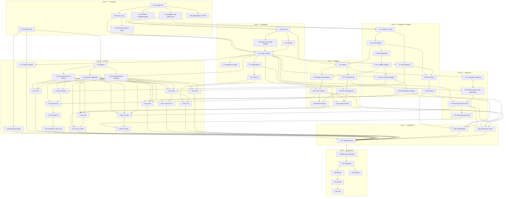

# Plano de Execução: Controle de vendas de PF e marmitas com fechamento diário

**PRD de referência:** [`docs/prds/PRD-001-controle-vendas-pf-marmitas.md`](../prds/PRD-001-controle-vendas-pf-marmitas.md) — Aprovado, 61 RN / 67 CA
**SPEC-UI de referência:** [`docs/prototype/SPEC-UI-001-controle-vendas-pf-marmitas.md`](../prototype/SPEC-UI-001-controle-vendas-pf-marmitas.md) — Aprovada; referência visual `docs/prototype/assets/prototipo-001-visual-v2.html`
**Arquitetura de referência:** [`docs/architecture/proposta-arquitetural.md`](../architecture/proposta-arquitetural.md) — ADR-001 a ADR-009
**Cliente/Produto:** projeto próprio — Controle de PF e Marmitas
**Stack:** API em Python 3.12 + FastAPI + SQLAlchemy 2.0 async (`asyncpg`) + Alembic, gerida com `uv` e `ruff`; Web em Next.js (App Router) + TypeScript com CSS Modules, gerida com `npm`; PostgreSQL na mesma versão principal do Supabase, local em Docker Compose; testes com pytest + pytest-asyncio + httpx (API) e Vitest + Testing Library (Web)
**Autor:** Thiago Barcelos
**Data:** 2026-09-29
**Status:** Aprovado (2026-09-29)

---

## 1. Resumo executivo

O sistema é construído do zero, num repositório único com `api/` e `web/`, e validado inteiro localmente antes de qualquer publicação (ADR-008). A quebra segue o padrão horizontal do pipeline, usando as fronteiras de módulo da arquitetura (seção 6.3) como eixo: primeiro a fundação transversal (projetos, banco, dia operacional, erros e segurança), depois a API módulo a módulo, na ordem das dependências entre eles: `identidade` → `catalogo` (com o cardápio) → `vendas` → `relatorios`. Dentro de cada módulo, a entidade com as regras vem antes do serviço, que vem antes do endpoint. A interface começa pelos tokens da v2 e pelos componentes reutilizáveis da SPEC-UI, e só então compõe as telas, com o caminho crítico (UI-02 e UI-03) primeiro. A fase de qualidade fecha os cenários que atravessam módulos e termina com uma validação local completa, que é o portão para a fase de publicação no Supabase, Render e Vercel.

## 2. Estratégia de entrega

O plano é executado tarefa a tarefa, com review de cada uma antes da seguinte (CLAUDE.md, "Como trabalhar neste projeto"). Não há usuário real até a publicação, então não há feature flag nem dark launch: o sistema só vai para a nuvem inteiro, depois da validação local da T-57.

**Modelo de entrega:** incremental por fase no ambiente local; publicação única ao final (Fase 8), só depois da validação local completa (ADR-008).

**Critério geral de "pronto":**
- Os 67 cenários do PRD com teste automatizado nomeado pelo CA (`test_CA_XX_*` na API, `describe('CA-XX — …')` na Web) e passando, exceto os de verificação manual declarada na T-57.
- RN-35 e RN-47, que não têm cenário, conferidas no review.
- Todas as telas e estados da SPEC-UI-001 implementados e conferidos contra a v2 na T-57.
- `ruff check`, `ruff format --check`, `npm run lint`, `uv run pytest` e `npm test` sem erro.
- Sistema publicado e acessível por HTTPS, com ping de `/health` e backup com restore testado (Fase 8).

## 3. Premissas e decisões

> ⚠️ **Premissa:** a expiração da sessão **por inatividade** é de **30 minutos para o ADMIN** e **12 horas para o Operador** (RN-36). Decisão do usuário em 2026-09-29; os valores vêm de variável de ambiente (`SESSAO_INATIVIDADE_ADMIN_MIN`, `SESSAO_INATIVIDADE_OPERADOR_MIN`). Afeta T-10.

> ⚠️ **Premissa:** o bloqueio progressivo por conta (RN-37) dura **1, 5, 15 e 60 minutos**, com teto de 60 minutos a partir do quarto bloqueio. Decisão do usuário em 2026-09-29; a sequência vem de variável de ambiente. Afeta T-08 e T-12.

> ⚠️ **Premissa:** o limite de ritmo por origem no login (RN-37, camada 2) é de **10 requisições por minuto por IP** em `POST /api/auth/login`, com resposta 429. Valor técnico escolhido pelo plano, configurável por variável de ambiente. Afeta T-37.

> ⚠️ **Premissa:** na Vercel, a contagem em memória do limite de ritmo fica **mais frouxa**, porque cada instância conta separado. Isso é **aceito no estágio de estudo** e revisto ao entrar em uso real. O bloqueio por conta (camada 1), que é a defesa contra adivinhação de senha, fica no banco e não é afetado. Decisão do usuário em 2026-09-29. Afeta T-37 e T-61.

> ⚠️ **Premissa:** o restaurante funciona das **10h às 15h, todos os dias**. O ping de `/health` roda das 9h30 às 15h (horário de Brasília). Decisão do usuário em 2026-09-29. Afeta T-62.

> ⚠️ **Premissa:** o backup diário é feito por um **workflow agendado do GitHub Actions**, com o `pg_dump` **criptografado** por uma senha guardada nos Secrets do repositório e guardado como artefato por **30 dias**. O repositório é **público**: qualquer pessoa autenticada no GitHub pode baixar artefatos de repositório público, então a criptografia não é opcional. Decisão do usuário em 2026-09-29. Afeta T-63.

> ⚠️ **Premissa:** o corpo máximo de requisição (RN-46) é de **16 KiB**. Nenhuma operação do sistema envia mais que isso. Configurável por variável de ambiente. Afeta T-07.

> ⚠️ **Premissa:** a versão principal do PostgreSQL é a que o Supabase usa em projetos novos, conferida na execução da T-01 e fixada na imagem do Docker Compose.

> ⚠️ **Premissa:** o Operador **não** troca a própria senha — a RN-53 vale só para o ADMIN, como está no PRD. Confirmado pelo usuário em 2026-09-29 depois de avaliar a troca livre e a troca obrigatória no primeiro login. Se um dia mudar, a mudança entra no PRD e na SPEC-UI antes de mexer nas tarefas T-14 e T-54.

Decisões técnicas relevantes já tomadas:

- **Decisão:** repositório único com `api/` e `web/` na raiz, `docker-compose.yml` ao lado de `docs/`. Dentro de `api/app/`, um pacote por módulo (`identidade`, `catalogo`, `vendas`, `relatorios`) e o pacote transversal `core` — *referência: ADR-001; decisão do usuário em 2026-09-29*
- **Decisão:** `uv` com `pyproject.toml` e `uv.lock`, Python 3.12, `ruff` para lint e formatação; `npm` e o ESLint do `create-next-app` na Web — *decisão do usuário em 2026-09-29*
- **Decisão:** testes da API contra **PostgreSQL real** num banco de teste do Docker Compose, nunca SQLite; cada teste roda numa transação desfeita ao final. Sem teste de ponta a ponta automatizado por enquanto: a interface é coberta por Vitest + Testing Library e pela validação manual da T-57 — *decisão do usuário em 2026-09-29; CLAUDE.md, Restrições*
- **Decisão:** estilo com CSS Modules; os tokens da seção 2 da SPEC-UI viram variáveis CSS em `globals.css`, copiadas do `:root` da v2. A fonte Nunito Sans é servida pelo `next/font`, que a hospeda junto com a aplicação e dispensa domínio externo na CSP — *decisão do usuário em 2026-09-29; SPEC-UI seções 2 e 9*
- **Decisão:** a sessão é um registro no banco (tabela `sessao`), identificado por um token aleatório no cookie e guardado só como hash. É o que permite invalidá-la no servidor ao Sair (RN-54) e ao desativar ou redefinir a senha de um usuário — *referência: ADR-006*
- **Decisão:** a criação do primeiro ADMIN, de um ADMIN adicional e a recuperação da senha do ADMIN são um **comando técnico** da API (`uv run python -m app.identidade.cli`), executado no container, fora da interface — *referência: RN-34, RN-53; o PRD delega a definição ao plano*
- **Decisão:** nenhuma operação que altera estado usa `GET` nem `PUT`: só `POST`, `PATCH` e `DELETE`, como a RN-42 enumera — *referência: RN-42, ADR-006*
- **Decisão:** localmente a aplicação roda em `http://localhost`. O redirecionamento para HTTPS é ligado por variável de ambiente (`FORCAR_HTTPS`), que fica ligada em produção e desligada no desenvolvimento; o cookie de sessão é sempre `Secure`, o que os navegadores aceitam em `localhost` — *referência: RN-44, ADR-008*

Contratos HTTP usados pelas tarefas (todos sob `/api`, que o Next.js reescreve para a API; `/health` fica fora de `/api` e é chamado direto no serviço da API):

| Módulo | Rotas |
|---|---|
| identidade | `POST /api/auth/login` · `POST /api/auth/logout` · `GET /api/auth/me` · `GET`/`POST /api/usuarios` · `POST /api/usuarios/{id}/desativar` · `POST /api/usuarios/{id}/reativar` · `POST /api/usuarios/{id}/redefinir-senha` · `POST /api/conta/senha` |
| catalogo | `GET`/`POST /api/catalogo/{proteinas,pratos,itens}` · `PATCH /api/catalogo/{proteinas,pratos,itens}/{id}` · `POST /api/catalogo/{proteinas,pratos,itens}/{id}/desativar` · `POST …/{id}/reativar` · `GET /api/cardapio/vigente` · `GET /api/cardapio?data=` · `POST /api/cardapio/{data}` |
| vendas | `POST /api/vendas` · `GET /api/vendas/minhas` · `GET /api/vendas?data=` · `POST /api/vendas/{id}/cancelar` |
| relatorios | `GET /api/fechamento/dia?data=` · `GET /api/fechamento/mes?mes=AAAA-MM` |

## 4. Mapa de dependências

A Fase 6 depende da API apenas nos pontos marcados, então a interface pode começar (T-35 a T-40) enquanto a Fase 3 ainda está em andamento. A ordem numérica é a ordem recomendada para um executor só.

## 5. Fases

### Fase 1 — Fundação

**Objetivo da fase:** ter os dois projetos rodando localmente, o banco versionado por Alembic e as peças transversais de `core` — relógio, dia operacional, valores, erros e segurança — prontas para os módulos usarem.

**Critério de conclusão da fase:** `docker compose up` sobe PostgreSQL e API; `/health` responde tocando o banco; `uv run pytest` e `npm test` passam; a migration inicial cria e semeia o estabelecimento; CA-41 (lado API), CA-44, CA-45 e CA-46 verdes.

---

#### T-01 — Criar o projeto da API com uv, Dockerfile e Docker Compose

- **Status:** Concluído
- **Complexidade:** Média
- **Depende de:** nenhuma
- **Implementa:** RN-47
- **Valida:** —
- **Decisões base:** ADR-001, ADR-008, ADR-009
- **Camadas/arquivos afetados:**
  - `api/pyproject.toml`, `api/uv.lock` *(novos)*
  - `api/Dockerfile`, `api/.dockerignore` *(novos)*
  - `api/app/main.py` *(novo)*
  - `api/app/core/config.py`, `api/app/core/db.py` *(novos)*
  - `api/app/{identidade,catalogo,vendas,relatorios}/__init__.py` *(novos, vazios)*
  - `api/tests/conftest.py`, `api/tests/core/test_health.py` *(novos)*
  - `docker-compose.yml`, `.env.example`, `.gitignore` *(novo / editado)*

**Descrição:**
Criar o projeto com `uv init`, Python 3.12, dependências de execução (`fastapi`, `uvicorn`, `sqlalchemy[asyncio]`, `asyncpg`, `alembic`, `pydantic-settings`, `bcrypt`, `httpx`) e de desenvolvimento (`pytest`, `pytest-asyncio`, `ruff`). `core/config.py` lê toda configuração de variável de ambiente com `pydantic-settings` (`DATABASE_URL`, `SEGREDO_SESSAO`, `PORT` e os parâmetros das premissas); `core/db.py` cria o engine async e a dependência que entrega uma `AsyncSession` por requisição. `main.py` monta a aplicação e a rota `GET /health`, que executa `SELECT 1`. O `Dockerfile` instala com `uv sync --frozen` e sobe o `uvicorn` escutando em `$PORT`. O `docker-compose.yml` sobe o PostgreSQL (imagem na versão principal do Supabase, conferida agora) com um banco da aplicação e um de teste, e a API a partir do `Dockerfile`. O `conftest.py` prepara o cliente `httpx.AsyncClient` com `ASGITransport` e a sessão de teste dentro de uma transação desfeita ao final. Os quatro pacotes de módulo nascem vazios, marcando a fronteira do ADR-001.

**Critério de aceite (testável):**
- [x] `docker compose up` sobe PostgreSQL e API, e `GET /health` responde 200 depois de consultar o banco
- [x] `uv run pytest`, `uv run ruff check` e `uv run ruff format --check` passam; nenhum segredo está no código ou versionado (`.env` no `.gitignore`, só `.env.example` no repositório)
- [x] A API escuta na porta de `$PORT` e não grava nada em disco

**Testes a escrever:**
- *Integration:* `test_health_responde_200_consultando_o_banco`, `test_health_responde_503_sem_banco` (engine apontando para banco inexistente)

**Riscos / pontos de atenção:**
- Confirmar a versão principal do PostgreSQL do Supabase **antes** de fixar a imagem; nunca SQLite, nem nos testes (CLAUDE.md).
- O `pytest-asyncio` precisa do loop e do engine compartilhados na sessão de teste; configurar `asyncio_mode = "auto"` e o escopo do loop no `pyproject.toml` desde já, para não brigar com isso em cada módulo.

---

#### T-02 — Criar o projeto web com Next.js, Vitest e rewrite de /api

- **Status:** Concluído
- **Complexidade:** Baixa
- **Depende de:** nenhuma
- **Implementa:** —
- **Valida:** —
- **Decisões base:** ADR-002, ADR-006, ADR-008
- **Camadas/arquivos afetados:**
  - `web/` via `create-next-app` (TypeScript, App Router, ESLint, `src/`) *(novo)*
  - `web/next.config.ts` *(editado — rewrite)*
  - `web/vitest.config.ts`, `web/vitest.setup.ts` *(novos)*
  - `web/src/app/page.tsx` *(editado — redireciona para `/registrar`)*
  - `web/.env.example` *(novo)*

**Descrição:**
Gerar o projeto com `npx create-next-app` (TypeScript, App Router, ESLint, pasta `src/`, sem Tailwind). Configurar o rewrite de `/api/:path*` para a URL da API lida de `API_URL`, que é o que torna a API same-origin (ADR-006). Instalar e configurar Vitest com `jsdom`, Testing Library e `@testing-library/jest-dom`, com o script `npm test`. Remover o conteúdo de exemplo do `create-next-app`.

**Critério de aceite (testável):**
- [x] `npm run dev` sobe a Web, e uma chamada a `/api/…` no navegador chega à API local (confirmado com `GET /api/auth/me` depois da T-11, ou com uma rota de teste temporária)
- [x] `npm test` roda um teste de fumaça e passa; `npm run lint` passa
- [x] A URL da API vem só de variável de ambiente, sem valor fixo no código

**Testes a escrever:**
- *Unit:* teste de fumaça que renderiza um componente simples com Testing Library (garante que a configuração do Vitest funciona)

**Riscos / pontos de atenção:**
- Depois desta tarefa e da T-01, sugerir `/leanwork-context raiz`: com `api/` e `web/` existindo, ele preenche as seções Comandos e Testes do `CLAUDE.md`, que hoje estão vazias.

---

#### T-03 — Configurar o Alembic e semear o estabelecimento

- **Status:** Concluído
- **Complexidade:** Baixa
- **Depende de:** T-01
- **Implementa:** RN-41
- **Valida:** —
- **Decisões base:** ADR-003, ADR-008
- **Camadas/arquivos afetados:**
  - `api/alembic.ini`, `api/alembic/env.py` *(novos — modo async)*
  - `api/alembic/versions/0001_estabelecimento.py` *(novo)*
  - `api/app/core/modelo_base.py` *(novo — `Base` declarativa com convenção de nomes)*
  - `api/app/core/estabelecimento.py` *(novo — modelo e dependência `estabelecimento_atual`)*
  - `api/tests/conftest.py` *(editado — aplica `alembic upgrade head` no banco de teste)*

**Descrição:**
Configurar o Alembic em modo async, lendo `DATABASE_URL` do ambiente, com convenção de nomes de índice e constraint na `Base`. A primeira migration cria `estabelecimento` e insere o único registro (ADR-003). A dependência `estabelecimento_atual` devolve o `id` do estabelecimento; a partir da T-10 ela passa a vir do usuário autenticado. Fica estabelecida a convenção que toda tarefa seguinte cumpre: **toda tabela de domínio tem `estabelecimento_id`**, e **todo repositório recebe o `estabelecimento_id` no construtor** e filtra toda consulta por ele (RN-41). O `conftest` passa a aplicar as migrations no banco de teste uma vez por sessão, nunca `create_all`.

**Critério de aceite (testável):**
- [x] `alembic upgrade head` num banco vazio cria `estabelecimento` com exatamente um registro; `alembic downgrade base` desfaz
- [x] O banco de teste é criado pelas migrations, não por `create_all`

**Testes a escrever:**
- *Integration:* `test_migration_inicial_semeia_um_unico_estabelecimento`

**Riscos / pontos de atenção:**
- **Ponto de validação humana:** revisar a primeira migration e a convenção de nomes antes de seguir (seção 9).

---

#### T-04 — Implementar o relógio do servidor, o dia operacional e os valores de dinheiro e gramagem

- **Status:** Concluído
- **Complexidade:** Média
- **Depende de:** T-01
- **Implementa:** RN-17, RN-27
- **Valida:** —
- **Decisões base:** ADR-005, ADR-009
- **Camadas/arquivos afetados:**
  - `api/app/core/relogio.py` *(novo)*
  - `api/app/core/tempo.py` *(novo — `DiaOperacional`, `MesOperacional`)*
  - `api/app/core/valores.py` *(novo — `Dinheiro`, `Gramagem`)*
  - `api/tests/core/test_tempo.py`, `api/tests/core/test_valores.py` *(novos)*

**Descrição:**
`Relogio` é um `Protocol` com `agora() -> datetime` em UTC; a implementação real usa o relógio do servidor, e os testes injetam um relógio fixo por `app.dependency_overrides`. `DiaOperacional` (dataclass congelada) é o **único** lugar do código com o fuso `America/Sao_Paulo`: converte um instante UTC na data civil, devolve o intervalo UTC `[início, fim)` de uma data para as consultas e informa o dia operacional corrente. `MesOperacional` faz o mesmo para um mês (usado pela RN-55). `Dinheiro` envolve `Decimal` com duas casas, nunca `float`; `Gramagem` envolve um inteiro positivo em gramas.

**Critério de aceite (testável):**
- [x] O fuso `America/Sao_Paulo` aparece em uma única constante no código (verificável por busca)
- [x] 22/09 às 23:59 em São Paulo pertence a 22/09; 23/09 às 00:01 pertence a 23/09; o intervalo UTC de uma data cobre exatamente 24 horas
- [x] `Dinheiro` recusa `float` e soma e multiplica sem perder centavos

**Testes a escrever:**
- *Unit:* `test_instante_2359_pertence_ao_dia_corrente`, `test_instante_0001_pertence_ao_dia_seguinte`, `test_0259_utc_pertence_ao_dia_anterior`, `test_intervalo_do_mes_de_agosto`, `test_dinheiro_recusa_float`, `test_dinheiro_multiplica_por_quantidade`

**Riscos / pontos de atenção:**
- Os cenários CA-19 e CA-20 só ficam verdes na T-31, quando o fechamento usa este objeto; aqui a regra é provada em unidade.

---

#### T-05 — Centralizar exceções de domínio, respostas de erro sem detalhe e log higienizado

- **Status:** Pendente
- **Complexidade:** Média
- **Depende de:** T-01
- **Implementa:** RN-45, RN-48
- **Valida:** CA-46
- **Decisões base:** ADR-009
- **Camadas/arquivos afetados:**
  - `api/app/core/excecoes.py` *(novo)*
  - `api/app/core/log.py` *(novo)*
  - `api/app/main.py` *(editado — registra os handlers)*
  - `api/tests/core/test_erros.py` *(novo)*

**Descrição:**
Criar a hierarquia de exceções de domínio (`ErroDeDominio` e as bases `NaoEncontrado`, `Conflito`, `RegraViolada`, `NaoAutenticado`, `SemPermissao`) que as entidades levantam sem conhecer HTTP. Um único handler traduz cada base para o status HTTP e uma mensagem de negócio. Um handler genérico captura qualquer outra exceção, registra o detalhe no log do servidor e devolve 500 com mensagem neutra. `core/log.py` configura o log estruturado e um filtro que nunca registra corpo de requisição, cabeçalho `Authorization`, cookie, senha ou hash (RN-45).

**Critério de aceite (testável):**
- [ ] Uma exceção inesperada numa rota devolve 500 sem stack trace, SQL ou caminho de arquivo, e o detalhe aparece no log (CA-46)
- [ ] Cada base de exceção de domínio vira o status esperado (404, 409, 422, 401, 403) com a mensagem da exceção
- [ ] O log de uma requisição com cookie e cabeçalho de autenticação não contém os valores deles

**Testes a escrever:**
- *Integration:* `test_CA_46_erro_interno_nao_vaza_detalhe`, `test_excecao_de_dominio_vira_status_http`, `test_log_nao_registra_cookie_nem_authorization`

**Riscos / pontos de atenção:**
- O handler de validação do FastAPI (422) também não pode ecoar o corpo recebido na resposta; ajustar a resposta padrão.

---

#### T-06 — Aplicar cabeçalhos de segurança e redirecionamento para HTTPS na API

- **Status:** Pendente
- **Complexidade:** Baixa
- **Depende de:** T-01
- **Implementa:** RN-43, RN-44
- **Valida:** CA-41 (lado API; o lado Web fecha na T-36), CA-42 (redirecionamento; o cookie `Secure` fecha na T-11)
- **Decisões base:** ADR-006, ADR-008
- **Camadas/arquivos afetados:**
  - `api/app/core/seguranca.py` *(novo — middlewares)*
  - `api/app/main.py` *(editado)*
  - `api/tests/core/test_seguranca.py` *(novo)*

**Descrição:**
Middleware que adiciona a toda resposta: `Strict-Transport-Security`, `X-Content-Type-Options: nosniff`, `X-Frame-Options: DENY` e uma `Content-Security-Policy` restritiva adequada a uma API JSON (`default-src 'none'; frame-ancestors 'none'`). Middleware de redirecionamento para HTTPS ligado por `FORCAR_HTTPS`: atrás do proxy do Render, decide pelo cabeçalho `X-Forwarded-Proto` e só confia nele vindo do proxy.

**Critério de aceite (testável):**
- [ ] Toda resposta da API, inclusive de erro e `/health`, traz os quatro cabeçalhos (CA-41)
- [ ] Com `FORCAR_HTTPS` ligado, uma requisição com `X-Forwarded-Proto: http` recebe redirecionamento permanente para `https` (CA-42)

**Testes a escrever:**
- *Integration:* `test_CA_41_resposta_da_api_carrega_cabecalhos_de_seguranca`, `test_CA_41_resposta_de_erro_tambem_carrega_cabecalhos`, `test_CA_42_http_redireciona_para_https`

**Riscos / pontos de atenção:**
- Com `FORCAR_HTTPS` ligado sem o cabeçalho do proxy, o redirecionamento entraria em laço no Render; o teste precisa cobrir a leitura de `X-Forwarded-Proto`.

---

#### T-07 — Validar entrada por schema estrito e limitar o tamanho do corpo

- **Status:** Pendente
- **Complexidade:** Baixa
- **Depende de:** T-05
- **Implementa:** RN-46
- **Valida:** CA-44, CA-45
- **Decisões base:** ADR-009
- **Camadas/arquivos afetados:**
  - `api/app/core/schemas.py` *(novo — `ModeloEstrito`)*
  - `api/app/core/seguranca.py` *(editado — limite de corpo)*
  - `api/tests/core/test_entrada.py` *(novo)*

**Descrição:**
`ModeloEstrito` é a base Pydantic de todo schema de entrada, com `extra="forbid"` e remoção de espaços nas pontas de texto. Um middleware recusa com 413 qualquer corpo acima de `CORPO_MAXIMO_BYTES` (16 KiB), antes de ler o corpo inteiro, conferindo `Content-Length` e também o fluxo quando ele não vier.

**Critério de aceite (testável):**
- [ ] Corpo com campo desconhecido é recusado com 422 (CA-44)
- [ ] Corpo acima do limite é recusado com 413 antes de chegar ao handler (CA-45)

**Testes a escrever:**
- *Integration:* `test_CA_44_campo_desconhecido_e_rejeitado`, `test_CA_45_corpo_acima_do_limite_e_recusado`, `test_CA_45_corpo_sem_content_length_acima_do_limite_e_recusado`

**Riscos / pontos de atenção:**
- Os limites de texto da SPEC-UI (nome até 60, motivo até 200, usuário até 30 sem espaços, senha com mínimo de 8) entram nos schemas de cada módulo, sempre sobre `ModeloEstrito`.

---

### Fase 2 — Identidade

**Objetivo da fase:** autenticação por sessão em cookie, proteção do login por conta, perfis e gestão de operadores e senhas, prontos para os outros módulos exigirem usuário autenticado e perfil.

**Critério de conclusão da fase:** um ADMIN criado pelo comando técnico autentica, cadastra operadores, redefine senhas e sai; CA-24, CA-25, CA-32, CA-35, CA-38, CA-39, CA-42, CA-43, CA-51, CA-52, CA-55, CA-56, CA-65 e CA-66 verdes.

---

#### T-08 — Criar a entidade Usuario com bloqueio progressivo por conta

- **Status:** Pendente
- **Complexidade:** Média
- **Depende de:** T-03, T-04
- **Implementa:** RN-34, RN-37 (camada 1), RN-60
- **Valida:** —
- **Decisões base:** ADR-003, ADR-006, ADR-009
- **Camadas/arquivos afetados:**
  - `api/app/identidade/modelos.py` *(novo — `Usuario`, `Perfil`)*
  - `api/alembic/versions/0002_usuario.py` *(novo)*
  - `api/tests/identidade/test_usuario.py` *(novo)*

**Descrição:**
Modelo `usuario` com `estabelecimento_id`, `nome`, `login`, `senha_hash`, `perfil` (`ADMIN` / `OPERADOR`), `ativo`, `falhas_consecutivas`, `bloqueado_ate` e `bloqueios` (quantos bloqueios já sofreu). Índice único em `(estabelecimento_id, lower(login))` (RN-60). Métodos com a regra: `registrar_falha_login(agora)` incrementa e, na quinta falha, bloqueia pelo próximo tempo da sequência 1 → 5 → 15 → 60 min; `registrar_login_ok()` zera as falhas; `esta_bloqueado(agora)`; `desativar()` e `reativar()` — nunca exclusão (RN-34).

**Critério de aceite (testável):**
- [ ] Cinco falhas seguidas bloqueiam por 1 min; o bloqueio seguinte dura 5, depois 15, depois 60, e fica em 60
- [ ] Login com sucesso zera as falhas; o estado de bloqueio está em colunas da conta
- [ ] Dois usuários com o mesmo login, diferindo só em maiúsculas, violam o índice único

**Testes a escrever:**
- *Unit:* `test_quinta_falha_bloqueia_por_um_minuto`, `test_bloqueio_e_progressivo_ate_o_teto`, `test_login_ok_zera_falhas`, `test_desativar_e_reativar_nao_apagam`
- *Integration:* `test_login_unico_sem_diferenciar_maiusculas`

**Riscos / pontos de atenção:**
- A sequência de tempos vem da configuração; a entidade recebe a sequência, não lê o ambiente.

---

#### T-09 — Implementar o hash de senha fora do event loop e o comando técnico de ADMIN

- **Status:** Pendente
- **Complexidade:** Média
- **Depende de:** T-08
- **Implementa:** RN-34 (ADMIN por operação técnica), RN-35, RN-53 (recuperação técnica do ADMIN), RN-60
- **Valida:** —
- **Decisões base:** ADR-006
- **Camadas/arquivos afetados:**
  - `api/app/identidade/senha.py` *(novo)*
  - `api/app/identidade/cli.py` *(novo)*
  - `api/tests/identidade/test_senha.py`, `api/tests/identidade/test_cli.py` *(novos)*

**Descrição:**
`senha.py` gera e confere hash com o pacote `bcrypt` da pyca, sempre via `asyncio.to_thread` — nunca `passlib`, nunca direto no event loop. Recusa senha com menos de 8 caracteres (RN-60). `cli.py` oferece `criar-admin` (primeiro ADMIN e ADMIN adicional) e `redefinir-senha` (recuperação do ADMIN), executados com `uv run python -m app.identidade.cli …` no container, lendo a senha sem ecoá-la. Documentar os dois comandos no README da API.

**Critério de aceite (testável):**
- [ ] O hash nunca é igual à senha e confere só com a senha certa; a chamada roda em thread
- [ ] `criar-admin` cria um ADMIN que autentica (conferido na T-11); `redefinir-senha` troca a senha de um ADMIN existente
- [ ] Senha com menos de 8 caracteres é recusada no comando

**Testes a escrever:**
- *Unit:* `test_hash_confere_so_com_a_senha_certa`, `test_hash_roda_fora_do_event_loop` (espiona `asyncio.to_thread`), `test_senha_curta_e_recusada`
- *Integration:* `test_cli_cria_admin`, `test_cli_redefine_senha_do_admin`

**Riscos / pontos de atenção:**
- O comando é a única porta para criar ADMIN; garantir que ele não aceite senha por argumento de linha de comando, que ficaria no histórico do shell.

---

#### T-10 — Implementar a sessão no servidor com renovação em uso e expiração por perfil

- **Status:** Pendente
- **Complexidade:** Alta
- **Depende de:** T-08
- **Implementa:** RN-36, RN-39, RN-54 (invalidação no servidor)
- **Valida:** CA-32, CA-55
- **Decisões base:** ADR-006, ADR-009
- **Camadas/arquivos afetados:**
  - `api/app/identidade/modelos.py` *(editado — `Sessao`)*
  - `api/alembic/versions/0003_sessao.py` *(novo)*
  - `api/app/identidade/repositorio.py`, `api/app/identidade/servico_sessao.py` *(novos)*
  - `api/app/identidade/dependencias.py` *(novo — `usuario_autenticado`, `exige_admin`)*
  - `api/tests/identidade/test_sessao.py` *(novo)*

**Descrição:**
Modelo `sessao` com `estabelecimento_id`, `usuario_id`, `token_hash`, `criada_em`, `ultimo_uso_em` e `encerrada_em`. O token vai no cookie; o banco guarda só o hash dele. `ServicoSessao` cria, valida e encerra: a validação recusa sessão encerrada, de usuário desativado ou parada além da inatividade do perfil (30 min ADMIN, 12 h Operador) e, se válida, renova `ultimo_uso_em`. A dependência `usuario_autenticado` lê o cookie e entrega um objeto de leitura do usuário; `exige_admin` recusa o Operador com 403 (RN-39). A partir daqui, `estabelecimento_atual` vem do usuário autenticado.

**Critério de aceite (testável):**
- [ ] ADMIN e Operador autenticados no mesmo instante e parados: depois de 30 min o ADMIN é recusado e o Operador segue válido (CA-32)
- [ ] ADMIN usando o sistema continuamente por mais de 30 min não é recusado, porque cada uso renova a sessão (CA-55)
- [ ] Sessão encerrada ou de usuário desativado é recusada com 401

**Testes a escrever:**
- *Integration (relógio injetado):* `test_CA_32_sessao_do_admin_parada_expira_antes_da_do_operador`, `test_CA_55_admin_em_uso_nao_e_deslogado`, `test_sessao_encerrada_e_recusada`, `test_operador_recebe_403_em_rota_de_admin`

**Riscos / pontos de atenção:**
- A renovação a cada requisição é uma escrita por chamada; aceitável no volume do sistema, mas não deve abrir transação separada no caminho do registro de venda — renovar na mesma transação da requisição.

---

#### T-11 — Expor login, logout e sessão atual com cookie httpOnly

- **Status:** Pendente
- **Complexidade:** Média
- **Depende de:** T-05, T-07, T-09, T-10
- **Implementa:** RN-38, RN-45, RN-54
- **Valida:** CA-35, CA-42 (cookie `Secure`), CA-43, CA-56
- **Decisões base:** ADR-006
- **Camadas/arquivos afetados:**
  - `api/app/identidade/servico_autenticacao.py`, `api/app/identidade/schemas.py`, `api/app/identidade/router.py` *(novos)*
  - `api/app/main.py` *(editado — inclui o router)*
  - `api/tests/identidade/test_autenticacao.py` *(novo)*

**Descrição:**
`POST /api/auth/login` confere login e senha e, se válidos, cria a sessão e emite o cookie `httpOnly`, `Secure`, `SameSite=Lax`, `Path=/`. Qualquer falha — usuário inexistente, senha errada, conta desativada ou bloqueada — devolve 401 com a **mesma** mensagem (RN-38). Para usuário inexistente, o hash é conferido do mesmo jeito contra um hash fixo, para o tempo de resposta não revelar a conta. `POST /api/auth/logout` encerra a sessão no servidor e remove o cookie (RN-54). `GET /api/auth/me` devolve nome, perfil e o dia operacional corrente.

**Critério de aceite (testável):**
- [ ] Usuário inexistente, senha errada e usuário desativado recebem a mesma mensagem e o mesmo status (CA-35); o cookie emitido é `httpOnly`, `Secure` e `SameSite=Lax` (CA-42)
- [ ] Depois de `POST /api/auth/logout`, uma requisição com o cookie antigo recebe 401 (CA-56)
- [ ] O log de um login com a senha "segredo123" não contém a senha, o hash nem o valor do cookie (CA-43)

**Testes a escrever:**
- *Integration:* `test_CA_35_erro_de_login_nao_revela_a_conta`, `test_CA_42_cookie_de_sessao_e_secure`, `test_CA_43_log_de_login_nao_contem_a_senha`, `test_CA_56_sair_encerra_a_sessao_no_servidor`, `test_logout_por_get_nao_existe`

**Riscos / pontos de atenção:**
- **Ponto de validação humana:** revisar a fase de autenticação inteira depois da T-12 (seção 9).

---

#### T-12 — Aplicar o bloqueio por conta no login

- **Status:** Pendente
- **Complexidade:** Média
- **Depende de:** T-11
- **Implementa:** RN-37 (camada 1)
- **Valida:** CA-24, CA-25, CA-38, CA-39
- **Decisões base:** ADR-006, ADR-009
- **Camadas/arquivos afetados:**
  - `api/app/identidade/servico_autenticacao.py` *(editado)*
  - `api/tests/identidade/test_bloqueio.py` *(novo)*

**Descrição:**
O serviço de autenticação carrega o usuário, pergunta `esta_bloqueado(agora)` antes de conferir a senha, e chama `registrar_falha_login` ou `registrar_login_ok` conforme o resultado, persistindo na mesma transação. Conta bloqueada recebe a mesma resposta genérica da RN-38. O bloqueio só atinge a conta que errou.

**Critério de aceite (testável):**
- [ ] Depois de 5 falhas em "joao", a sexta tentativa encontra a conta bloqueada, e "maria", da mesma origem, autentica normalmente (CA-24); o bloqueio seguinte dura mais (CA-25)
- [ ] Um bloqueio gravado continua valendo depois de recriar a aplicação e o engine, porque está no banco (CA-38)
- [ ] Um login correto depois de 3 falhas zera o contador (CA-39)

**Testes a escrever:**
- *Integration (relógio injetado):* `test_CA_24_bloqueio_atinge_so_a_conta_que_errou`, `test_CA_25_bloqueio_e_progressivo`, `test_CA_38_bloqueio_sobrevive_ao_reinicio`, `test_CA_39_login_ok_zera_o_contador`

**Riscos / pontos de atenção:**
- Duas tentativas simultâneas na mesma conta não podem perder uma falha; usar `SELECT … FOR UPDATE` na conta durante o login.

---

#### T-13 — Expor o cadastro, a desativação e a reativação de operadores

- **Status:** Pendente
- **Complexidade:** Média
- **Depende de:** T-11
- **Implementa:** RN-34, RN-52 (bloqueio visível ao ADMIN), RN-60
- **Valida:** CA-65, CA-66 (cadastro)
- **Decisões base:** ADR-003, ADR-009
- **Camadas/arquivos afetados:**
  - `api/app/identidade/servico_usuarios.py` *(novo)*
  - `api/app/identidade/schemas.py`, `api/app/identidade/router.py` *(editados)*
  - `api/tests/identidade/test_usuarios.py` *(novo)*

**Descrição:**
Rotas de ADMIN: `GET /api/usuarios` lista nome, login, perfil, situação e, para conta bloqueada, até quando (RN-52); `POST /api/usuarios` cadastra **sempre** Operador — o schema não tem campo de perfil (RN-34); `POST /api/usuarios/{id}/desativar` desativa e encerra as sessões abertas do usuário; `POST /api/usuarios/{id}/reativar` reativa. Login repetido, sem diferenciar maiúsculas, é recusado com 409.

**Critério de aceite (testável):**
- [ ] Cadastrar "Joao" quando existe "joao" é recusado (CA-65); senha "1234567" é recusada no cadastro (CA-66)
- [ ] Desativar encerra as sessões do usuário e impede novo login; reativar devolve o acesso com a mesma conta
- [ ] A lista informa "bloqueado até HH:MM" para conta bloqueada; o Operador recebe 403 em todas essas rotas

**Testes a escrever:**
- *Integration:* `test_CA_65_login_repetido_e_recusado`, `test_CA_66_senha_curta_e_recusada_no_cadastro`, `test_desativar_encerra_sessoes_e_impede_login`, `test_lista_informa_bloqueio`, `test_cadastro_sempre_cria_operador`

**Riscos / pontos de atenção:**
- CA-27 e CA-53 (autoria das vendas preservada) dependem de vendas e fecham na T-30.

---

#### T-14 — Expor a redefinição de senha de operador e a troca da própria senha

- **Status:** Pendente
- **Complexidade:** Baixa
- **Depende de:** T-13
- **Implementa:** RN-52, RN-53, RN-60
- **Valida:** CA-51, CA-52, CA-66
- **Decisões base:** ADR-006
- **Camadas/arquivos afetados:**
  - `api/app/identidade/servico_usuarios.py`, `api/app/identidade/router.py`, `api/app/identidade/schemas.py` *(editados)*
  - `api/tests/identidade/test_senhas.py` *(novo)*

**Descrição:**
`POST /api/usuarios/{id}/redefinir-senha` (ADMIN) grava a nova senha, zera falhas, encerra o bloqueio e as sessões abertas do operador (RN-52). `POST /api/conta/senha` (ADMIN) exige a senha atual correta e grava a nova (RN-53). Nas duas, o mínimo de 8 caracteres (RN-60).

**Critério de aceite (testável):**
- [ ] Operador bloqueado autentica logo depois da redefinição, com contador zerado, e a senha anterior deixa de funcionar (CA-51)
- [ ] Troca com senha atual errada é recusada; com a certa, o ADMIN passa a autenticar com a nova (CA-52)
- [ ] Senha "1234567" é recusada na redefinição e na troca (CA-66)

**Testes a escrever:**
- *Integration:* `test_CA_51_redefinicao_libera_operador_bloqueado`, `test_CA_52_troca_exige_senha_atual`, `test_CA_66_senha_curta_e_recusada_na_redefinicao_e_na_troca`

**Riscos / pontos de atenção:**
- A rota `POST /api/conta/senha` é só do ADMIN, por decisão confirmada (seção 3); o Operador recebe 403.

---

### Fase 3 — Catálogo e cardápio

**Objetivo da fase:** cadastro de proteínas, pratos e itens com desativação e reativação, e o cardápio por data com herança resolvida na leitura, expondo ao módulo de vendas o item vendável como objeto de leitura.

**Critério de conclusão da fase:** o ADMIN monta o catálogo e o cardápio pela API; a leitura do cardápio vigente devolve próprio, herdado ou vazio; CA-07, CA-08, CA-10, CA-26, CA-29, CA-30, CA-48, CA-49, CA-61, CA-62, CA-63 e CA-64 verdes.

---

#### T-15 — Criar as entidades Proteina e Prato com nomes únicos

- **Status:** Pendente
- **Complexidade:** Média
- **Depende de:** T-03, T-04
- **Implementa:** RN-01, RN-02, RN-59
- **Valida:** —
- **Decisões base:** ADR-003, ADR-009
- **Camadas/arquivos afetados:**
  - `api/app/catalogo/modelos.py` *(novo — `Proteina`, `Prato`)*
  - `api/alembic/versions/0004_proteina_prato.py` *(novo)*
  - `api/tests/catalogo/test_proteina_prato.py` *(novo)*

**Descrição:**
`proteina` (nome, ativo) e `prato` (nome, `proteina_id`, `gramas_por_porcao`, ativo), ambos com `estabelecimento_id`. Índices únicos em `(estabelecimento_id, lower(trim(nome)))` nas duas tabelas (RN-01, RN-59). A gramagem é um inteiro positivo, fixo por prato (RN-02). Relacionamentos com `lazy="raise"`. Métodos `desativar()`, `reativar()` e `alterar_gramagem()` nas entidades.

**Critério de aceite (testável):**
- [ ] "Frango" e " frango " na mesma tabela violam o índice único; o mesmo nome em outro estabelecimento é aceito
- [ ] Gramagem zero ou negativa é recusada pela entidade
- [ ] Acessar a proteína de um prato não carregada explicitamente levanta erro legível, em vez de `MissingGreenlet`

**Testes a escrever:**
- *Unit:* `test_gramagem_precisa_ser_positiva`, `test_desativar_e_reativar_prato`
- *Integration:* `test_nome_de_proteina_unico_sem_maiusculas_nem_espacos`, `test_nome_de_prato_unico_sem_maiusculas_nem_espacos`, `test_relacionamento_nao_carregado_falha_cedo`

**Riscos / pontos de atenção:**
- O índice por expressão (`lower(trim(nome))`) precisa aparecer na migration escrita à mão; o autogenerate do Alembic não o detecta.

---

#### T-16 — Criar a entidade ItemCardapio com formato e preço próprio

- **Status:** Pendente
- **Complexidade:** Baixa
- **Depende de:** T-15
- **Implementa:** RN-03, RN-59
- **Valida:** —
- **Decisões base:** ADR-003, ADR-009
- **Camadas/arquivos afetados:**
  - `api/app/catalogo/modelos.py` *(editado — `ItemCardapio`, `Formato`)*
  - `api/alembic/versions/0005_item_cardapio.py` *(novo)*
  - `api/tests/catalogo/test_item_cardapio.py` *(novo)*

**Descrição:**
`item_cardapio` com `estabelecimento_id`, `prato_id`, `formato` (`PF` / `MARMITA`), `preco` em `Numeric(10, 2)` e ativo. Índice único em `(prato_id, formato)`, valendo também para desativados (RN-59). O preço entra e sai como `Dinheiro`. Métodos `alterar_preco()`, `desativar()` e `reativar()`; prato e formato não mudam depois de criados.

**Critério de aceite (testável):**
- [ ] Um segundo item do mesmo prato no mesmo formato viola o índice único
- [ ] Preço zero ou negativo é recusado; o preço é persistido e lido como `Decimal`

**Testes a escrever:**
- *Unit:* `test_preco_precisa_ser_positivo`, `test_alterar_preco`
- *Integration:* `test_item_unico_por_prato_e_formato`, `test_preco_persistido_como_decimal`

**Riscos / pontos de atenção:**
- Nenhum.

---

#### T-17 — Expor o cadastro de proteínas com desativação protegida

- **Status:** Pendente
- **Complexidade:** Média
- **Depende de:** T-11, T-15
- **Implementa:** RN-01, RN-04, RN-49, RN-58 (proteína)
- **Valida:** CA-29, CA-62
- **Decisões base:** ADR-003, ADR-009
- **Camadas/arquivos afetados:**
  - `api/app/catalogo/repositorio.py`, `api/app/catalogo/servico.py`, `api/app/catalogo/schemas.py`, `api/app/catalogo/router.py` *(novos)*
  - `api/tests/catalogo/test_api_proteinas.py` *(novo)*

**Descrição:**
Rotas de ADMIN para proteínas: listar (com filtro de desativadas e a contagem de pratos ativos que a usam), cadastrar, renomear, desativar e reativar. Desativar proteína usada por prato ativo é recusado com 409 e a lista dos pratos que impedem (RN-58). Cadastrar nome igual ao de uma desativada devolve 409 indicando que ela pode ser reativada (RN-49). O repositório recebe o `estabelecimento_id` no construtor.

**Critério de aceite (testável):**
- [ ] Cadastrar "Frango" com "Frango" existente é recusado (CA-29); o nome de uma desativada devolve a indicação de reativar
- [ ] Desativar "Frango" com o prato ativo "Frango grelhado" é recusado, e a resposta nomeia o prato (CA-62)
- [ ] Desativar e reativar preservam o registro; o Operador recebe 403

**Testes a escrever:**
- *Integration:* `test_CA_29_proteina_com_nome_repetido_e_recusada`, `test_CA_62_proteina_em_uso_nao_e_desativada`, `test_nome_de_desativada_indica_reativar`, `test_reativar_proteina`

**Riscos / pontos de atenção:**
- A checagem de dependentes ativos e a desativação precisam estar na mesma transação, para um prato não ser ativado no meio.

---

#### T-18 — Expor o cadastro de pratos

- **Status:** Pendente
- **Complexidade:** Média
- **Depende de:** T-16, T-17
- **Implementa:** RN-02, RN-06, RN-58 (prato), RN-59
- **Valida:** CA-26, CA-63
- **Decisões base:** ADR-004, ADR-009
- **Camadas/arquivos afetados:**
  - `api/app/catalogo/servico.py`, `api/app/catalogo/schemas.py`, `api/app/catalogo/router.py`, `api/app/catalogo/repositorio.py` *(editados)*
  - `api/tests/catalogo/test_api_pratos.py` *(novo)*

**Descrição:**
Rotas de ADMIN para pratos: listar (com proteína e contagem de itens ativos), cadastrar com proteína **ativa** e gramagem, alterar nome e gramagem, desativar e reativar. Desativar prato com item ativo é recusado com a lista dos itens (RN-58). A alteração de gramagem vale dali em diante; nenhuma venda é tocada (RN-06 — a prova fica na T-55).

**Critério de aceite (testável):**
- [ ] O Operador recebe acesso negado ao cadastro de pratos (CA-26)
- [ ] Cadastrar "frango grelhado" com "Frango grelhado" existente é recusado (CA-63)
- [ ] Desativar prato com item ativo é recusado nomeando os itens; cadastrar prato com proteína desativada é recusado

**Testes a escrever:**
- *Integration:* `test_CA_26_operador_nao_acessa_cadastro_de_pratos`, `test_CA_63_prato_com_nome_repetido_e_recusado`, `test_prato_com_item_ativo_nao_e_desativado`, `test_prato_exige_proteina_ativa`

**Riscos / pontos de atenção:**
- Nenhum.

---

#### T-19 — Expor o cadastro de itens de cardápio

- **Status:** Pendente
- **Complexidade:** Média
- **Depende de:** T-18
- **Implementa:** RN-03, RN-04, RN-05, RN-49, RN-59
- **Valida:** CA-30, CA-64
- **Decisões base:** ADR-004, ADR-009
- **Camadas/arquivos afetados:**
  - `api/app/catalogo/servico.py`, `api/app/catalogo/schemas.py`, `api/app/catalogo/router.py`, `api/app/catalogo/repositorio.py` *(editados)*
  - `api/tests/catalogo/test_api_itens.py` *(novo)*

**Descrição:**
Rotas de ADMIN para itens: listar, criar (prato **ativo** + formato + preço), alterar **só o preço**, desativar e reativar. O segundo item do mesmo prato e formato é recusado, e, se o existente estiver desativado, a resposta indica reativar (RN-49, RN-59).

**Critério de aceite (testável):**
- [ ] "Frango grelhado - PF" a R$ 18,00 e "Frango grelhado - Marmita" a R$ 22,00 coexistem com preços independentes e a mesma gramagem do prato (CA-30)
- [ ] Um segundo item "Frango grelhado" no formato PF é recusado (CA-64)
- [ ] A edição não aceita trocar prato nem formato

**Testes a escrever:**
- *Integration:* `test_CA_30_mesmo_prato_em_dois_formatos_tem_precos_independentes`, `test_CA_64_segundo_item_do_mesmo_prato_e_formato_e_recusado`, `test_edicao_so_altera_preco`, `test_reativar_item`

**Riscos / pontos de atenção:**
- CA-47 (reativação sem mexer nas vendas anteriores) depende de vendas e fecha na T-56.

---

#### T-20 — Criar o CardapioData com herança resolvida em memória

- **Status:** Pendente
- **Complexidade:** Média
- **Depende de:** T-16
- **Implementa:** RN-07, RN-08, RN-12, RN-57
- **Valida:** —
- **Decisões base:** ADR-003, ADR-009
- **Camadas/arquivos afetados:**
  - `api/app/catalogo/modelos.py` *(editado — `CardapioData`, tabela de associação com itens)*
  - `api/alembic/versions/0006_cardapio_data.py` *(novo)*
  - `api/tests/catalogo/test_cardapio_data.py` *(novo)*

**Descrição:**
`cardapio_data` com `estabelecimento_id` e `data`, único por estabelecimento e data, e a associação com os itens. Só existe no banco o cardápio **próprio** (RN-07). `CardapioData.herdar_de(anterior, data)` devolve um cardápio resolvido em memória, marcado como herdado com a data de origem e sem os itens desativados (RN-08, RN-12), e que nunca é adicionado à sessão. `CardapioData.definir(data, itens)` recusa lista vazia (RN-57) e item desativado (RN-12).

**Critério de aceite (testável):**
- [ ] O cardápio herdado traz a data de origem e exclui itens desativados; nenhum registro é gravado ao herdar
- [ ] Definir cardápio sem itens, ou com item desativado, levanta exceção de domínio

**Testes a escrever:**
- *Unit:* `test_herdado_descarta_item_desativado`, `test_herdado_guarda_data_de_origem`, `test_cardapio_vazio_e_recusado`, `test_item_desativado_nao_entra_em_cardapio_novo`
- *Integration:* `test_herdar_nao_grava_nada_no_banco`

**Riscos / pontos de atenção:**
- O objeto herdado não pode ir parar na sessão por um `add` em cascata; o teste de integração confere a contagem de linhas antes e depois.

---

#### T-21 — Implementar o serviço do cardápio vigente e a leitura de item vendável

- **Status:** Pendente
- **Complexidade:** Média
- **Depende de:** T-20
- **Implementa:** RN-08, RN-09, RN-11, RN-19, RN-50
- **Valida:** CA-08
- **Decisões base:** ADR-001, ADR-005, ADR-009
- **Camadas/arquivos afetados:**
  - `api/app/catalogo/servico_cardapio.py` *(novo)*
  - `api/app/catalogo/leitura.py` *(novo — `ItemVendavel`, `CardapioVigente`, congelados)*
  - `api/app/catalogo/repositorio.py` *(editado)*
  - `api/tests/catalogo/test_servico_cardapio.py` *(novo)*

**Descrição:**
`cardapio_vigente(data)` devolve o próprio da data; sem ele, o herdado do cardápio mais recente **anterior** à data — um cardápio de data futura nunca é herdado por data anterior (RN-50); sem nenhum, o estado vazio (RN-11). O resultado informa `tipo` (próprio, herdado, vazio) e a data de origem, que alimenta o aviso ao ADMIN (RN-09). `item_vendavel(item_id, data)` devolve um `ItemVendavel` imutável com os campos do snapshot (nome do prato, nome da proteína, formato, preço, gramagem), ou levanta `ItemForaDoCardapio` se o item não está no vigente (RN-19). É por esse objeto — e nunca pela entidade — que `vendas` lê o catálogo.

**Critério de aceite (testável):**
- [ ] Sem próprio hoje e com o de 21/09 contendo 4 itens, um deles desativado, o vigente é herdado de 21/09 com 3 itens (CA-08)
- [ ] O cardápio de amanhã não é herdado hoje; sem nenhum cardápio anterior, o vigente é vazio
- [ ] Item fora do vigente levanta `ItemForaDoCardapio`; o `ItemVendavel` não expõe entidade de `catalogo`

**Testes a escrever:**
- *Integration:* `test_CA_08_item_desativado_nao_entra_no_herdado`, `test_cardapio_futuro_nao_e_herdado_por_data_anterior`, `test_sem_cardapio_algum_vigente_e_vazio`, `test_item_fora_do_vigente_e_recusado`

**Riscos / pontos de atenção:**
- A consulta do "mais recente anterior" precisa de índice em `(estabelecimento_id, data)`; ele já vem da unicidade da T-20.

---

#### T-22 — Expor a consulta do cardápio vigente e do cardápio por data

- **Status:** Pendente
- **Complexidade:** Baixa
- **Depende de:** T-11, T-21
- **Implementa:** RN-08, RN-09, RN-11, RN-42
- **Valida:** CA-07, CA-10
- **Decisões base:** ADR-005, ADR-006
- **Camadas/arquivos afetados:**
  - `api/app/catalogo/router_cardapio.py`, `api/app/catalogo/schemas.py` *(novo / editado)*
  - `api/tests/catalogo/test_api_cardapio_consulta.py` *(novo)*

**Descrição:**
`GET /api/cardapio/vigente` (qualquer perfil) devolve o dia operacional corrente calculado no servidor, o tipo (próprio, herdado, vazio), a data de origem se herdado e os itens ordenados por prato, em ordem alfabética, com formato e preço — o preço aparece para o Operador na tela de registro (RN-40). `GET /api/cardapio?data=` (ADMIN) devolve o cardápio da data e indica se ela é passada (somente leitura). Nenhuma das duas grava nada.

**Critério de aceite (testável):**
- [ ] Sem cardápio hoje e com o de 21/09 contendo 4 itens, o Operador recebe os 4 itens marcados como herdados de 21/09, e nenhum cardápio é gravado para hoje (CA-07)
- [ ] Sem nenhum cardápio no sistema, a resposta é o estado vazio, sem itens (CA-10)

**Testes a escrever:**
- *Integration:* `test_CA_07_cardapio_herdado_e_exibido_sem_gravar`, `test_CA_10_primeiro_uso_devolve_estado_vazio`, `test_vigente_traz_dia_operacional_do_servidor`

**Riscos / pontos de atenção:**
- A data devolvida aqui é a que a Web usa para prender a pendência ao dia (RN-56); ela nunca pode vir do relógio do aparelho.

---

#### T-23 — Expor a definição do cardápio da data pelo ADMIN

- **Status:** Pendente
- **Complexidade:** Média
- **Depende de:** T-22
- **Implementa:** RN-10, RN-12, RN-50, RN-57
- **Valida:** CA-48, CA-49, CA-61
- **Decisões base:** ADR-005, ADR-009
- **Camadas/arquivos afetados:**
  - `api/app/catalogo/servico_cardapio.py`, `api/app/catalogo/router_cardapio.py`, `api/app/catalogo/schemas.py` *(editados)*
  - `api/tests/catalogo/test_api_cardapio_definicao.py` *(novo)*

**Descrição:**
`POST /api/cardapio/{data}` (ADMIN) grava o cardápio próprio da data com a lista de itens enviada, substituindo o anterior se houver. Confirmar o herdado é enviar os mesmos itens. Data anterior ao dia operacional corrente é recusada (RN-50); lista vazia (RN-57) e item desativado (RN-12) também.

**Critério de aceite (testável):**
- [ ] Em 22/09, montar o cardápio de 23/09 com 5 itens grava o de 23/09 e não muda o que o Operador vê em 22/09; em 23/09 ele vê os 5, sem marca de herdado (CA-48)
- [ ] Alterar o cardápio de 20/09 em 22/09 é recusado e ele continua como estava (CA-49)
- [ ] Salvar o cardápio de amanhã sem itens é recusado e nada é gravado (CA-61)

**Testes a escrever:**
- *Integration (relógio injetado):* `test_CA_48_admin_monta_o_cardapio_de_amanha`, `test_CA_49_cardapio_de_data_passada_nao_e_alterado`, `test_CA_61_cardapio_sem_itens_nao_e_salvo`, `test_confirmar_herdado_grava_proprio`

**Riscos / pontos de atenção:**
- CA-09 (vendas já registradas continuam válidas depois da troca) depende de vendas e fecha na T-55.

---

### Fase 4 — Vendas

**Objetivo da fase:** registro de venda idempotente com snapshot, cancelamento lógico pelo ADMIN e as duas listas de vendas.

**Critério de conclusão da fase:** o caminho crítico funciona pela API — registrar, reenviar sem duplicar, cancelar e listar; CA-01 (lado API), CA-02, CA-03, CA-05, CA-06, CA-15, CA-16, CA-17, CA-27, CA-28, CA-36, CA-40, CA-50, CA-53 e CA-54 verdes.

---

#### T-24 — Criar a entidade Venda com snapshot e cálculo de valor e proteína

- **Status:** Pendente
- **Complexidade:** Média
- **Depende de:** T-08, T-16
- **Implementa:** RN-14, RN-15, RN-16, RN-20
- **Valida:** —
- **Decisões base:** ADR-003, ADR-004, ADR-009
- **Camadas/arquivos afetados:**
  - `api/app/vendas/modelos.py` *(novo — `Venda`)*
  - `api/app/vendas/excecoes.py` *(novo — `QuantidadeForaDoLimite`, `VendaJaCancelada`, `MotivoObrigatorio`)*
  - `api/alembic/versions/0007_venda.py` *(novo)*
  - `api/tests/vendas/test_venda.py` *(novo)*

**Descrição:**
`venda` com `estabelecimento_id`, `item_cardapio_id`, `quantidade`, snapshot (`prato_nome`, `proteina_nome`, `formato`, `preco_unitario` em `Numeric(10, 2)`, `gramas_por_porcao`), `valor_total`, `proteina_total_g`, `registrada_em` (`timestamptz`), `registrada_por`, `chave_idempotencia` e os campos de cancelamento (`cancelada_em`, `cancelada_por`, `motivo_cancelamento`). Índice único em `(estabelecimento_id, chave_idempotencia)` e índice em `(estabelecimento_id, registrada_em)` para os relatórios. `Venda.registrar(item: ItemVendavel, quantidade, usuario_id, chave, agora)` é o **único** caminho de criação: valida 1 ≤ quantidade ≤ 20 (RN-14), copia o snapshot (RN-15) e calcula valor e proteína (RN-16).

**Critério de aceite (testável):**
- [ ] Quantidade 0 ou 21 levanta `QuantidadeForaDoLimite`
- [ ] 3 × "Frango grelhado - Marmita" a R$ 22,00 com 150 g gera valor R$ 66,00 e proteína 450 g, com o snapshot copiado do `ItemVendavel`
- [ ] A venda guarda quem registrou; a chave de idempotência repetida no mesmo estabelecimento viola o índice único

**Testes a escrever:**
- *Unit:* `test_quantidade_fora_de_1_a_20_e_recusada`, `test_registrar_copia_snapshot`, `test_valor_e_proteina_pela_quantidade`
- *Integration:* `test_chave_de_idempotencia_unica_por_estabelecimento`

**Riscos / pontos de atenção:**
- Append-only (ADR-004): o repositório de vendas **não** oferece método de atualização de valor nem de exclusão; o review confere.

---

#### T-25 — Implementar o registro idempotente de venda

- **Status:** Pendente
- **Complexidade:** Alta
- **Depende de:** T-21, T-24
- **Implementa:** RN-17, RN-18, RN-19
- **Valida:** CA-03, CA-06, CA-28
- **Decisões base:** ADR-004, ADR-005, ADR-009
- **Camadas/arquivos afetados:**
  - `api/app/vendas/repositorio.py`, `api/app/vendas/servico.py` *(novos)*
  - `api/tests/vendas/test_registro.py` *(novo)*

**Descrição:**
`ServicoVendas.registrar(item_id, quantidade, chave, usuario)` pede ao serviço de catálogo o `ItemVendavel` do vigente no dia operacional corrente (RN-19), chama `Venda.registrar` com o instante do relógio do servidor (RN-17) e insere. A idempotência é resolvida no banco: `INSERT … ON CONFLICT (estabelecimento_id, chave_idempotencia) DO NOTHING` seguido da leitura da venda existente, o que também cobre dois envios simultâneos da mesma chave (RN-18). O serviço informa se a venda foi criada ou reencontrada.

**Critério de aceite (testável):**
- [ ] A mesma chave enviada duas vezes, inclusive em paralelo, gera uma única venda e devolve a original (CA-03)
- [ ] Item fora do cardápio vigente é recusado e nenhuma venda é criada (CA-06)
- [ ] Com o relógio do "aparelho" adiantado dois dias, o instante gravado é o do servidor e a venda cai no dia operacional corrente (CA-28)

**Testes a escrever:**
- *Integration:* `test_CA_03_reenvio_da_mesma_chave_nao_duplica`, `test_CA_03_envios_simultaneos_da_mesma_chave_criam_uma_venda`, `test_CA_06_item_fora_do_cardapio_e_recusado`, `test_CA_28_instante_vem_do_servidor`

**Riscos / pontos de atenção:**
- **Ponto de validação humana:** revisar idempotência e snapshot antes de expor o endpoint (seção 9) — é o coração da integridade do fechamento.
- O corpo da requisição não tem campo de data nem de hora; o schema estrito (T-07) garante que um cliente não consiga mandar.

---

#### T-26 — Expor o registro de venda em POST /api/vendas

- **Status:** Pendente
- **Complexidade:** Baixa
- **Depende de:** T-11, T-25
- **Implementa:** —
- **Valida:** CA-01 (lado API), CA-02, CA-05
- **Decisões base:** ADR-004, ADR-006
- **Camadas/arquivos afetados:**
  - `api/app/vendas/schemas.py`, `api/app/vendas/router.py` *(novos)*
  - `api/tests/vendas/test_api_registro.py` *(novo)*

**Descrição:**
`POST /api/vendas` (ADMIN e Operador) recebe `item_id`, `quantidade` e `chave_idempotencia`; devolve 201 com a venda criada ou 200 com a original quando a chave já existia. Quantidade fora de 1–20 e item fora do cardápio devolvem 422 com mensagem de negócio, que a UI-02 mostra no estado `.recusado`.

**Critério de aceite (testável):**
- [ ] Uma unidade de "Frango grelhado - PF" é registrada com preço 18,00, gramagem 150 e o usuário que registrou (CA-01)
- [ ] Quantidade 3 da marmita de R$ 22,00 grava R$ 66,00 e 450 g (CA-02)
- [ ] Quantidade 21 é recusada com a mensagem do limite por lançamento (CA-05)

**Testes a escrever:**
- *Integration:* `test_CA_01_registrar_uma_unidade`, `test_CA_02_registrar_mais_de_uma_unidade`, `test_CA_05_quantidade_acima_do_teto_e_recusada`, `test_reenvio_devolve_200_com_a_original`

**Riscos / pontos de atenção:**
- A parte de interface do CA-01 (confirmar sem esperar o servidor) fecha na T-43.

---

#### T-27 — Implementar o cancelamento lógico da venda

- **Status:** Pendente
- **Complexidade:** Média
- **Depende de:** T-24
- **Implementa:** RN-22, RN-23, RN-24, RN-25, RN-26
- **Valida:** CA-16, CA-17
- **Decisões base:** ADR-004, ADR-009
- **Camadas/arquivos afetados:**
  - `api/app/vendas/modelos.py` *(editado — `Venda.cancelar`)*
  - `api/app/vendas/servico.py`, `api/app/vendas/repositorio.py` *(editados)*
  - `api/tests/vendas/test_cancelamento.py` *(novo)*

**Descrição:**
`Venda.cancelar(por, motivo, agora)` é a **única** mutação da venda: exige motivo não vazio (RN-26), recusa venda já cancelada (RN-25) e grava instante, autor e motivo (RN-23). Atinge a linha inteira, sem mexer na quantidade (RN-24). O serviço carrega a venda com `SELECT … FOR UPDATE` e cancela sem checar data: qualquer data pode ser cancelada (RN-22).

**Critério de aceite (testável):**
- [ ] Cancelar sem motivo é recusado (CA-16)
- [ ] Cancelar venda já cancelada é recusado e os dados do primeiro cancelamento ficam intactos (CA-17)
- [ ] Cancelar uma venda de outra data funciona, e a linha continua no banco com instante, autor e motivo

**Testes a escrever:**
- *Unit:* `test_CA_16_cancelamento_sem_motivo_e_recusado`, `test_CA_17_venda_ja_cancelada_nao_e_cancelada_de_novo`
- *Integration:* `test_cancelar_venda_de_data_passada`, `test_cancelamento_nao_remove_a_linha`

**Riscos / pontos de atenção:**
- Dois ADMINs cancelando a mesma venda ao mesmo tempo: o `FOR UPDATE` faz o segundo encontrar a venda já cancelada.

---

#### T-28 — Expor o cancelamento de venda só para ADMIN e só por POST

- **Status:** Pendente
- **Complexidade:** Baixa
- **Depende de:** T-11, T-27
- **Implementa:** RN-21, RN-42
- **Valida:** CA-15, CA-40
- **Decisões base:** ADR-006, ADR-009
- **Camadas/arquivos afetados:**
  - `api/app/vendas/router.py`, `api/app/vendas/schemas.py` *(editados)*
  - `api/tests/vendas/test_api_cancelamento.py` *(novo)*

**Descrição:**
`POST /api/vendas/{id}/cancelar` com `motivo` (até 200 caracteres), protegido por `exige_admin` (RN-21). Não existe rota `GET` que cancele.

**Critério de aceite (testável):**
- [ ] O Operador recebe 403 e a venda continua ativa (CA-15)
- [ ] Um `GET` no caminho de cancelamento é recusado e a venda continua ativa (CA-40)

**Testes a escrever:**
- *Integration:* `test_CA_15_operador_nao_pode_cancelar`, `test_CA_40_cancelamento_por_get_e_recusado`, `test_admin_cancela_com_motivo`

**Riscos / pontos de atenção:**
- CA-14 e CA-18 (unidades saem do fechamento) fecham na T-33, quando o fechamento existe.

---

#### T-29 — Expor a lista das próprias vendas do dia

- **Status:** Pendente
- **Complexidade:** Baixa
- **Depende de:** T-26, T-28
- **Implementa:** RN-40
- **Valida:** CA-36, CA-54
- **Decisões base:** ADR-005, ADR-009
- **Camadas/arquivos afetados:**
  - `api/app/vendas/repositorio.py`, `api/app/vendas/schemas.py`, `api/app/vendas/router.py` *(editados)*
  - `api/tests/vendas/test_api_minhas_vendas.py` *(novo)*

**Descrição:**
`GET /api/vendas/minhas` (ADMIN e Operador) devolve as vendas do usuário autenticado no dia operacional corrente, da mais recente para a mais antiga, com horário no fuso do dia operacional, item, formato, quantidade e marca de cancelada. O schema de resposta **não tem** campo de preço nem de valor — a restrição é do contrato HTTP, não da entidade (RN-40).

**Critério de aceite (testável):**
- [ ] Com 12 vendas minhas e 8 de outro Operador hoje, recebo só as minhas 12, sem preço nem valor (CA-36)
- [ ] Das minhas 3 vendas, a que o ADMIN cancelou aparece marcada como cancelada (CA-54)

**Testes a escrever:**
- *Integration:* `test_CA_36_operador_ve_so_as_proprias_vendas_sem_valores`, `test_CA_54_operador_ve_a_venda_cancelada_marcada`

**Riscos / pontos de atenção:**
- Conferir que nenhum campo monetário escapa por serialização automática da entidade.

---

#### T-30 — Expor a lista de vendas da data para o ADMIN

- **Status:** Pendente
- **Complexidade:** Média
- **Depende de:** T-13, T-26, T-28
- **Implementa:** RN-51
- **Valida:** CA-27, CA-50, CA-53
- **Decisões base:** ADR-001, ADR-005, ADR-009
- **Camadas/arquivos afetados:**
  - `api/app/vendas/repositorio.py`, `api/app/vendas/servico.py`, `api/app/vendas/schemas.py`, `api/app/vendas/router.py` *(editados)*
  - `api/app/identidade/servico_usuarios.py` *(editado — leitura de nomes por id)*
  - `api/tests/vendas/test_api_vendas_da_data.py` *(novo)*

**Descrição:**
`GET /api/vendas?data=` (ADMIN) devolve todas as vendas da data, de todos os usuários, com item, formato, quantidade, preço unitário, valor, autor e horário; as canceladas vêm marcadas, com quem cancelou, quando e o motivo, e os totais da lista as excluem (RN-28). Os nomes dos autores vêm do serviço de `identidade`, nunca do repositório dele (ADR-001).

**Critério de aceite (testável):**
- [ ] Em 15/09, com 5 vendas de "João" e 3 de "Maria", uma cancelada, a lista traz as 8 com todos os campos, a cancelada marcada com autor, instante e motivo, e fora dos totais (CA-50)
- [ ] Depois de desativar "João", as vendas dele continuam atribuídas a ele (CA-27); depois de reativá-lo, ele autentica e as vendas seguem dele (CA-53)

**Testes a escrever:**
- *Integration:* `test_CA_50_admin_ve_todas_as_vendas_da_data`, `test_CA_27_usuario_desativado_preserva_autoria`, `test_CA_53_operador_reativado_volta_a_autenticar`

**Riscos / pontos de atenção:**
- Buscar os nomes em lote, numa chamada ao serviço de identidade, e não um por venda.

---

### Fase 5 — Relatórios

**Objetivo da fase:** fechamento do dia e do mês por consulta agregada no PostgreSQL, sem somar em Python.

**Critério de conclusão da fase:** CA-14, CA-18, CA-19, CA-20, CA-21, CA-22, CA-23, CA-31, CA-37, CA-57 e CA-67 verdes, com os números dos cenários do PRD reproduzidos exatamente.

---

#### T-31 — Agregar no SQL as unidades e a proteína do fechamento do dia

- **Status:** Pendente
- **Complexidade:** Alta
- **Depende de:** T-24
- **Implementa:** RN-27, RN-28, RN-29, RN-30
- **Valida:** CA-19, CA-20, CA-21, CA-22
- **Decisões base:** ADR-004, ADR-005, ADR-007, ADR-009
- **Camadas/arquivos afetados:**
  - `api/app/relatorios/consultas.py` *(novo)*
  - `api/app/relatorios/schemas.py` *(novo)*
  - `api/tests/relatorios/test_fechamento_unidades.py` *(novo)*

**Descrição:**
Funções de consulta, sem entidade e sem service (ADR-009): recebem sessão, `estabelecimento_id` e o intervalo UTC do `DiaOperacional`, e devolvem unidades por item com PF e marmita distinguidos, unidades por prato somando os formatos, total de unidades e proteína consumida por tipo (soma de gramagem do snapshot × quantidade). Todas com `GROUP BY` no banco, filtro `cancelada_em IS NULL` (RN-28) e filtro de estabelecimento.

**Critério de aceite (testável):**
- [ ] Venda às 23:59 de 22/09 entra no fechamento de 22/09; venda às 00:01 de 23/09 não entra (CA-19, CA-20)
- [ ] Com 10 × Frango PF, 4 × Frango Marmita e 6 × Bife PF, o fechamento dá Frango 2100 g, Carne 1080 g e 20 unidades (CA-21); 10 em PF, 4 em Marmita e 14 no prato "Frango grelhado" (CA-22)
- [ ] Nenhuma soma é feita em Python sobre linhas de venda (verificável no review)

**Testes a escrever:**
- *Integration:* `test_CA_19_venda_as_2359_pertence_ao_dia_corrente`, `test_CA_20_venda_as_0001_pertence_ao_dia_seguinte`, `test_CA_21_fechamento_agrega_proteina_por_tipo`, `test_CA_22_fechamento_distingue_pf_de_marmita`, `test_venda_cancelada_nao_entra_nas_unidades`

**Riscos / pontos de atenção:**
- **Ponto de validação humana:** revisar o SQL das agregações contra as tabelas dos cenários do PRD depois da T-34 (seção 9).
- O filtro por dia usa o intervalo UTC `[início, fim)` do `DiaOperacional`, nunca `date(registrada_em)` no banco, que ignoraria o fuso.

---

#### T-32 — Agregar o faturamento por formato e os cancelamentos posteriores

- **Status:** Pendente
- **Complexidade:** Média
- **Depende de:** T-27, T-31
- **Implementa:** RN-31, RN-61
- **Valida:** CA-37, CA-67
- **Decisões base:** ADR-004, ADR-007
- **Camadas/arquivos afetados:**
  - `api/app/relatorios/consultas.py`, `api/app/relatorios/schemas.py` *(editados)*
  - `api/tests/relatorios/test_fechamento_faturamento.py` *(novo)*

**Descrição:**
Faturamento por formato e total: soma de preço do snapshot × quantidade das vendas não canceladas, em `Numeric`, entregue como `Dinheiro` (RN-31). Cancelamentos posteriores: vendas registradas no dia e canceladas **depois** do fim daquele dia operacional, com quem cancelou, quando e o motivo (RN-61).

**Critério de aceite (testável):**
- [ ] 10 × PF a R$ 18,00 e 4 × Marmita a R$ 22,00 dão PF R$ 180,00, Marmita R$ 88,00 e total R$ 268,00 (CA-37)
- [ ] Uma venda de 15/09 cancelada em 20/09 por "Carla" com o motivo "lançado em dobro" aparece nos cancelamentos posteriores de 15/09 e fora dos totais (CA-67)

**Testes a escrever:**
- *Integration:* `test_CA_37_fechamento_separa_faturamento_por_formato`, `test_CA_67_fechamento_informa_cancelamento_posterior`, `test_cancelamento_no_mesmo_dia_nao_e_posterior`

**Riscos / pontos de atenção:**
- O valor monetário não pode passar por `float` em nenhum ponto, nem na serialização JSON; serializar como texto decimal.

---

#### T-33 — Expor o fechamento do dia

- **Status:** Pendente
- **Complexidade:** Baixa
- **Depende de:** T-11, T-32
- **Implementa:** RN-32, RN-33
- **Valida:** CA-14, CA-18, CA-23, CA-31
- **Decisões base:** ADR-005, ADR-007
- **Camadas/arquivos afetados:**
  - `api/app/relatorios/router.py` *(novo)*
  - `api/tests/relatorios/test_api_fechamento_dia.py` *(novo)*

**Descrição:**
`GET /api/fechamento/dia?data=` (ADMIN) reúne as consultas das T-31 e T-32 para a data (padrão: dia operacional corrente), informando se ela é o dia corrente (parcial) ou passada. O resultado reflete sempre o estado atual dos dados (RN-32).

**Critério de aceite (testável):**
- [ ] O ADMIN consulta o fechamento de 15/09 e recebe os totais daquela data sem as canceladas (CA-23)
- [ ] Cancelar hoje uma venda de 2 unidades tira as 2 do fechamento (CA-14); cancelar uma venda de 2 unidades de 15/09 leva 80 unidades a 78 (CA-18)
- [ ] Cancelar uma venda de 3 e registrar outra de 2 deixa o fechamento com 2, e as duas linhas continuam no histórico (CA-31)

**Testes a escrever:**
- *Integration:* `test_CA_23_admin_consulta_fechamento_de_data_passada`, `test_CA_14_venda_cancelada_sai_do_fechamento`, `test_CA_18_cancelamento_de_data_passada_altera_aquela_data`, `test_CA_31_corrigir_quantidade_exige_cancelar_e_registrar`

**Riscos / pontos de atenção:**
- Nenhum.

---

#### T-34 — Agregar e expor o fechamento do mês com quebra por dia

- **Status:** Pendente
- **Complexidade:** Média
- **Depende de:** T-33
- **Implementa:** RN-55
- **Valida:** CA-57
- **Decisões base:** ADR-005, ADR-007
- **Camadas/arquivos afetados:**
  - `api/app/relatorios/consultas.py`, `api/app/relatorios/schemas.py`, `api/app/relatorios/router.py` *(editados)*
  - `api/tests/relatorios/test_fechamento_mes.py` *(novo)*

**Descrição:**
`GET /api/fechamento/mes?mes=AAAA-MM` (ADMIN) devolve os mesmos totais do dia sobre o intervalo UTC do `MesOperacional`, mais a quebra por dia com venda: unidades e faturamento de cada dia operacional. O agrupamento por dia converte o instante para o fuso **no SQL** (`registrada_em AT TIME ZONE` com a constante do fuso passada como parâmetro), para não somar em Python. O mês corrente vem marcado como parcial.

**Critério de aceite (testável):**
- [ ] Com os dados do CA-57, agosto dá 20 unidades; Frango 2100 g e Carne 1080 g; PF R$ 300,00, Marmita R$ 88,00, total R$ 388,00; quebra 05/08 = 10, 18/08 = 4, 31/08 = 6; e as vendas de 01/09 ficam fora (CA-57)
- [ ] A constante do fuso continua única: a consulta recebe o fuso de `core/tempo.py`, sem repetir o texto

**Testes a escrever:**
- *Integration:* `test_CA_57_fechamento_do_mes_soma_os_dias_sem_as_canceladas`, `test_quebra_por_dia_respeita_o_fuso_na_virada`

**Riscos / pontos de atenção:**
- Uma venda às 23:30 do último dia do mês em São Paulo já é dia seguinte em UTC; o teste da virada do mês cobre isso.

---

### Fase 6 — Interface

**Objetivo da fase:** as 13 telas da SPEC-UI-001 com todos os estados, no visual da v2, começando pelo caminho crítico.

**Critério de conclusão da fase:** todas as telas navegáveis contra a API local, com os estados da SPEC-UI; testes Vitest dos cenários de interface passando; CA-34 e CA-41 (lado Web) verdes.

---

#### T-35 — Transformar os tokens da v2 em estilos globais

- **Status:** Pendente
- **Complexidade:** Baixa
- **Depende de:** T-02
- **Implementa:** —
- **Valida:** —
- **Decisões base:** ADR-002
- **Telas:** base de todas (SPEC-UI seção 2)
- **Camadas/arquivos afetados:**
  - `web/src/app/globals.css` *(editado — tokens do `:root` da v2)*
  - `web/src/app/layout.tsx` *(editado — Nunito Sans via `next/font`, `lang="pt-BR"`)*
  - `web/src/lib/formato.ts`, `web/src/lib/formato.test.ts` *(novos)*

**Descrição:**
Copiar para `globals.css` as variáveis do `:root` de `prototipo-001-visual-v2.html` e da seção 2 da SPEC-UI — paleta, semânticas, raios, sombras, transição de 160 ms e `prefers-reduced-motion`. Carregar Nunito Sans (400, 600, 700, 800) com `next/font/google`, que hospeda a fonte junto com a aplicação. Criar os formatadores de PT-BR da seção 9 da SPEC-UI: moeda `R$ 1.234,56`, data `dd/mm`, mês por extenso e gramas com separador de milhar e kg a partir de 1.000 g.

**Critério de aceite (testável):**
- [ ] Nenhuma cor literal fora de `globals.css`: componentes usam só as variáveis (SPEC-UI seção 9, "Cor via tokens")
- [ ] Os formatadores produzem `R$ 1.234,56`, `28/09`, `setembro 2026` e `2.100 g (2,1 kg)`

**Testes a escrever:**
- *Unit:* `formata moeda em PT-BR`, `formata gramas com kg a partir de 1000`, `formata mês por extenso`

**Riscos / pontos de atenção:**
- A referência visual é **só** a v2; a v1 é histórico descartado (SPEC-UI seção 9).

---

#### T-36 — Aplicar cabeçalhos de segurança e CSP no Next.js

- **Status:** Pendente
- **Complexidade:** Baixa
- **Depende de:** T-02
- **Implementa:** RN-43
- **Valida:** CA-41 (lado Web)
- **Decisões base:** ADR-002, ADR-006
- **Camadas/arquivos afetados:**
  - `web/next.config.ts` *(editado — `headers()`)*
  - `web/src/seguranca.test.ts` *(novo)*

**Descrição:**
Configurar em todas as rotas da Web: HSTS, `X-Content-Type-Options: nosniff`, `X-Frame-Options: DENY` e uma CSP restritiva (`default-src 'self'`, `frame-ancestors 'none'`, sem domínio externo, já que a fonte é servida localmente pelo `next/font`). Ajustar o necessário para os scripts do Next.js funcionarem sem abrir `unsafe-eval` em produção.

**Critério de aceite (testável):**
- [ ] Qualquer página da Web responde com os quatro cabeçalhos (CA-41)
- [ ] O app funciona em `npm run build && npm start` sem erro de CSP no console

**Testes a escrever:**
- *Unit:* `CA-41 — a configuração de headers cobre todas as rotas com os quatro cabeçalhos`

**Riscos / pontos de atenção:**
- Em desenvolvimento o Next.js precisa de `unsafe-eval`; a CSP de produção não pode herdar isso.

---

#### T-37 — Limitar o ritmo de login por origem na borda

- **Status:** Pendente
- **Complexidade:** Média
- **Depende de:** T-02, T-11
- **Implementa:** RN-37 (camada 2)
- **Valida:** CA-34
- **Decisões base:** ADR-006, ADR-008
- **Camadas/arquivos afetados:**
  - `web/src/middleware.ts` *(novo)*
  - `web/src/lib/limite-ritmo.ts`, `web/src/lib/limite-ritmo.test.ts` *(novos)*

**Descrição:**
Middleware do Next.js que aplica, só em `POST /api/auth/login`, um limite de 10 requisições por minuto por IP de origem, respondendo 429 sem repassar à API e sem bloquear conta nenhuma. A contagem é efêmera, em janela deslizante, e vive na borda — nunca no processo da API (ADR-006). As demais rotas, inclusive o registro de venda, não passam pelo limite.

**Critério de aceite (testável):**
- [ ] A 11ª tentativa no mesmo minuto, da mesma origem, recebe 429; nenhuma conta muda de estado por causa disso (CA-34)
- [ ] `POST /api/vendas` da mesma origem continua respondendo normalmente durante o limite (CA-34)

**Testes a escrever:**
- *Unit:* `CA-34 — disparo acima do ritmo é contido sem bloquear ninguém`, `CA-34 — outras rotas não passam pelo limite`, `a janela libera depois de um minuto`

**Riscos / pontos de atenção:**
- A contagem em memória funciona localmente; na Vercel, cada instância conta em separado e o limite fica mais frouxo. Isso foi aceito no estágio de estudo (seção 3) e é revisto ao entrar em uso real.
- Ler o IP de `X-Forwarded-For` só da forma que a plataforma garante; localmente, cair no IP da conexão.

---

#### T-38 — Criar o cliente HTTP, o contexto de sessão e o AppShell por perfil

- **Status:** Pendente
- **Complexidade:** Alta
- **Depende de:** T-11, T-35
- **Implementa:** RN-39, RN-54
- **Valida:** —
- **Decisões base:** ADR-002, ADR-006, ADR-009
- **Telas:** `AppShell` (por perfil), `MenuMais` (aberto, fechado), `AcessoNegado` — estados `.semPermissao` de UI-05 a UI-13
- **Camadas/arquivos afetados:**
  - `web/src/lib/api.ts` *(novo — `fetch` same-origin com cookie; 401 leva a `/login` com motivo)*
  - `web/src/lib/sessao.tsx` *(novo — contexto a partir de `GET /api/auth/me`)*
  - `web/src/app/(app)/layout.tsx` *(novo — guarda de rota, client component)*
  - `web/src/components/AppShell/`, `web/src/components/MenuMais/`, `web/src/components/AcessoNegado/` *(novos)*

**Descrição:**
Tudo em client components (ADR-002). O cliente HTTP chama só caminhos relativos `/api/…`, nunca guarda token, e trata 401 redirecionando para `/login` com o motivo "sessão expirada". O contexto de sessão guarda nome, perfil e dia operacional vindos de `/api/auth/me`. O `AppShell` mostra o topo em tomate com título, usuário e perfil e **Sair** (que faz `POST /api/auth/logout` e leva a `UI-01.saiu`), e a navegação inferior por perfil: Operador com Registrar e Minhas vendas; ADMIN com Registrar, Vendas, Fechamento, Cardápio e Mais. O `MenuMais` abre o painel com os itens da SPEC-UI. Rota de ADMIN aberta pelo Operador mostra `AcessoNegado` com "Voltar ao registro".

**Critério de aceite (testável):**
- [ ] A navegação muda por perfil exatamente como na SPEC-UI (seção 5, `AppShell`)
- [ ] Sair faz `POST`, e o próximo acesso cai no login
- [ ] O Operador abrindo `/vendas` vê `AcessoNegado`, sem chamar a API de ADMIN

**Testes a escrever:**
- *Unit:* `AppShell mostra a navegação do Operador`, `AppShell mostra a navegação do ADMIN e o Mais`, `Sair chama POST /api/auth/logout`, `rota de ADMIN mostra AcessoNegado ao Operador`, `401 redireciona para o login com sessão expirada`

**Riscos / pontos de atenção:**
- O `AvisoCardapioHerdado` do ADMIN é global ao `AppShell`, mas depende do cardápio vigente; ele entra na T-42.

---

#### T-39 — Criar os componentes de retorno ao usuário

- **Status:** Pendente
- **Complexidade:** Média
- **Depende de:** T-35
- **Implementa:** RN-48 (mensagens sem detalhe técnico)
- **Valida:** —
- **Decisões base:** ADR-002
- **Telas:** componentes `Aviso` (falha, aviso, informação, sucesso), `Toast`, `Skeleton`, `EstadoVazio`, `ErroCarregamento`, `Etiqueta` — SPEC-UI seção 5
- **Camadas/arquivos afetados:**
  - `web/src/components/{Aviso,Toast,Skeleton,EstadoVazio,ErroCarregamento,Etiqueta}/` *(novos — `.tsx`, `.module.css`, `.test.tsx`)*

**Descrição:**
Os componentes de retorno usados em quase todas as telas, no visual da v2. `Aviso` de falha usa `role="alert"`; os demais, `role="status"`. `ErroCarregamento` mostra mensagem neutra e "Tentar de novo". `Etiqueta` cobre Cancelada, Desativado, Herdado, Próprio e Somente leitura.

**Critério de aceite (testável):**
- [ ] O `Aviso` de falha é anunciado como alerta e permanece até ser tratado
- [ ] Cada componente usa só os tokens de `globals.css`

**Testes a escrever:**
- *Unit:* `Aviso de falha tem role alert`, `ErroCarregamento chama o retry`, `Etiqueta renderiza cada variante`

**Riscos / pontos de atenção:**
- Nenhum.

---

#### T-40 — Criar os componentes de interação

- **Status:** Pendente
- **Complexidade:** Média
- **Depende de:** T-35
- **Implementa:** —
- **Valida:** —
- **Decisões base:** ADR-002
- **Telas:** componentes `PainelInferior` (aberto, processando), `DialogoConfirmacao` (confirmação, processando), `CampoFormulario` (normal, erro, desabilitado), `NavegadorData` (padrão, limite atingido), `SeletorPeriodo` (dia, mês) — SPEC-UI seção 5
- **Camadas/arquivos afetados:**
  - `web/src/components/{PainelInferior,DialogoConfirmacao,CampoFormulario,NavegadorData,SeletorPeriodo}/` *(novos)*

**Descrição:**
`PainelInferior` é o bottom sheet com fundo escurecido, foco preso dentro dele e fechamento por Voltar. `DialogoConfirmacao` descreve a consequência em uma frase. `CampoFormulario` tem rótulo visível, erro junto ao campo e `maxLength` espelhando o schema. `NavegadorData` troca de dia ou de mês com limite superior configurável. Alvos de toque de pelo menos 44 px.

**Critério de aceite (testável):**
- [ ] O `PainelInferior` prende o foco e devolve ao elemento de origem ao fechar
- [ ] O `NavegadorData` desabilita "próximo" no limite configurado

**Testes a escrever:**
- *Unit:* `PainelInferior prende e devolve o foco`, `NavegadorData respeita o limite superior`, `CampoFormulario mostra o erro junto ao campo`

**Riscos / pontos de atenção:**
- Nenhum.

---

#### T-41 — Implementar a tela Entrar

- **Status:** Pendente
- **Complexidade:** Média
- **Depende de:** T-38, T-39, T-40
- **Implementa:** RN-38, RN-54
- **Valida:** —
- **Decisões base:** ADR-006
- **Telas:** UI-01 (default, validacao, enviando, credencialInvalida, limiteRitmo, sessaoExpirada, saiu, erro)
- **Camadas/arquivos afetados:**
  - `web/src/app/login/page.tsx`, `web/src/app/login/login.module.css`, `web/src/app/login/login.test.tsx` *(novos)*

**Descrição:**
Formulário de usuário e senha com Entrar de 64 px. Qualquer 401 mostra a mensagem única "Usuário ou senha inválidos. Se o problema continuar, fale com o responsável." (RN-38); 429 mostra a mensagem do limite de ritmo; o motivo vindo do redirecionamento mostra `sessaoExpirada` ou `saiu`. Enquanto envia, informa que a primeira conexão do dia pode demorar. Sucesso leva a `/registrar` para os dois perfis.

**Critério de aceite (testável):**
- [ ] Os oito estados da UI-01 renderizam como na SPEC-UI
- [ ] A mensagem de credencial inválida é idêntica para qualquer 401

**Testes a escrever:**
- *Unit:* `mostra a mensagem única para 401`, `mostra o aviso de limite para 429`, `mostra "Você saiu." depois de Sair`, `sucesso leva ao registro`

**Riscos / pontos de atenção:**
- O campo de senha precisa aceitar colar e gerenciador de senhas.

---

#### T-42 — Implementar a grade de registro de venda

- **Status:** Pendente
- **Complexidade:** Média
- **Depende de:** T-22, T-38, T-39
- **Implementa:** RN-09, RN-11, RN-19
- **Valida:** CA-10 (lado Web)
- **Decisões base:** ADR-002
- **Telas:** UI-02 (carregando, default, herdado, vazio, erro); componentes `GradeCardapio`/`BotaoItem` e `AvisoCardapioHerdado`
- **Camadas/arquivos afetados:**
  - `web/src/app/(app)/registrar/page.tsx`, `registrar.module.css` *(novos)*
  - `web/src/components/GradeCardapio/`, `web/src/components/AvisoCardapioHerdado/` *(novos)*
  - `web/src/components/AppShell/` *(editado — aviso global do ADMIN)*

**Descrição:**
Busca `GET /api/cardapio/vigente` ao abrir e ao tocar "↻ Atualizar" — sem atualização automática. Uma linha por prato em ordem alfabética, colunas fixas PF à esquerda e Marmita à direita, célula vaga quando o formato não existe, preço abaixo do formato, botões de 64 px. Herdado mostra a marca "Herdado de DD/MM" e, para o ADMIN, o `AvisoCardapioHerdado` com "Revisar cardápio", também no `AppShell` das outras telas. Vazio: Operador vê "Chame o responsável…", ADMIN vê "Montar cardápio".

**Critério de aceite (testável):**
- [ ] Sem cardápio algum, nenhum item é tocável e a mensagem depende do perfil (CA-10)
- [ ] Com 6 pratos (12 itens), a grade cabe sem rolagem em 375 × 667 (PRD §14 — conferido na T-57)
- [ ] O ADMIN vê o aviso de herdado; o Operador vê só a marca

**Testes a escrever:**
- *Unit:* `CA-10 — primeiro uso mostra estado vazio sem itens tocáveis`, `grade ordena pratos e fixa as colunas PF e Marmita`, `herdado mostra a data de origem e o aviso só ao ADMIN`

**Riscos / pontos de atenção:**
- O dia operacional usado pelas pendências (T-44) vem desta resposta, nunca do relógio do aparelho.

---

#### T-43 — Implementar o painel de confirmação e o envio otimista

- **Status:** Pendente
- **Complexidade:** Alta
- **Depende de:** T-26, T-40, T-42
- **Implementa:** RN-13, RN-14, RN-18
- **Valida:** CA-01, CA-02, CA-05
- **Decisões base:** ADR-002, ADR-004
- **Telas:** UI-03 (default, ajustando, limite); UI-02 (registrado, recusado); componente `SeletorQuantidade`
- **Camadas/arquivos afetados:**
  - `web/src/components/PainelConfirmacao/`, `web/src/components/SeletorQuantidade/` *(novos)*
  - `web/src/lib/vendas.ts` *(novo — envio com chave de idempotência)*
  - `web/src/app/(app)/registrar/page.tsx` *(editado)*

**Descrição:**
Tocar um item abre o `PainelInferior` com quantidade 1 (RN-13). O `SeletorQuantidade` só tem `−` e `+`, sem teclado, na faixa 1–20; em 20, o `+` desabilita e aparece a orientação (RN-14). Tocar Confirmar gera a chave com `crypto.randomUUID()` (RN-18), desabilita o botão, fecha o painel, mostra o toast "✓ Registrado: …" **antes** da resposta e envia `POST /api/vendas` sem bloquear a grade — vários envios podem estar em voo. Um 422 mostra `.recusado` com "Atualizar cardápio" e sem Reenviar.

**Critério de aceite (testável):**
- [ ] O toast de registrado aparece antes da resposta do servidor (CA-01); a requisição leva quantidade 1 e uma chave nova
- [ ] Incrementar para 3 envia quantidade 3 (CA-02); em 20 o `+` desabilita e informa o limite (CA-05)
- [ ] Um 422 mostra `.recusado`, sem Reenviar

**Testes a escrever:**
- *Unit:* `CA-01 — confirma o registro sem aguardar o servidor`, `CA-02 — envia a quantidade ajustada`, `CA-05 — mais desabilita em 20 e informa o limite`, `422 mostra recusado sem reenviar`

**Riscos / pontos de atenção:**
- **Ponto de validação humana:** testar o fluxo no celular de verdade depois da T-45 (seção 9) — retorno em menos de 1 s e toque com uma mão.

---

#### T-44 — Guardar a venda com falha como pendência e oferecer reenvio e descarte

- **Status:** Pendente
- **Complexidade:** Alta
- **Depende de:** T-43
- **Implementa:** RN-56
- **Valida:** CA-04, CA-58
- **Decisões base:** ADR-004
- **Telas:** UI-02 (falhaEnvio, reenviando, confirmarDescarte); componente `AvisoFalhaEnvio`
- **Camadas/arquivos afetados:**
  - `web/src/lib/pendencias.ts`, `web/src/lib/pendencias.test.ts` *(novos)*
  - `web/src/components/AvisoFalhaEnvio/` *(novo)*
  - `web/src/app/(app)/registrar/page.tsx` *(editado)*

**Descrição:**
Quando o envio falha por rede, a venda vira pendência em `sessionStorage` — sobrevive a recarregar, some ao fechar a aba — com item, quantidade, **a mesma chave de idempotência**, o usuário e o dia operacional vindo do servidor. O `AvisoFalhaEnvio` é vermelho, persistente, com `role="alert"`, "Venda NÃO registrada — sem conexão", e lista cada pendência com Reenviar (mesma chave) e Descartar (com confirmação). Com pendência, fechar a aba dispara o aviso do navegador (`beforeunload`). A grade continua usável.

**Critério de aceite (testável):**
- [ ] Sem rede, confirmar mostra o aviso persistente com Reenviar, e a venda não entra no fechamento (CA-04)
- [ ] Reenviar usa a mesma chave; descartar pede confirmação, remove a pendência e não envia nada (CA-58)
- [ ] A pendência sobrevive a recarregar a página

**Testes a escrever:**
- *Unit:* `CA-04 — falha de rede não é silenciada e oferece reenviar`, `CA-58 — pendência descartada não é enviada`, `reenvio usa a mesma chave`, `pendência sobrevive a recarregar`

**Riscos / pontos de atenção:**
- Tudo que envolve `sessionStorage` precisa de `try/catch`: em aba anônima ou com armazenamento bloqueado, a falha continua sinalizada mesmo sem persistir.

---

#### T-45 — Prender a pendência ao usuário e ao dia operacional

- **Status:** Pendente
- **Complexidade:** Média
- **Depende de:** T-44
- **Implementa:** RN-56
- **Valida:** CA-59, CA-60
- **Decisões base:** ADR-005, ADR-006
- **Telas:** UI-02 (sessaoExpirada, pendenciaDescartada)
- **Camadas/arquivos afetados:**
  - `web/src/lib/pendencias.ts`, `web/src/lib/pendencias.test.ts` *(editados)*
  - `web/src/app/(app)/registrar/page.tsx` *(editado)*

**Descrição:**
Ao abrir a tela, cada pendência é conferida contra o usuário autenticado e o dia operacional devolvido pelo servidor. Mesmo usuário e mesmo dia: continua pendente e pode ser reenviada. Outro usuário ou outro dia: é descartada **sem enviar**, com o aviso `.pendenciaDescartada` mostrando o item e a origem. Um envio que volta 401 leva a `.sessaoExpirada`: a venda fica pendente para o mesmo usuário reenviar depois de entrar de novo.

**Critério de aceite (testável):**
- [ ] "joao" com sessão expirada entra de novo e ainda pode reenviar a pendência; se "maria" entrar no lugar, a pendência é descartada com aviso e nada é enviado em nome dela (CA-59)
- [ ] Uma pendência de 22/09 às 23:58, com o servidor já em 23/09, é descartada com aviso e não é enviada (CA-60)

**Testes a escrever:**
- *Unit:* `CA-59 — pendência sobrevive à sessão expirada só para o mesmo usuário`, `CA-60 — pendência de um dia não é enviada no dia seguinte`, `401 no envio mostra sessão expirada`

**Riscos / pontos de atenção:**
- **Ponto de validação humana:** revisar a UI-02 inteira no celular (seção 9).

---

#### T-46 — Implementar Minhas vendas de hoje

- **Status:** Pendente
- **Complexidade:** Baixa
- **Depende de:** T-29, T-38, T-39
- **Implementa:** RN-40
- **Valida:** CA-36 (lado Web), CA-54 (lado Web)
- **Decisões base:** ADR-002
- **Telas:** UI-04 (carregando, default, comCancelada, vazio, erro); componente `LinhaVenda` (ativa, cancelada)
- **Camadas/arquivos afetados:**
  - `web/src/app/(app)/minhas-vendas/page.tsx` *(novo)*
  - `web/src/components/LinhaVenda/` *(novo — variantes Operador e ADMIN)*

**Descrição:**
Lista das próprias vendas do dia, com horário, item, formato e quantidade; cancelada riscada com a etiqueta Cancelada. Sem preço nem valor, também para o ADMIN (lacuna 15). `LinhaVenda` já nasce com a variante ADMIN (autor, preço, valor) para a T-47.

**Critério de aceite (testável):**
- [ ] Nenhum preço ou valor aparece na tela (CA-36); a venda cancelada aparece marcada (CA-54)

**Testes a escrever:**
- *Unit:* `CA-36 — lista não mostra preço nem valor`, `CA-54 — venda cancelada aparece marcada`

**Riscos / pontos de atenção:**
- Nenhum.

---

#### T-47 — Implementar Vendas da data e o cancelamento

- **Status:** Pendente
- **Complexidade:** Média
- **Depende de:** T-30, T-40, T-46
- **Implementa:** RN-21, RN-26, RN-51
- **Valida:** CA-50 (lado Web)
- **Decisões base:** ADR-002
- **Telas:** UI-05 (carregando, default, comCancelada, vazio, erro, semPermissao); UI-06 (confirmacao, validacao, processando, sucesso, jaCancelada, erro, semPermissao)
- **Camadas/arquivos afetados:**
  - `web/src/app/(app)/vendas/page.tsx` *(novo)*
  - `web/src/components/DialogoCancelarVenda/` *(novo)*

**Descrição:**
Lista de todas as vendas da data com `NavegadorData` (limite: hoje), totais sem as canceladas e, em cada venda ativa, "Cancelar". O diálogo pede o motivo (obrigatório, até 200 caracteres), mostra a consequência e trata 409 de venda já cancelada.

**Critério de aceite (testável):**
- [ ] A lista mostra autor, preço, valor e as canceladas marcadas com quem, quando e motivo (CA-50)
- [ ] Cancelar sem motivo não envia; o cancelamento concluído atualiza a lista e os totais

**Testes a escrever:**
- *Unit:* `CA-50 — mostra todas as vendas com a cancelada marcada`, `cancelar exige motivo`, `409 mostra jaCancelada`

**Riscos / pontos de atenção:**
- Nenhum.

---

#### T-48 — Implementar o Fechamento do dia

- **Status:** Pendente
- **Complexidade:** Média
- **Depende de:** T-33, T-38, T-39, T-40
- **Implementa:** RN-29, RN-33, RN-61
- **Valida:** CA-67 (lado Web)
- **Decisões base:** ADR-002
- **Telas:** UI-07 (carregando, default, dataPassada, cancelamentoPosterior, vazio, erro, semPermissao)
- **Camadas/arquivos afetados:**
  - `web/src/app/(app)/fechamento/page.tsx`, `fechamento.module.css` *(novos)*

**Descrição:**
`SeletorPeriodo` em Dia, `NavegadorData` com limite em hoje, blocos de faturamento (PF, Marmita e total em destaque tomate), unidades por formato e total, proteína consumida por tipo em gramas e kg, e tabela por item. Data passada com cancelamentos posteriores mostra o aviso com quem, quando e o motivo, e o atalho para a lista de vendas da data.

**Critério de aceite (testável):**
- [ ] Os números exibidos batem com a resposta da API, formatados em PT-BR
- [ ] Data com cancelamento posterior mostra o aviso e o atalho para a UI-05 (CA-67)

**Testes a escrever:**
- *Unit:* `CA-67 — mostra cancelamento posterior com autor e motivo`, `formata gramas com kg`, `mostra estado vazio sem vendas`

**Riscos / pontos de atenção:**
- Nenhum.

---

#### T-49 — Implementar o Fechamento do mês

- **Status:** Pendente
- **Complexidade:** Baixa
- **Depende de:** T-34, T-48
- **Implementa:** RN-55
- **Valida:** CA-57 (lado Web)
- **Decisões base:** ADR-002
- **Telas:** UI-07 (mes)
- **Camadas/arquivos afetados:**
  - `web/src/app/(app)/fechamento/page.tsx` *(editado)*
  - `web/src/components/QuebraPorDia/` *(novo)*

**Descrição:**
`SeletorPeriodo` em Mês troca o `NavegadorData` para granularidade de mês e mostra os mesmos blocos do dia, mais a quebra por dia com unidades e faturamento de cada dia com venda. O mês corrente vem marcado como parcial.

**Critério de aceite (testável):**
- [ ] Agosto exibe os totais e a quebra por dia do CA-57

**Testes a escrever:**
- *Unit:* `CA-57 — mostra a quebra por dia do mês`

**Riscos / pontos de atenção:**
- Nenhum.

---

#### T-50 — Implementar o Cardápio da data

- **Status:** Pendente
- **Complexidade:** Alta
- **Depende de:** T-23, T-38, T-39, T-40
- **Implementa:** RN-10, RN-50, RN-57
- **Valida:** CA-49 (lado Web), CA-61 (lado Web)
- **Decisões base:** ADR-002
- **Telas:** UI-08 (carregando, proprio, herdado, vazio, futuroSemCardapio, editando, validacao, salvando, erroEnvio, sucesso, somenteLeitura, somenteLeituraSemProprio, semPermissao)
- **Camadas/arquivos afetados:**
  - `web/src/app/(app)/cardapio/page.tsx`, `cardapio.module.css` *(novos)*

**Descrição:**
`NavegadorData` sem limite superior. Próprio, herdado (com "Confirmar" e "Montar outro"), vazio e futuro sem cardápio conforme a SPEC-UI. Em edição, todos os itens ativos com checkbox e preço, contador de selecionados e, hoje, o aviso de vendas já registradas. Salvar vazio mostra a validação; sucesso mostra o toast "Cardápio salvo. Avise o balcão…". Data passada é somente leitura.

**Critério de aceite (testável):**
- [ ] Data passada não oferece nenhuma ação de edição (CA-49); salvar sem itens mostra a validação e não envia (CA-61)
- [ ] Um erro de envio preserva a seleção

**Testes a escrever:**
- *Unit:* `CA-49 — data passada é somente leitura`, `CA-61 — salvar sem itens mostra validação`, `erro de envio preserva a seleção`

**Riscos / pontos de atenção:**
- É a tela com mais estados; se passar do tamanho de uma tarefa, separar a edição (editando, validacao, salvando, erroEnvio, sucesso) em tarefa própria.

---

#### T-51 — Implementar a lista de cadastro e a tela de Proteínas

- **Status:** Pendente
- **Complexidade:** Média
- **Depende de:** T-17, T-38, T-39, T-40
- **Implementa:** RN-04, RN-49, RN-58
- **Valida:** CA-62 (lado Web)
- **Decisões base:** ADR-002
- **Telas:** UI-09 (carregando, default, vazio, comDesativados, formulario, validacao, salvando, erroEnvio, confirmarDesativar, sucesso, erro, semPermissao, duplicado, duplicadoDesativado, desativarBloqueado); componente `ListaCadastro`
- **Camadas/arquivos afetados:**
  - `web/src/components/ListaCadastro/` *(novo)*
  - `web/src/app/(app)/catalogo/layout.tsx` *(novo — abas Proteínas, Pratos, Itens)*
  - `web/src/app/(app)/catalogo/proteinas/page.tsx` *(novo)*

**Descrição:**
`ListaCadastro` é a peça comum às UI-09 a UI-12: lista em ordem alfabética, filtro "Mostrar desativados", Reativar, e formulário no `PainelInferior`. A tela de Proteínas usa a lista, mostra a contagem de pratos ativos por proteína, trata o nome duplicado (com Reativar quando a duplicada está desativada) e a desativação bloqueada com a lista dos pratos e o atalho para a aba deles.

**Critério de aceite (testável):**
- [ ] Desativar proteína em uso mostra os pratos que impedem e o atalho (CA-62)
- [ ] Nome duplicado de desativada oferece Reativar em vez de criar

**Testes a escrever:**
- *Unit:* `CA-62 — desativação bloqueada lista os dependentes`, `duplicado desativado oferece reativar`, `filtro mostra desativados`

**Riscos / pontos de atenção:**
- Nenhum.

---

#### T-52 — Implementar as telas de Pratos e de Itens de cardápio

- **Status:** Pendente
- **Complexidade:** Média
- **Depende de:** T-19, T-51
- **Implementa:** RN-02, RN-05, RN-06, RN-12
- **Valida:** —
- **Decisões base:** ADR-002
- **Telas:** UI-10 (estados comuns, duplicado, duplicadoDesativado, desativarBloqueado, editarGramagem); UI-11 (estados comuns, duplicado, duplicadoDesativado, editarPreco)
- **Camadas/arquivos afetados:**
  - `web/src/app/(app)/catalogo/pratos/page.tsx`, `web/src/app/(app)/catalogo/itens/page.tsx` *(novos)*

**Descrição:**
Pratos: formulário com nome, proteína (só ativas) e gramagem, com a nota "A mesma gramagem vale para PF e marmita"; editar a gramagem mostra o aviso de que as vendas anteriores não mudam. Itens: prato (só ativos), formato em seletor segmentado e preço; na edição, só o preço, com o aviso de que as vendas anteriores continuam com o preço antigo; desativar avisa que o item sai do cardápio e da tela de registro na hora.

**Critério de aceite (testável):**
- [ ] Editar item não permite trocar prato nem formato; os avisos de preço e gramagem aparecem na edição
- [ ] Os estados comuns e específicos das duas telas renderizam como na SPEC-UI

**Testes a escrever:**
- *Unit:* `edição de item só altera preço`, `editar gramagem mostra o aviso`, `desativar item avisa a saída do cardápio`

**Riscos / pontos de atenção:**
- Nenhum.

---

#### T-53 — Implementar a tela de Usuários

- **Status:** Pendente
- **Complexidade:** Média
- **Depende de:** T-14, T-51
- **Implementa:** RN-34, RN-52, RN-60
- **Valida:** —
- **Decisões base:** ADR-002
- **Telas:** UI-12 (carregando, default, comBloqueado, comDesativados, formulario, validacao, senhaCurta, salvando, erroEnvio, sucesso, confirmarDesativar, redefinirSenha, redefinirSucesso, vazio, erro, semPermissao)
- **Camadas/arquivos afetados:**
  - `web/src/app/(app)/usuarios/page.tsx` *(novo)*

**Descrição:**
Lista de operadores com a marca "Bloqueado até HH:MM", Novo operador (nome, usuário até 30 sem espaços, senha inicial com mínimo de 8 indicado no rótulo e a orientação "Entregue a senha ao operador pessoalmente."), Desativar com confirmação, Reativar e Redefinir senha.

**Critério de aceite (testável):**
- [ ] Conta bloqueada aparece marcada, e Redefinir senha continua disponível nela
- [ ] O formulário não tem campo de perfil; senha curta mostra a mensagem da SPEC-UI

**Testes a escrever:**
- *Unit:* `mostra bloqueado até`, `formulário não tem perfil`, `senha curta mostra a mensagem`

**Riscos / pontos de atenção:**
- Nenhum.

---

#### T-54 — Implementar Trocar minha senha

- **Status:** Pendente
- **Complexidade:** Baixa
- **Depende de:** T-14, T-38, T-40
- **Implementa:** RN-53, RN-60
- **Valida:** —
- **Decisões base:** ADR-002
- **Telas:** UI-13 (default, validacao, senhaCurta, enviando, senhaAtualIncorreta, sucesso, erroEnvio, semPermissao)
- **Camadas/arquivos afetados:**
  - `web/src/app/(app)/conta/senha/page.tsx` *(novo)*

**Descrição:**
Senha atual, nova senha e repetição. A repetição que não confere dá erro no campo; senha atual incorreta dá erro no campo "Senha atual"; sucesso mostra "Senha alterada.". Só o ADMIN vê a tela (premissa da seção 3).

**Critério de aceite (testável):**
- [ ] Os estados da UI-13 renderizam como na SPEC-UI; o Operador vê `AcessoNegado`

**Testes a escrever:**
- *Unit:* `repetição diferente mostra erro`, `senha atual incorreta marca o campo`, `Operador vê AcessoNegado`

**Riscos / pontos de atenção:**
- Nenhum. Só o ADMIN troca a própria senha (seção 3).

---

### Fase 7 — Qualidade e validação local

**Objetivo da fase:** fechar os cenários que atravessam módulos e validar o sistema inteiro localmente, que é o portão da publicação (ADR-008).

**Critério de conclusão da fase:** CA-09, CA-11, CA-12, CA-13, CA-33 e CA-47 verdes; checklist da T-57 completo e aprovado pelo usuário.

---

#### T-55 — Testar a imutabilidade do histórico ponta a ponta

- **Status:** Pendente
- **Complexidade:** Média
- **Depende de:** T-19, T-23, T-26, T-33
- **Implementa:** —
- **Valida:** CA-09, CA-11, CA-12, CA-13
- **Decisões base:** ADR-004
- **Camadas/arquivos afetados:**
  - `api/tests/integracao/test_imutabilidade.py` *(novo)*

**Descrição:**
Cenários que cruzam `catalogo`, `vendas` e `relatorios` pela API: trocar o cardápio, o preço, a gramagem ou desativar um item depois de vendas registradas, e conferir que as vendas e o fechamento daquele dia não mudam.

**Critério de aceite (testável):**
- [ ] Com 12 vendas sobre o herdado, o ADMIN define outro cardápio: o vigente muda, as 12 continuam válidas e contadas (CA-09)
- [ ] Reajustar o preço de 18,00 para 20,00 não muda a venda nem o faturamento do dia, e as novas usam 20,00 (CA-11); mudar a gramagem de 150 para 180 g não muda a proteína do dia (CA-12)
- [ ] Desativar "Feijoada - PF" tira o item da tela de registro, e o fechamento das datas anteriores continua exibindo-o pelo nome (CA-13)

**Testes a escrever:**
- *Integration:* `test_CA_09_troca_de_cardapio_preserva_vendas`, `test_CA_11_reajuste_de_preco_nao_altera_venda`, `test_CA_12_alteracao_de_gramagem_nao_altera_venda`, `test_CA_13_item_desativado_continua_legivel_no_historico`

**Riscos / pontos de atenção:**
- Nenhum.

---

#### T-56 — Testar o isolamento por estabelecimento, a reativação com histórico e a ausência de GET que altera estado

- **Status:** Pendente
- **Complexidade:** Média
- **Depende de:** T-19, T-30, T-33
- **Implementa:** RN-41, RN-42
- **Valida:** CA-33, CA-47
- **Decisões base:** ADR-003, ADR-004, ADR-006
- **Camadas/arquivos afetados:**
  - `api/tests/integracao/test_isolamento.py`, `api/tests/integracao/test_rotas.py` *(novos)*

**Descrição:**
Semear um segundo estabelecimento no teste, com usuário, catálogo e vendas próprios, e conferir que nenhuma rota de leitura do primeiro enxerga dado do segundo. Reativar um item com vendas anteriores e conferir que ele volta ao cardápio sem duplicar e sem mexer nas vendas. Inspecionar todas as rotas da aplicação e falhar se alguma rota `GET` estiver ligada a um serviço que escreve, ou se existir rota `PUT`.

**Critério de aceite (testável):**
- [ ] O fechamento, as listas e o catálogo do ADMIN de um estabelecimento contam só as vendas e cadastros dele (CA-33)
- [ ] "Feijoada - PF" reativado entra em cardápio novo, sem item duplicado, e as vendas anteriores ficam iguais (CA-47)
- [ ] O inventário de rotas passa: nenhuma rota `GET` altera estado, nenhuma rota `PUT` existe

**Testes a escrever:**
- *Integration:* `test_CA_33_consulta_nunca_alcanca_outro_estabelecimento`, `test_CA_47_item_reativado_sem_duplicar`, `test_nenhuma_rota_get_altera_estado`

**Riscos / pontos de atenção:**
- Um teste de isolamento que só consulta o fechamento deixa passar vazamento nas listas; cobrir todas as rotas de leitura.

---

#### T-57 — Validar o sistema localmente contra a SPEC-UI

- **Status:** Pendente
- **Complexidade:** Média
- **Depende de:** T-36, T-37, T-41, T-45, T-47, T-49, T-50, T-52, T-53, T-54, T-55, T-56
- **Implementa:** —
- **Valida:** —
- **Decisões base:** ADR-008
- **Telas:** UI-01 a UI-13, todos os estados
- **Camadas/arquivos afetados:**
  - `docs/validacao/VALIDACAO-001-local.md` *(novo — roteiro e resultado)*

**Descrição:**
Roteiro de validação manual com o usuário, no celular e no computador, com o sistema rodando no Docker Compose e na Web local: cada tela e estado da SPEC-UI conferido contra a v2; o caminho crítico cronometrado (retorno em menos de 1 s); a grade com 6 pratos em 375 × 667 sem rolagem; a coluna central de até 480 px no computador; a falha de rede simulada pelo modo avião; e o `npm run build` sem erro de CSP. O resultado fica registrado no documento de validação.

**Critério de aceite (testável):**
- [ ] Todos os estados da SPEC-UI conferidos, sem divergência aberta
- [ ] Retorno do registro abaixo de 1 s e grade de 6 pratos sem rolagem em 375 × 667
- [ ] O usuário aprova a publicação

**Testes a escrever:**
- *Não aplicável* — validação manual registrada em documento; os testes automáticos já passaram nas tarefas anteriores.

**Riscos / pontos de atenção:**
- **Ponto de validação humana obrigatório:** a Fase 8 só começa com a aprovação do usuário aqui (ADR-008).

---

### Fase 8 — Publicação

**Objetivo da fase:** publicar o sistema validado no Supabase, Render e Vercel sem mudar código, só configuração (ADR-008).

**Critério de conclusão da fase:** o sistema responde por HTTPS na URL da Vercel; CA-41 e CA-42 conferidos em produção; ping e backup agendados, com restore testado.

---

#### T-58 — Preparar a API para produção

- **Status:** Pendente
- **Complexidade:** Baixa
- **Depende de:** T-57
- **Implementa:** RN-47
- **Valida:** —
- **Decisões base:** ADR-008
- **Camadas/arquivos afetados:**
  - `api/Dockerfile` *(editado — usuário sem privilégio, `alembic upgrade head` antes do `uvicorn`)*
  - `api/README.md`, `.env.example` *(editados — variáveis de produção)*

**Descrição:**
O container passa a aplicar as migrations ao subir, antes de iniciar o servidor, para que a configuração não dependa de recurso exclusivo do Render. Documentar todas as variáveis de ambiente de produção (`DATABASE_URL` do pooler em modo session, `SEGREDO_SESSAO`, `FORCAR_HTTPS=true`, tempos de sessão e bloqueio) e o comando técnico de criar ADMIN.

**Critério de aceite (testável):**
- [ ] Um container novo, contra um banco vazio, aplica as migrations e sobe servindo `/health`
- [ ] Nenhum valor de produção está no repositório

**Testes a escrever:**
- *Não aplicável* — verificação pelo `docker compose` com banco vazio.

**Riscos / pontos de atenção:**
- Com mais de uma réplica, duas migrations simultâneas disputariam; no plano atual há uma só.

---

#### T-59 — Criar o banco no Supabase e aplicar as migrations pelo pooler

- **Status:** Pendente
- **Complexidade:** Média
- **Depende de:** T-58
- **Implementa:** —
- **Valida:** —
- **Decisões base:** ADR-008
- **Camadas/arquivos afetados:**
  - nenhum arquivo do repositório; configuração no painel do Supabase

**Descrição:**
Criar o projeto no Supabase na mesma região em que a API vai ficar (leste dos EUA), usá-lo **só** como PostgreSQL — sem Auth, Storage, Realtime, API automática ou RLS pelo painel — e obter a connection string do **pooler em modo session**. Aplicar as migrations a partir do container e criar o primeiro ADMIN com o comando técnico.

**Critério de aceite (testável):**
- [ ] As migrations estão aplicadas no Supabase, e o estabelecimento está semeado
- [ ] O primeiro ADMIN existe, criado pelo comando técnico

**Testes a escrever:**
- *Não aplicável* — configuração de ambiente.

**Riscos / pontos de atenção:**
- **Ponto de validação humana:** criar contas e serviços em provedores externos é ação do usuário (seção 9).
- A conexão direta do Supabase pode ser só IPv6; usar o pooler.

---

#### T-60 — Publicar a API no Render a partir do Dockerfile

- **Status:** Pendente
- **Complexidade:** Média
- **Depende de:** T-59
- **Implementa:** —
- **Valida:** —
- **Decisões base:** ADR-001, ADR-008
- **Camadas/arquivos afetados:**
  - nenhum arquivo obrigatório; se usar `render.yaml`, a mesma configuração também fica documentada no README

**Descrição:**
Criar o Web Service no Render a partir do mesmo `Dockerfile`, na mesma região do banco, com as variáveis de ambiente de produção e health check em `/health`.

**Critério de aceite (testável):**
- [ ] `GET /health` responde 200 pela URL do Render, tocando o Supabase
- [ ] Uma requisição por HTTP é redirecionada para HTTPS

**Testes a escrever:**
- *Não aplicável* — verificação na URL publicada.

**Riscos / pontos de atenção:**
- A configuração não pode existir **só** no `render.yaml` (ADR-008).

---

#### T-61 — Publicar a Web no Vercel com o rewrite para a API

- **Status:** Pendente
- **Complexidade:** Média
- **Depende de:** T-60
- **Implementa:** —
- **Valida:** CA-41 e CA-42 (em produção)
- **Decisões base:** ADR-002, ADR-006, ADR-008
- **Camadas/arquivos afetados:**
  - nenhum arquivo obrigatório; `API_URL` configurada no painel da Vercel

**Descrição:**
Importar o projeto `web/` na Vercel com `API_URL` apontando para o Render. Conferir, pela URL pública, o login, o registro de uma venda, os cabeçalhos de segurança e o cookie `Secure` em HTTPS real.

**Critério de aceite (testável):**
- [ ] Login e registro de venda funcionam pela URL da Vercel, same-origin
- [ ] As respostas trazem os cabeçalhos de segurança, e o cookie é `Secure` (CA-41, CA-42)

**Testes a escrever:**
- *Não aplicável* — conferência manual na URL publicada, registrada no documento da T-57.

**Riscos / pontos de atenção:**
- O limite de ritmo por origem fica mais frouxo na Vercel, o que foi aceito no estudo (seção 3); registrar em `docs/operacao/OPERACAO-001.md` que ele precisa ser revisto antes do uso real.
- A primeira chamada depois de ocioso pode levar dezenas de segundos até o ping da T-62 existir.

---

#### T-62 — Agendar o ping de /health no horário de funcionamento

- **Status:** Pendente
- **Complexidade:** Baixa
- **Depende de:** T-61
- **Implementa:** —
- **Valida:** —
- **Decisões base:** ADR-008
- **Camadas/arquivos afetados:**
  - `docs/operacao/OPERACAO-001.md` *(novo — o que está agendado, onde e em que horário)*

**Descrição:**
Configurar um serviço externo (cron-job.org ou UptimeRobot) para chamar `/health` da API a cada 10 minutos, das 9h30 às 15h (horário de Brasília), todos os dias — o restaurante funciona das 10h às 15h (seção 3). Isso mantém a API acordada no horário de uso e o Supabase ativo.

**Critério de aceite (testável):**
- [ ] O ping roda a cada 10 minutos das 9h30 às 15h, todos os dias, e o primeiro login às 10h responde sem espera de cold start

**Testes a escrever:**
- *Não aplicável* — configuração externa.

**Riscos / pontos de atenção:**
- Ao entrar em uso real, trocar para o plano pago do Render (ADR-008).

---

#### T-63 — Agendar o backup com pg_dump e testar o restore

- **Status:** Pendente
- **Complexidade:** Média
- **Depende de:** T-59
- **Implementa:** —
- **Valida:** —
- **Decisões base:** ADR-008
- **Camadas/arquivos afetados:**
  - `.github/workflows/backup.yml` *(novo)*
  - `docs/operacao/OPERACAO-001.md` *(editado — rotina de backup e de restore)*

**Descrição:**
Workflow do GitHub Actions agendado uma vez por dia, depois do fechamento (por exemplo, às 16h de Brasília). Ele roda `pg_dump` contra o Supabase, com a connection string nos Secrets, criptografa o arquivo com `gpg --symmetric` (AES-256) usando uma senha também nos Secrets e publica o arquivo criptografado como artefato com retenção de 30 dias. O arquivo sem criptografia nunca sai do job. O restore é testado num PostgreSQL local antes do primeiro uso real (apêndice da arquitetura). A senha de criptografia fica guardada também fora do GitHub, porque sem ela o backup é inútil.

**Critério de aceite (testável):**
- [ ] O workflow roda sozinho todo dia, e o artefato publicado está criptografado: aberto sem a senha, não é um dump legível
- [ ] Um restore num PostgreSQL local, a partir de um artefato baixado e descriptografado, reproduz o fechamento de uma data conhecida

**Testes a escrever:**
- *Não aplicável* — verificação operacional registrada.

**Riscos / pontos de atenção:**
- O repositório é **público**: qualquer pessoa autenticada no GitHub pode baixar os artefatos. O dump tem vendas e hashes de senha, então a criptografia não é opcional, e o log do job não pode imprimir a connection string nem a senha.
- A versão do `pg_dump` no runner precisa ser igual ou maior que a do PostgreSQL do Supabase.

---

## 6. Testes transversais

- [ ] **Smoke test ponta a ponta (manual, T-57):** login do Operador → registrar 3 vendas → minhas vendas → login do ADMIN → cancelar uma → fechamento do dia com os números conferidos à mão.
- [ ] **Desempenho do caminho crítico (manual, T-57):** do toque em Confirmar ao toast de registrado, abaixo de 1 s no celular.
- [ ] **Regressão de segurança:** `test_nenhuma_rota_get_altera_estado` (T-56) e os testes de cabeçalhos (T-06, T-36) rodam em toda execução da suíte.
- [ ] **Cobertura dos cenários:** `grep -rE "CA[-_][0-9]{2}" api/tests web/src` encontra os 67 CAs.

## 7. Checklist de prontidão para produção

- [ ] Todos os critérios de aceite do PRD verificados (seção 2, "Critério geral de pronto")
- [ ] Cada tarefa com review aprovado em `docs/reviews/`
- [ ] Migrations aplicadas num banco vazio local e no Supabase sem erro
- [ ] Log estruturado sem senha, hash, cookie ou corpo de login (RN-45)
- [ ] `CLAUDE.md` atualizado com Comandos e Testes (`/leanwork-context raiz`)
- [ ] Validação local aprovada pelo usuário (T-57)
- [ ] Ping de `/health` e backup com restore testado (T-62, T-63)
- [ ] Rollback documentado (seção 8)

## 8. Rollback e contingência

- **Migrations:** todas têm `downgrade`, usado no desenvolvimento. Em produção, depois que houver vendas, a estratégia é avançar com uma migration corretiva, nunca `downgrade` que perca dado; nenhuma migration deste plano é destrutiva.
- **API:** voltar ao deploy anterior no Render, que usa a imagem anterior. Publicar a API antes da Web mantém o contrato compatível (seção 10 da arquitetura).
- **Web:** voltar ao deploy anterior na Vercel.
- **Dados:** vendas são append-only (ADR-004); um erro de registro se corrige por cancelamento, nunca por edição. Perda de dados se recupera pelo último backup da T-63.
- **Indisponibilidade no almoço:** o fallback conhecido é papel e caneta, com os lançamentos feitos depois (seção 8 da arquitetura).

## 9. Pontos de validação humana

- [ ] Após **T-03** — revisar a primeira migration, a convenção de nomes e a regra de `estabelecimento_id` antes de criar as demais tabelas
- [ ] Após **T-12** — revisar autenticação, sessão e bloqueio por conta antes de construir os módulos sobre eles
- [ ] Após **T-25** — revisar idempotência, snapshot e append-only antes de expor o registro de venda
- [ ] Após **T-34** — revisar o SQL das agregações e conferir os números contra as tabelas do PRD (CA-21, CA-22, CA-37, CA-57)
- [ ] Após **T-45** — testar o caminho crítico no celular de verdade: dois toques, retorno abaixo de 1 s, falha de rede pelo modo avião
- [ ] Na **T-57** — aprovar a validação local; a Fase 8 não começa sem isso
- [ ] Antes de **T-59, T-60, T-61, T-62 e T-63** — criar contas e serviços em provedores externos é ação do usuário; o agente prepara e confere, não cria

## 10. Questões em aberto

- [x] **O Operador deve poder trocar a própria senha?** *(resolvida em 2026-09-29)* — não: fica como no PRD, só o ADMIN define e redefine a senha do Operador (RN-52, RN-53). Foram avaliadas a troca livre e a troca obrigatória no primeiro login (seção 3)
- [x] **O limite de ritmo por origem funciona na Vercel?** *(resolvida em 2026-09-29)* — o afrouxamento na Vercel é aceito no estágio de estudo e revisto no uso real; o bloqueio por conta segue protegendo contra adivinhação de senha (seção 3; T-37, T-61)
- [x] **Onde guardar o backup?** *(resolvida em 2026-09-29)* — GitHub Actions agendado, com dump criptografado e artefato por 30 dias; a criptografia é obrigatória porque o repositório é público (seção 3; T-63)
- [x] **Qual o horário de funcionamento, para o ping?** *(levantada e resolvida em 2026-09-29)* — 10h às 15h, todos os dias; ping das 9h30 às 15h (seção 3; T-62)

Nenhuma questão em aberto.

## 11. Histórico de execução

| Tarefa | Status | Concluída em | Commit | Observação |
|--------|--------|--------------|--------|------------|
| T-01   | Concluído | 2026-09-29 | `4c22453` | PostgreSQL 17 (versão dos projetos novos do Supabase). `.gitignore` já cobria `.env` e `.venv`, sem mudança. `api/.python-version` criado pelo uv e usado pelo Dockerfile. Review: Aprovado com ressalvas (REVIEW-T-01-2026-09-29); as sugestões R-01, R-02 e R-03 (REVIEW-T-01-2026-09-29) foram aplicadas na mesma tarefa: timeout de banco no `/health` (`BANCO_TIMEOUT_SEGUNDOS`), `tests/apoio.py` e imagem `python:3.12.14-slim-trixie`. Ajustes posteriores ao review, em 2026-10-01: `259455f` (lifespan tipado como `AsyncGenerator`, `engine.dispose()` em `finally`) e `f7969c6` (config lê o `.env` da raiz para rodar a API no terminal; teste de leitura e de prioridade da variável de ambiente) |
| T-02   | Concluído | 2026-10-05 | `8d260f9` | Node 24 LTS (o 20 saiu de suporte e não roda Vitest 5 nem jsdom 30), fixado em `web/.nvmrc` e `engines`; Next.js 16.3.8, Vitest 5, Vite 8 com `resolve.tsconfigPaths`. Rewrite `/api/:path*` → `${API_URL}/api/:path*`: a API serve suas rotas sob `/api`; sem `API_URL`, `dev`/`build` falham. Rewrite conferido sem rota temporária: `GET /api/rota-inexistente` pela Web devolve o 404 JSON do FastAPI e aparece no log do uvicorn. Diferenças da lista de arquivos: `vitest.config.mts` em vez de `.ts` (o Vite pede ESM), e a mais `web/next.config.test.ts`, `web/src/app/page.test.tsx`, `web/.nvmrc`, `web/README.md`, título em `layout.tsx` e `!.env.example` no `web/.gitignore`. `create-next-app` com `--empty` e `--no-agents-md`, mas o `next dev` gerou `web/AGENTS.md` e `web/CLAUDE.md` ao detectar o agente; mantidos por decisão do usuário (opção 1 do R-01 (REVIEW-T-02-2026-10-05)): apontam para a documentação do Next 16 instalado. Review: Aprovado com ressalvas (REVIEW-T-02-2026-10-05); R-02 (ESLint 10) fica para depois; a T-37 precisa trocar `middleware.ts` por `proxy.ts`. `npm audit`: 5 altas em `braces`, só na cadeia do `eslint-config-next` (dev); sem correção fora do `--force`, que rebaixaria para o Next 14 |
| T-03   | Concluído | 2026-10-05 | `ebb3ca9` | Decisões do usuário na validação: chave primária `BIGINT GENERATED ALWAYS AS IDENTITY` em todas as tabelas; estabelecimento semeado como "Meu restaurante"; convenção de nomes `pk_`/`fk_`/`uq_`/`ix_`/`ck_` em `app/core/modelo_base.py`. Revisões com id sequencial (`alembic revision --autogenerate --rev-id 0002 -m usuario`), arquivo `000N_slug.py`, ruff aplicado pelo `post_write_hooks`. `estabelecimento_atual` exige exatamente um estabelecimento (zero ou mais de um → erro). `env.py` usa a `DATABASE_URL` da configuração da API, ou a conexão recebida em `config.attributes` (testes). Conferido na linha de comando, no banco de desenvolvimento: `upgrade head` → 1 registro; `alembic check` sem diferença; `downgrade base` remove a tabela; banco deixado na `0001`. Fora da lista de arquivos: `tests/apoio.py` (aplicar/desfazer migrations, criar/remover banco), `tests/core/test_migrations.py`, `tests/core/test_estabelecimento.py`, `alembic/script.py.mako` (tipos modernos) e `known-third-party = ["alembic"]` no `pyproject.toml` (a pasta `alembic/` confundia o isort do ruff). A imagem Docker ainda não leva o Alembic: fica para a T-58. Validação humana: migration conferida pelo usuário no banco (`\d estabelecimento`). Review: Aprovado com ressalvas (REVIEW-T-03-2026-10-05); aplicados na mesma tarefa R-01 (banco de teste recriado a cada execução), R-02 (versão comparada com o `head` do Alembic, não com `"0001"`) e R-03 (regra de registro dos modelos escrita no `env.py`); R-04 (migration exige `SEGREDO_SESSAO`) fica para a T-59 |
| T-04   | Concluído | 2026-10-06 | — | Fora da lista de arquivos: dependência `tzdata` em `pyproject.toml`/`uv.lock` — no Windows o `zoneinfo` não encontra `America/Sao_Paulo` sem ela, e a imagem `slim` não garante a base IANA; a imagem a instala pelo `uv sync --frozen`. Fuso em `NOME_FUSO` (texto, para o SQL da T-34 receber como parâmetro) e `FUSO` (`ZoneInfo`), em `app/core/tempo.py`; o teste `test_fuso_aparece_em_uma_unica_constante` varre `app/` e falha se o nome do fuso aparecer em outra linha, inclusive em comentário. `DiaOperacional`/`MesOperacional` com `do_instante`, `corrente(relogio)` e `intervalo_utc()` `[início, fim)`; instante sem fuso é recusado. `Dinheiro` aceita `Decimal`, `int` ou `str`, recusa `float`, NaN/infinito e fração de centavo (recusa em vez de arredondar); soma com `Dinheiro` e multiplica só por inteiro (não `bool`). `Gramagem` recusa zero, negativo e não inteiro; multiplicada por quantidade devolve `Gramagem`. `obter_relogio` é a dependência a sobrescrever nos testes; o relógio fixo dos testes fica local em `test_tempo.py` até a primeira tarefa que precisar dele em rota. Review: Aprovado com ressalvas (REVIEW-T-04-2026-10-06); aplicados na mesma tarefa R-01 (`DiaOperacional` recusa `datetime` no construtor, que viraria a data UTC, e o que não for `date`; `MesOperacional` exige `ano` e `mes` inteiros) e R-03 (testes das 23h59 e 00h01 partem da hora local); R-02 (`Dinheiro` gigante escapa como `InvalidOperation`) não aplicado: o limite de dígitos vem da T-07 e da coluna `Numeric(10, 2)` da T-16. Ajustar a redação do ADR-009 ("único lugar da conversão") ao executar a T-34, que converte no SQL com `NOME_FUSO` |
