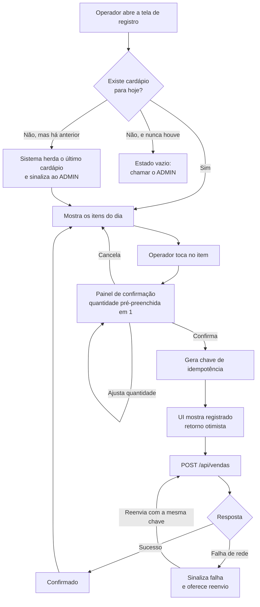
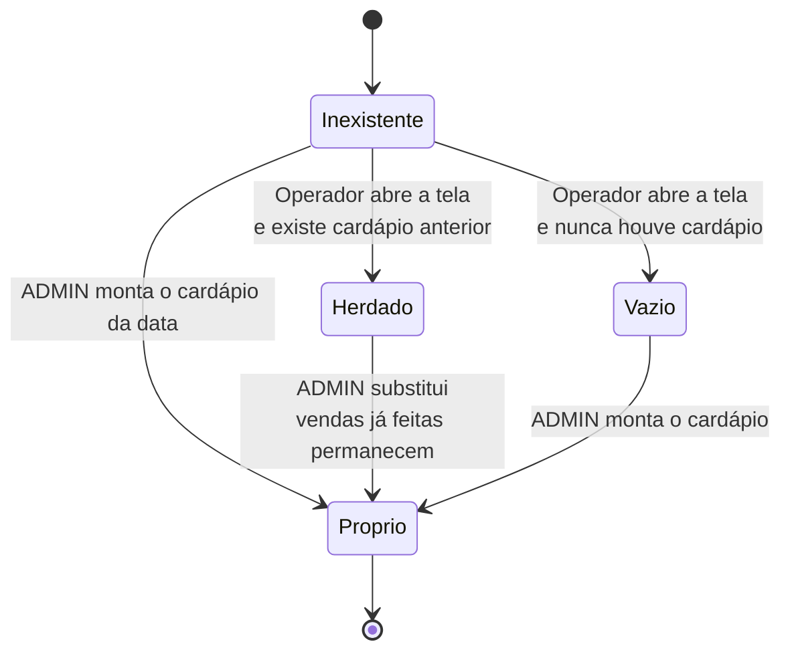
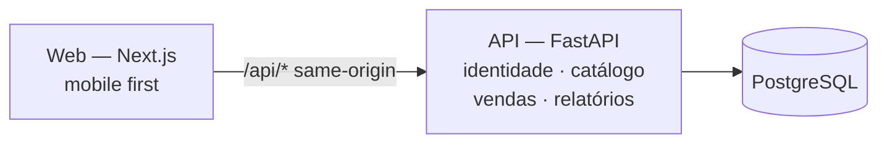

# PRD: Controle de vendas de PF e marmitas com fechamento diário

**Cliente/Produto:** projeto próprio — Controle de PF e Marmitas
**Tipo:** Epic
**Autor:** Thiago Barcelos
**Data:** 2026-09-22
**Status:** Rascunho
**Arquitetura base:** [`docs/architecture/proposta-arquitetural.md`](../architecture/proposta-arquitetural.md) — ADR-001 a ADR-007

---

## Resumo de rastreabilidade

> 📸 **Snapshot de 2026-09-22.** Esta tabela é conferência, não fonte de verdade — a fonte são as seções 8 e 9. Ao editar regras ou cenários, reconte com o comando ao final do bloco.

**48 regras de negócio** (RN-01 a RN-48) · **46 cenários de aceite** (CA-01 a CA-46)

| Bloco | RN | CA |
|---|---:|---:|
| Catálogo | 6 | 2 |
| Cardápio do dia | 6 | 4 |
| Registro de venda | 8 | 7 |
| Cancelamento | 6 | 6 |
| Fechamento e relatórios | 7 | 6 |
| Identidade e acesso | 8 | 11 |
| Segurança transversal | 7 | 7 |
| Imutabilidade do histórico | — | 3 |
| **Total** | **48** | **46** |

Duas assimetrias da tabela são propositais e vale registrar o porquê:

- **Imutabilidade do histórico** não tem bloco de regras próprio. Seus três cenários validam regras que vivem em Catálogo e em Registro de venda — RN-04, RN-05, RN-06 e RN-15 — porque a imutabilidade não é uma funcionalidade, é uma propriedade que atravessa várias.
- **Identidade e acesso** tem mais cenários que regras porque a RN-37 sozinha consome cinco: são duas camadas de proteção do login, com armazenamentos distintos, e cada comportamento precisa ser verificado em separado.

**Duas regras não têm cenário Gherkin**, deliberadamente: a **RN-35** (hash bcrypt) e a **RN-47** (segredos fora do código-fonte) são verificação de repositório e de implementação, não comportamento observável por um ator. Ficam a cargo do review.

Para reconferir os totais a qualquer momento:

```bash
F=docs/prds/PRD-001-controle-vendas-pf-marmitas.md
echo "RN: $(grep -c '^- \*\*RN-' $F) | CA: $(grep -c 'Cenário \[CA-' $F)"
```

---

## 1. Visão geral

Um sistema web, usado principalmente no celular, onde quem está no balcão registra cada prato feito ou marmita vendida com dois toques, e onde o responsável pelo restaurante vê, ao fim do dia, quantas unidades saíram de cada item e quanta proteína isso consumiu.

Não é um sistema de pedidos: não existe comanda, mesa, fila de cozinha nem status de preparo. Ele é um **contador de saídas** com ficha técnica de proteína acoplada. O valor está no número do fim do dia e no histórico que esse número acumula.

---

## 2. Problema e contexto

**Problema:** hoje não existe registro confiável do que foi vendido. Ao fechar o dia, o responsável não sabe quantos PFs e quantas marmitas saíram, e não tem ideia de **quanta proteína foi consumida** — o insumo mais caro do prato e o mais fácil de faltar ou sobrar.

**Contexto atual:** o controle é informal, feito de memória ou em papel avulso que não sobrevive à semana. Não há histórico consultável, então não existe base para comparar um dia com outro, nem para saber se um prato vende bem.

**Impacto de não fazer:** a compra de proteína continua sendo feita no escuro. Comprar demais vira desperdício; comprar de menos vira venda perdida. Nenhum dos dois aparece em lugar nenhum, então o mesmo erro se repete todo mês. Em paralelo, o cardápio segue sendo decidido por intuição, sem saber quais pratos puxam movimento.

---

## 3. Objetivo

Permitir que o responsável saiba, ao fim de cada dia, quantos PFs e marmitas foram vendidos e quanta proteína foi consumida, acumulando histórico confiável o bastante para sustentar decisões de compra e de cardápio.

### Métricas de sucesso

- Registro de uma venda concluído em **dois toques** e com retorno visual em menos de um segundo
- **100% dos dias de operação** com fechamento registrado no sistema, sem lacuna
- Divergência entre o fechamento do sistema e uma conferência manual pontual **igual a zero**

---

## 4. Escopo

### 4.1. Dentro do escopo

- Autenticação com dois perfis — ADMIN e Operador — e cadastro de operadores pelo ADMIN
- Cadastro de proteínas, pratos (com proteína e gramagem por porção) e itens de cardápio (prato × formato, com preço)
- Montagem do cardápio por data, com herança automática do último cardápio quando a data não tiver um
- Registro de venda pelo Operador: toque no item, painel de confirmação com quantidade, confirmação
- Cancelamento de venda pelo ADMIN, com registro de quem cancelou, quando e por quê
- Fechamento do dia: unidades por item e por prato, separando PF e marmita; proteína consumida por tipo; faturamento
- Consulta do fechamento de qualquer data passada

### 4.2. Fora do escopo

- **Pedidos, comanda, mesa e status de preparo** — o sistema conta saídas, não gerencia atendimento
- **Emissão fiscal** (NFC-e, SAT, cupom) e **meio de pagamento** — o sistema não sabe se foi dinheiro, Pix ou cartão
- **Delivery** e integração com marketplaces
- **Estoque de insumos em geral** — arroz, feijão, salada e embalagem ficam de fora; só proteína é rastreada, porque só ela justifica o esforço de cadastro
- **Funcionamento offline** — decidido na fase de arquitetura; ver Dívida 2 da proposta
- **Projeções e previsão de demanda** — objetivo declarado para o futuro. Este PRD garante que o dado seja coletado com fidelidade desde o primeiro dia, mas não especifica nenhum cálculo de projeção
- **Multi-estabelecimento operacional** — o modelo já carrega `estabelecimento_id` (ADR-003), mas não há onboarding, cobrança nem troca de estabelecimento na interface
- **Gestão de despesas, custo de compra e margem** — o sistema informa quanto de proteína saiu, não quanto ela custou

---

## 5. Personas e usuários impactados

| Persona | Papel | Como interage com a feature |
|---------|-------|----------------------------|
| **Responsável** | ADMIN | Monta o cardápio do dia, cadastra proteínas, pratos e gramagens, define e reajusta preços, cancela vendas registradas por engano e consulta o fechamento. Usa poucas vezes ao dia, sem pressa, tipicamente antes de abrir e depois de fechar |
| **Atendente** | Operador | Registra cada venda. Usa dezenas a centenas de vezes por dia, em pé, com uma mão, durante o pico do almoço. É o único perfil no caminho crítico |

O contraste entre os dois é o que dita as prioridades: a tela do Operador é otimizada para velocidade e resistência a erro de toque; as telas do ADMIN são otimizadas para clareza.

---

## 6. Hierarquia de entrega

- **Epic:** Controle de vendas de PF e marmitas com fechamento diário

  - **Feature 1:** Identidade e acesso
    - **PBI 1.1:** Autenticação com sessão em cookie httpOnly e durações distintas por perfil
    - **PBI 1.2:** Proteção do login em duas camadas — bloqueio progressivo por conta, persistido no banco, e limite de ritmo por origem na borda
    - **PBI 1.3:** Cadastro e desativação de operadores pelo ADMIN
    - **PBI 1.4:** Segurança transversal — cabeçalhos, HTTPS, higiene de log, validação de entrada e tratamento de erro (RN-42 a RN-48). Atravessa todas as Features; deve ser executado cedo, porque retrofitar cabeçalho e tratamento de erro em rotas já escritas é mais caro que nascer com eles

  - **Feature 2:** Catálogo
    - **PBI 2.1:** Cadastro de proteínas
    - **PBI 2.2:** Cadastro de pratos, com proteína e gramagem por porção
    - **PBI 2.3:** Itens de cardápio — prato × formato (PF / Marmita) — com preço próprio
    - **PBI 2.4:** Desativação de pratos e itens preservando o histórico

  - **Feature 3:** Cardápio do dia
    - **PBI 3.1:** Montagem do cardápio de uma data a partir do catálogo
    - **PBI 3.2:** Herança automática do último cardápio e sinalização ao ADMIN

  - **Feature 4:** Registro de venda
    - **PBI 4.1:** Tela de registro mobile first com painel de confirmação e quantidade
    - **PBI 4.2:** Registro idempotente com snapshot de preço e gramagem
    - **PBI 4.3:** Cancelamento de venda pelo ADMIN
    - **PBI 4.4:** Lista das próprias vendas do dia para o Operador, sem valores

  - **Feature 5:** Fechamento
    - **PBI 5.1:** Fechamento do dia corrente — unidades, proteína e faturamento
    - **PBI 5.2:** Consulta de fechamento de datas passadas

> Sugestão de quebra. O PBI é unidade de backlog e costuma valer vários dias; cada um vira várias `T-XX` quando o `planner-leanwork` decompuser.

---

## 7. Fluxos

### 7.1. Fluxo principal — registro de venda



O operador abre a tela uma vez e permanece nela o dia todo. Cada venda é um ciclo de dois toques: item e confirmação. O painel de confirmação serve a dois propósitos ao mesmo tempo — evita o toque acidental e é onde a quantidade é ajustada — o que mantém o caso comum, de uma unidade, em dois toques.

O retorno é otimista: a interface confirma antes da resposta do servidor, porque a chave de idempotência torna o reenvio seguro. Como o registro é sempre online, uma falha de rede **precisa ser sinalizada de forma inequívoca** — a venda não entrou, e silenciar isso corromperia o fechamento.

### 7.2. Fluxo alternativo — cardápio não montado

Se o ADMIN não montou o cardápio da data, o sistema **não bloqueia a venda**. Ele copia o cardápio da data mais recente que tenha um, marca a cópia como *herdada* e sinaliza ao ADMIN para revisão. O operador vende normalmente. Quando o ADMIN definir o cardápio da data, o herdado é substituído — e as vendas já registradas permanecem válidas, com o snapshot que tinham no momento do registro.

Só há um caso sem saída: o primeiro uso do sistema, quando não existe nenhum cardápio anterior para herdar. Aí a tela mostra estado vazio orientando a chamar o responsável.

### 7.3. Fluxo alternativo — cancelamento

O Operador **não cancela**. Ao perceber um registro errado, ele aciona o responsável. O ADMIN localiza a venda na lista do dia, cancela informando o motivo, e a linha permanece no banco marcada como cancelada — nunca é apagada. Todos os totais passam a desconsiderá-la imediatamente.

Como não há limite de tempo para cancelar, o fechamento de uma data passada pode mudar. Isso é esperado, e toda alteração é rastreável: cada cancelamento registra quem, quando e por quê.

---

## 8. Regras de negócio

### Catálogo

- **RN-01:** Uma proteína tem nome único dentro do estabelecimento. Proteínas nunca são apagadas, apenas desativadas.
- **RN-02:** Um prato tem nome, exatamente uma proteína e uma **gramagem fixa por porção**, em gramas. A gramagem é a mesma independentemente do formato em que o prato é vendido — PF e marmita consomem a mesma quantidade de proteína *(decisão da fase de arquitetura; ver Dívida 1 da proposta)*.
- **RN-03:** Um item de cardápio é o par **prato × formato**, onde formato é `PF` ou `Marmita`, e tem **preço próprio**. É o item de cardápio, não o prato, que o Operador toca na tela.
- **RN-04:** Pratos e itens de cardápio nunca são apagados, apenas desativados. Item desativado deixa de aparecer para venda, mas continua legível em todo o histórico e em todo relatório *(ADR-004)*.
- **RN-05:** Alteração de preço vale a partir do momento em que é salva e **não altera nenhuma venda já registrada** *(ADR-004)*.
- **RN-06:** Alteração da gramagem de um prato vale a partir do momento em que é salva e **não altera nenhuma venda já registrada** *(ADR-004)*.

### Cardápio do dia

- **RN-07:** O cardápio é definido **por data**. Cada data tem um conjunto de itens de cardápio disponíveis para venda.
- **RN-08:** Não havendo cardápio definido para a data corrente, o sistema **herda automaticamente** o cardápio da data mais recente que tenha um, e a cópia é marcada como *herdada*. O Operador vende normalmente.
- **RN-09:** Cardápio herdado é sinalizado ao ADMIN de forma visível, com a data de origem, até que ele o substitua ou confirme.
- **RN-10:** Ao ADMIN definir o cardápio da data, o herdado é substituído. **Vendas já registradas permanecem válidas**, com o snapshot que tinham.
- **RN-11:** Não existindo nenhum cardápio anterior para herdar — primeiro uso do sistema — a tela de registro exibe estado vazio orientando a acionar o ADMIN.
- **RN-12:** Um item desativado (RN-04) não pode ser incluído em cardápio novo, e é removido automaticamente de um cardápio herdado.

### Registro de venda

- **RN-13:** Registrar uma venda exige **dois toques**: tocar no item de cardápio e confirmar no painel. O painel abre com a quantidade pré-preenchida em **1**.
- **RN-14:** A quantidade é um inteiro entre **1 e 20** por lançamento. Acima disso, o Operador faz um segundo lançamento. O teto é proteção contra toque repetido acidental no incremento.
- **RN-15:** No instante do registro, a venda **copia** os seguintes dados, que passam a pertencer a ela e nunca mais mudam: nome do prato, nome da proteína, formato, preço unitário e gramagem por porção *(ADR-004)*.
- **RN-16:** Valor total da venda = preço unitário do snapshot × quantidade. Proteína da venda = gramagem do snapshot × quantidade.
- **RN-17:** O instante da venda é gerado **pelo servidor**, em UTC. O relógio do dispositivo nunca é usado *(ADR-005)*.
- **RN-18:** Cada venda carrega uma **chave de idempotência** gerada pelo cliente no ato da confirmação. Uma requisição com chave já existente devolve a venda original e **não cria uma segunda** *(ADR-004)*.
- **RN-19:** Só podem ser vendidos itens presentes no cardápio vigente da data corrente — próprio ou herdado.
- **RN-20:** Toda venda registra qual usuário a registrou.

### Cancelamento

- **RN-21:** Somente o **ADMIN** pode cancelar uma venda. O Operador não tem essa ação disponível.
- **RN-22:** **Não há limite de tempo** para cancelar: o ADMIN pode cancelar uma venda de qualquer data.
- **RN-23:** O cancelamento é **lógico**. A venda registra data/hora do cancelamento, quem cancelou e o motivo. A linha nunca é removida do banco *(ADR-004)*.
- **RN-24:** O cancelamento atinge a **linha inteira**. Para corrigir a quantidade de um lançamento, o ADMIN cancela e registra novamente com a quantidade certa.
- **RN-25:** Uma venda já cancelada não pode ser cancelada outra vez.
- **RN-26:** O motivo do cancelamento é obrigatório.

### Fechamento e relatórios

- **RN-27:** O **dia operacional** é a data civil no fuso `America/Sao_Paulo`, de `00:00:00` a `23:59:59`. Uma venda registrada às 23h59 pertence ao dia corrente; uma registrada às 00h01 pertence ao dia seguinte *(ADR-005)*.
- **RN-28:** Todos os totais **excluem vendas canceladas** *(ADR-004)*.
- **RN-29:** O fechamento do dia apresenta, no mínimo: unidades vendidas por item de cardápio com PF e marmita distinguidos; unidades por prato somando os formatos; **proteína consumida por tipo de proteína**; faturamento **separado por formato** (quanto veio de PF e quanto de marmita); e faturamento total.
- **RN-30:** A proteína consumida estimada é a soma de (gramagem do snapshot × quantidade) de todas as vendas não canceladas do período, agrupada por proteína.
- **RN-31:** O faturamento é a soma de (preço unitário do snapshot × quantidade) de todas as vendas não canceladas do período, apurado **por formato e no total**.
- **RN-32:** O fechamento reflete o **estado atual** dos dados. Um cancelamento posterior altera o número de uma data já consultada, e isso é esperado — a rastreabilidade de quem cancelou, quando e por quê é o que torna a mudança explicável.
- **RN-33:** O ADMIN pode consultar o fechamento de qualquer data passada.

### Identidade e acesso

- **RN-34:** O ADMIN cadastra e desativa operadores. Usuários nunca são apagados, apenas desativados, para preservar a autoria das vendas já registradas.
- **RN-35:** A senha é armazenada com hash **bcrypt** *(ADR-006)*.
- **RN-36:** A sessão do Operador é longa e renovada em uso; a do ADMIN é mais curta, por ser o perfil que altera preço e cadastro *(ADR-006)*.
- **RN-37:** A proteção do login tem **duas camadas independentes**, porque defende de dois ataques diferentes e guarda estado em lugares diferentes:
  1. **Por conta — persistida no banco.** Após **5** tentativas malsucedidas consecutivas na mesma conta, aquela conta sofre bloqueio temporário progressivo: a espera aumenta a cada novo bloqueio. O bloqueio atinge **somente** a conta que errou; as demais seguem autenticando normalmente. O contador de falhas e o instante de liberação são **colunas da própria conta**, não memória de processo — o que os torna imunes a reinício da aplicação e a múltiplas réplicas, além de auditáveis.
  2. **Por origem — efêmera, na borda.** Limite de ritmo de requisições, **sem bloqueio de ninguém**. Contém o disparo automatizado que visa ocupar o servidor com o custo do hash, e é imperceptível para alguém digitando a senha. Por ser contagem de segundos, não é persistida; vive na borda da aplicação ou na plataforma de hospedagem, antes de chegar à API *(ADR-006 e risco de negação de serviço na seção 10 da proposta)*.
  Uma tentativa bem-sucedida zera o contador de falhas da conta.
- **RN-38:** A mensagem de erro do login **não revela** se o usuário existe, nem se a conta está bloqueada por tentativa ou desativada pelo ADMIN.
- **RN-39:** O Operador não acessa nenhuma tela ou operação de ADMIN.
- **RN-40:** O Operador consulta a lista das vendas que **ele próprio** registrou no dia operacional corrente, com item, formato e quantidade — e **sem preço, sem faturamento**. É o que lhe permite apontar ao ADMIN exatamente qual lançamento corrigir, já que não pode cancelar (RN-21).
- **RN-41:** Todo dado de domínio pertence a um estabelecimento, e **toda consulta filtra por ele** *(ADR-003)*.

### Segurança transversal

Estas regras não pertencem a nenhuma feature: valem para **toda rota e toda tela**, inclusive as que ainda não existem. Existem como bloco próprio porque, diluídas, não teriam onde ser cobradas no review.

- **RN-42:** Operação que altera estado é feita exclusivamente por `POST`, `PATCH` ou `DELETE` — **nunca** por `GET`. É o que faz o `SameSite=Lax` do cookie de sessão efetivamente barrar requisição forjada de outro site *(ADR-006)*.
- **RN-43:** Toda resposta HTTP carrega os cabeçalhos de segurança: HSTS, `X-Content-Type-Options: nosniff`, bloqueio de enquadramento em iframe e uma Content Security Policy restritiva.
- **RN-44:** O acesso é exclusivamente por HTTPS. Requisição em HTTP é redirecionada, e o cookie de sessão é sempre marcado como `Secure` *(ADR-006)*.
- **RN-45:** O log **nunca** registra senha, hash, valor de cookie, cabeçalho de autenticação ou corpo de requisição de login.
- **RN-46:** Toda entrada é validada por schema; o corpo da requisição tem tamanho máximo; campo desconhecido é rejeitado em vez de ignorado.
- **RN-47:** Segredos — credencial de banco, chave de assinatura de sessão — vêm de variável de ambiente. Nunca do código-fonte, nunca versionados.
- **RN-48:** Resposta de erro não devolve ao cliente detalhe interno do sistema: sem stack trace, sem SQL, sem caminho de arquivo. O detalhe fica no log do servidor.

---

## 9. Critérios de aceite

```gherkin
Funcionalidade: Registro de venda

  Cenário [CA-01]: Registrar uma unidade com dois toques
    Dado que existe cardápio para hoje com o item "Frango grelhado - PF" a R$ 18,00 (RN-07)
    E que o prato "Frango grelhado" tem 150g da proteína "Frango" (RN-02)
    E que estou autenticado como Operador
    Quando eu toco no item "Frango grelhado - PF"
    Então o painel de confirmação abre com quantidade igual a 1 (RN-13)
    Quando eu confirmo
    Então a venda é registrada com quantidade 1 (RN-13)
    E a venda guarda preço unitário 18,00 e gramagem 150 (RN-15)
    E a venda registra o usuário que a criou (RN-20)
    E a interface confirma o registro sem aguardar a resposta do servidor

  Cenário [CA-02]: Registrar mais de uma unidade do mesmo item
    Dado que existe cardápio para hoje com o item "Frango grelhado - Marmita" a R$ 22,00
    E que estou autenticado como Operador
    Quando eu toco no item e incremento a quantidade para 3
    E eu confirmo
    Então a venda é registrada com quantidade 3 (RN-14)
    E o valor total da venda é R$ 66,00 (RN-16)
    E a proteína da venda é 450g (RN-16)

  Cenário [CA-03]: Reenvio da mesma venda não duplica o registro
    Dado que uma venda foi enviada com a chave de idempotência "abc-123"
    E que a venda já está registrada
    Quando a mesma requisição é reenviada com a chave "abc-123" (RN-18)
    Então nenhuma venda nova é criada
    E a resposta devolve a venda original
    E o fechamento do dia continua contando uma única unidade (RN-18)

  Cenário [CA-04]: Falha de rede não pode ser silenciada
    Dado que estou autenticado como Operador
    E que a rede está indisponível
    Quando eu confirmo uma venda
    Então a interface sinaliza que o registro não foi concluído
    E oferece reenviar
    E a venda não aparece no fechamento do dia

  Cenário [CA-05]: Quantidade acima do teto é recusada
    Dado que estou no painel de confirmação de um item
    Quando eu tento registrar quantidade 21 (RN-14)
    Então o registro é recusado
    E a interface informa o limite por lançamento

  Cenário [CA-06]: Item fora do cardápio do dia não pode ser vendido
    Dado que o item "Feijoada - PF" existe no catálogo mas não está no cardápio de hoje (RN-19)
    Quando uma tentativa de registro desse item é enviada à API
    Então o registro é recusado
    E nenhuma venda é criada

  Cenário [CA-28]: O instante da venda vem do servidor, não do dispositivo
    Dado que o relógio do celular do Operador está adiantado em 2 dias (RN-17)
    Quando uma venda é registrada
    Então o instante gravado é o do servidor (RN-17)
    E a venda pertence ao dia operacional corrente, não ao do relógio do dispositivo (RN-27)
```

```gherkin
Funcionalidade: Catálogo

  Cenário [CA-29]: Proteína com nome repetido é recusada
    Dado que já existe a proteína "Frango" no estabelecimento (RN-01)
    Quando o ADMIN tenta cadastrar outra proteína chamada "Frango"
    Então o cadastro é recusado (RN-01)

  Cenário [CA-30]: O mesmo prato em dois formatos tem preços independentes
    Dado que existe o prato "Frango grelhado" com 150g de proteína (RN-02)
    Quando o ADMIN cria o item "Frango grelhado - PF" a R$ 18,00
    E cria o item "Frango grelhado - Marmita" a R$ 22,00 (RN-03)
    Então os dois itens aparecem separadamente para venda (RN-03)
    E ambos consomem 150g de proteína por unidade (RN-02)
```

```gherkin
Funcionalidade: Cardápio do dia

  Cenário [CA-07]: Cardápio é herdado quando o ADMIN não montou o do dia
    Dado que não existe cardápio definido para hoje (RN-08)
    E que o cardápio mais recente é o de 21/09 com 4 itens
    Quando o Operador abre a tela de registro
    Então os 4 itens de 21/09 são exibidos para venda (RN-08)
    E o cardápio de hoje é marcado como herdado
    E o ADMIN vê a sinalização indicando a data de origem 21/09 (RN-09)

  Cenário [CA-08]: Item desativado não entra no cardápio herdado
    Dado que não existe cardápio definido para hoje
    E que o cardápio mais recente tem 4 itens, sendo "Feijoada - PF" desativado (RN-04)
    Quando o cardápio é herdado
    Então apenas 3 itens são exibidos para venda (RN-12)

  Cenário [CA-09]: ADMIN substitui o cardápio herdado sem afetar vendas já registradas
    Dado que o cardápio de hoje foi herdado de 21/09
    E que 12 vendas já foram registradas hoje sobre esse cardápio
    Quando o ADMIN define o cardápio de hoje com outros itens (RN-10)
    Então o cardápio exibido ao Operador passa a ser o novo
    E as 12 vendas continuam válidas com seus snapshots (RN-10)
    E o fechamento do dia continua contando as 12 vendas (RN-15)

  Cenário [CA-10]: Primeiro uso do sistema, sem cardápio anterior
    Dado que nunca foi definido nenhum cardápio (RN-11)
    Quando o Operador abre a tela de registro
    Então é exibido estado vazio orientando acionar o ADMIN (RN-11)
    E nenhuma venda pode ser registrada
```

```gherkin
Funcionalidade: Imutabilidade do histórico

  Cenário [CA-11]: Reajuste de preço não altera venda já registrada
    Dado que o item "Frango grelhado - PF" custava R$ 18,00
    E que uma venda foi registrada com esse preço (RN-15)
    Quando o ADMIN altera o preço do item para R$ 20,00 (RN-05)
    Então a venda registrada continua com preço unitário 18,00
    E o faturamento daquele dia permanece inalterado (RN-05)
    E vendas novas do mesmo item passam a usar 20,00

  Cenário [CA-12]: Alteração de gramagem não altera venda já registrada
    Dado que o prato "Frango grelhado" tinha 150g de proteína
    E que uma venda foi registrada com essa gramagem (RN-15)
    Quando o ADMIN altera a gramagem do prato para 180g (RN-06)
    Então a proteína consumida daquele dia permanece calculada sobre 150g (RN-06)

  Cenário [CA-13]: Item desativado continua legível no histórico
    Dado que existem vendas do item "Feijoada - PF"
    Quando o ADMIN desativa o item (RN-04)
    Então o item deixa de aparecer na tela de registro
    E o fechamento das datas anteriores continua exibindo "Feijoada - PF" pelo nome (RN-04)
```

```gherkin
Funcionalidade: Cancelamento de venda

  Cenário [CA-14]: ADMIN cancela uma venda registrada por engano
    Dado que estou autenticado como ADMIN
    E que existe uma venda de 2 unidades registrada hoje
    Quando eu cancelo a venda informando o motivo "cliente desistiu" (RN-26)
    Então a venda é marcada como cancelada, sem ser removida (RN-23)
    E o registro guarda quem cancelou e quando (RN-23)
    E as 2 unidades saem do fechamento do dia (RN-28)

  Cenário [CA-15]: Operador não pode cancelar venda
    Dado que estou autenticado como Operador
    Quando eu tento cancelar uma venda (RN-21)
    Então a operação é recusada
    E a venda permanece ativa

  Cenário [CA-16]: Cancelamento sem motivo é recusado
    Dado que estou autenticado como ADMIN
    Quando eu tento cancelar uma venda sem informar o motivo (RN-26)
    Então a operação é recusada

  Cenário [CA-17]: Venda já cancelada não é cancelada de novo
    Dado que existe uma venda já cancelada (RN-25)
    Quando o ADMIN tenta cancelá-la novamente
    Então a operação é recusada
    E os dados do cancelamento original são preservados

  Cenário [CA-18]: Cancelamento de data passada altera o fechamento daquela data
    Dado que o fechamento de 15/09 apresentava 80 unidades (RN-32)
    E que estou autenticado como ADMIN
    Quando eu cancelo uma venda de 2 unidades registrada em 15/09 (RN-22)
    Então o fechamento de 15/09 passa a apresentar 78 unidades (RN-32)
    E o cancelamento é rastreável por quem, quando e por quê (RN-23)

  Cenário [CA-31]: Corrigir quantidade exige cancelar e registrar de novo
    Dado que existe uma venda de 3 unidades que deveria ser de 2
    E que estou autenticado como ADMIN
    Quando eu cancelo a venda (RN-24)
    Então as 3 unidades saem do fechamento por inteiro (RN-24)
    Quando uma nova venda de 2 unidades é registrada
    Então o fechamento passa a contar 2 unidades
    E o histórico preserva as duas linhas, uma cancelada e uma ativa (RN-23)
```

```gherkin
Funcionalidade: Fechamento do dia

  Cenário [CA-19]: Venda às 23h59 pertence ao dia corrente
    Dado que é dia 22/09 às 23:59 no fuso America/Sao_Paulo (RN-27)
    Quando uma venda é registrada
    Então ela pertence ao dia operacional 22/09 (RN-27)
    E aparece no fechamento de 22/09

  Cenário [CA-20]: Venda às 00h01 pertence ao dia seguinte
    Dado que é dia 23/09 às 00:01 no fuso America/Sao_Paulo (RN-27)
    Quando uma venda é registrada
    Então ela pertence ao dia operacional 23/09 (RN-27)
    E não aparece no fechamento de 22/09

  Cenário [CA-21]: Fechamento agrega proteína por tipo
    Dado que hoje foram vendidas, sem cancelamento:
      | item                        | proteína | gramagem | quantidade |
      | Frango grelhado - PF        | Frango   | 150      | 10         |
      | Frango grelhado - Marmita   | Frango   | 150      | 4          |
      | Bife acebolado - PF         | Carne    | 180      | 6          |
    Quando o ADMIN consulta o fechamento de hoje
    Então a proteína "Frango" apresenta 2100g consumidos (RN-30)
    E a proteína "Carne" apresenta 1080g consumidos (RN-30)
    E o total de unidades é 20 (RN-29)

  Cenário [CA-22]: Fechamento distingue PF de marmita
    Dado que hoje foram vendidas 10 unidades de "Frango grelhado - PF" e 4 de "Frango grelhado - Marmita"
    Quando o ADMIN consulta o fechamento de hoje
    Então o fechamento apresenta 10 unidades no formato PF e 4 no formato Marmita (RN-29)
    E apresenta 14 unidades no prato "Frango grelhado" (RN-29)

  Cenário [CA-37]: Fechamento separa o faturamento por formato
    Dado que hoje foram vendidas 10 unidades de "Frango grelhado - PF" a R$ 18,00
    E 4 unidades de "Frango grelhado - Marmita" a R$ 22,00
    E que nenhuma foi cancelada
    Quando o ADMIN consulta o fechamento de hoje
    Então o faturamento em PF é R$ 180,00 (RN-31)
    E o faturamento em Marmita é R$ 88,00 (RN-31)
    E o faturamento total é R$ 268,00 (RN-31)

  Cenário [CA-23]: ADMIN consulta fechamento de data passada
    Dado que estou autenticado como ADMIN
    Quando eu consulto o fechamento de 15/09 (RN-33)
    Então são exibidos os totais daquela data
    E vendas canceladas não são contabilizadas (RN-28)
```

```gherkin
Funcionalidade: Acesso

  Cenário [CA-24]: Bloqueio após tentativas malsucedidas atinge só a conta que errou
    Dado que a conta "joao" acumulou 5 tentativas de login malsucedidas (RN-37)
    Quando uma sexta tentativa em "joao" é feita
    Então a conta "joao" fica temporariamente bloqueada (RN-37)
    E a conta "maria", na mesma origem, continua autenticando normalmente (RN-37)

  Cenário [CA-25]: Bloqueio de conta é progressivo
    Dado que a conta "joao" já sofreu um bloqueio temporário
    Quando ela atinge o limite de tentativas outra vez (RN-37)
    Então o novo bloqueio dura mais que o anterior (RN-37)

  Cenário [CA-38]: Bloqueio de conta sobrevive ao reinício da aplicação
    Dado que a conta "joao" está bloqueada até um instante futuro (RN-37)
    Quando a aplicação é reiniciada
    Então "joao" continua bloqueado até o mesmo instante (RN-37)

  Cenário [CA-39]: Autenticação bem-sucedida zera o contador de falhas
    Dado que a conta "joao" acumulou 3 tentativas malsucedidas (RN-37)
    Quando "joao" autentica com a senha correta
    Então o contador de falhas da conta volta a zero (RN-37)

  Cenário [CA-34]: Disparo automatizado é contido sem bloquear ninguém
    Dado que uma origem dispara requisições de login em ritmo muito acima do humano (RN-37)
    Então as requisições excedentes são recusadas por limite de ritmo (RN-37)
    E nenhuma conta é bloqueada por causa disso (RN-37)
    E o registro de vendas segue respondendo normalmente

  Cenário [CA-35]: Erro de login não revela informação sobre a conta
    Dado que tento autenticar com um usuário inexistente
    E depois com um usuário existente e senha errada
    E depois com um usuário desativado (RN-38)
    Então as três tentativas retornam a mesma mensagem de erro (RN-38)

  Cenário [CA-26]: Operador não acessa tela de ADMIN
    Dado que estou autenticado como Operador
    Quando eu tento acessar o cadastro de pratos (RN-39)
    Então o acesso é negado

  Cenário [CA-36]: Operador vê as próprias vendas do dia, sem valores
    Dado que estou autenticado como Operador
    E que registrei 12 vendas hoje
    E que outro Operador registrou 8 vendas hoje
    Quando eu abro a lista das minhas vendas (RN-40)
    Então são exibidas as minhas 12 vendas, com item, formato e quantidade (RN-40)
    E as 8 do outro Operador não aparecem (RN-40)
    E nenhum preço ou faturamento é exibido (RN-40)

  Cenário [CA-27]: Usuário desativado preserva a autoria das vendas
    Dado que o Operador "João" registrou 40 vendas
    Quando o ADMIN desativa o usuário "João" (RN-34)
    Então "João" não consegue mais autenticar
    E as 40 vendas continuam atribuídas a ele no histórico (RN-34)

  Cenário [CA-32]: Sessão do Operador dura mais que a do ADMIN
    Dado que um Operador e um ADMIN autenticaram no mesmo instante (RN-36)
    Quando decorre o tempo de expiração da sessão de ADMIN
    Então o ADMIN precisa autenticar novamente (RN-36)
    E o Operador continua autenticado
    E o uso contínuo pelo Operador renova a sessão dele (RN-36)

  Cenário [CA-33]: Consulta nunca alcança dado de outro estabelecimento
    Dado que existem vendas em dois estabelecimentos distintos (RN-41)
    Quando o ADMIN de um deles consulta o fechamento do dia
    Então apenas as vendas do estabelecimento dele são contabilizadas (RN-41)
```

```gherkin
Funcionalidade: Segurança transversal

  Cenário [CA-40]: Alteração de estado por GET é recusada
    Dado que existe uma venda ativa
    Quando uma requisição GET tenta cancelá-la (RN-42)
    Então a requisição é recusada
    E a venda permanece ativa

  Cenário [CA-41]: Resposta carrega os cabeçalhos de segurança
    Quando qualquer rota da aplicação responde (RN-43)
    Então a resposta contém HSTS
    E contém X-Content-Type-Options igual a nosniff
    E contém política que impede o app de ser embutido em iframe
    E contém Content Security Policy (RN-43)

  Cenário [CA-42]: Acesso em HTTP é redirecionado para HTTPS
    Quando uma requisição chega por HTTP (RN-44)
    Então ela é redirecionada para HTTPS
    E o cookie de sessão é emitido com a marcação Secure (RN-44)

  Cenário [CA-43]: Log de login não contém a senha
    Dado que uma tentativa de login é feita com a senha "segredo123"
    Quando a requisição é processada e registrada em log (RN-45)
    Então o log não contém "segredo123"
    E não contém o hash nem o valor do cookie de sessão (RN-45)

  Cenário [CA-44]: Campo desconhecido no corpo é rejeitado
    Quando uma requisição envia um campo não previsto no schema (RN-46)
    Então a requisição é recusada em vez de ignorar o campo (RN-46)

  Cenário [CA-45]: Corpo acima do tamanho máximo é recusado
    Quando uma requisição chega com corpo acima do limite (RN-46)
    Então ela é recusada antes de ser processada (RN-46)

  Cenário [CA-46]: Erro interno não vaza detalhe do sistema
    Dado que uma falha inesperada ocorre ao processar uma requisição
    Quando a resposta de erro é devolvida ao cliente (RN-48)
    Então ela não contém stack trace, SQL nem caminho de arquivo (RN-48)
    E o detalhe da falha é registrado no log do servidor (RN-48)
```

---

## 10. Permissionamento

| Ação | Perfis autorizados | Observação |
|------|-------------------|------------|
| Registrar venda | ADMIN, Operador | Único caminho crítico do sistema |
| Ver as próprias vendas do dia | ADMIN, Operador | Sem preço nem faturamento para o Operador (RN-40) |
| Cancelar venda | **ADMIN** | Sem limite de tempo (RN-21, RN-22). O Operador aciona o responsável |
| Consultar fechamento do dia | ADMIN | — |
| Consultar fechamento de data passada | ADMIN | RN-33 |
| Montar cardápio da data | ADMIN | RN-07 |
| Cadastrar / editar proteína, prato, item de cardápio | ADMIN | RN-01 a RN-03 |
| Alterar preço e gramagem | ADMIN | Não afeta venda registrada (RN-05, RN-06) |
| Desativar prato, item ou usuário | ADMIN | Nunca apagar (RN-04, RN-34) |
| Cadastrar / desativar operador | ADMIN | RN-34 |

---

## 11. Integrações e dados

### 11.1. Sistemas envolvidos

**Nenhum.** O sistema não depende de nenhum serviço externo para operar — sem gateway de pagamento, emissor fiscal, ERP ou marketplace. Essa ausência é deliberada e é o que permite ao registro de venda ser rápido e previsível (seção 6.1 da proposta arquitetural).

### 11.2. Dados consumidos

Todos de origem própria, cadastrados pelo ADMIN: proteínas, pratos com gramagem, itens de cardápio com preço, cardápio da data e usuários.

### 11.3. Dados produzidos / persistidos

| Entidade | O que guarda |
|---|---|
| `Estabelecimento` | um único registro semeado; presente em todas as tabelas de domínio *(ADR-003)* |
| `Usuario` | nome, credencial, perfil (ADMIN / Operador), situação ativa |
| `Proteina` | nome, situação ativa |
| `Prato` | nome, proteína, **gramas por porção**, situação ativa |
| `ItemCardapio` | prato, formato (PF / Marmita), **preço**, situação ativa |
| `CardapioData` | data, itens disponíveis, origem (próprio ou herdado de qual data) |
| `Venda` | item, **quantidade**, snapshot de nome do prato, nome da proteína, formato, preço unitário e gramagem; instante em UTC; usuário que registrou; chave de idempotência; e, quando cancelada, instante, autor e motivo do cancelamento |

O registro de venda é **append-only**: nenhum `UPDATE` de valor, nenhum `DELETE` *(ADR-004)*.

### 11.4. Eventos

Não se aplica. O sistema não publica nem consome eventos — não há fila nem worker *(ADR-001)*.

---

## 12. Diagrama de estados

O ciclo de vida do **cardápio de uma data** é o único não-trivial do sistema:



A transição **Herdado → Próprio** é a que carrega a regra sensível: ela troca o que o Operador vê, mas não toca em nenhuma venda já registrada (RN-10), porque cada venda guarda o próprio snapshot.

O ciclo da **venda** é deliberadamente raso: `Registrada → Cancelada`, sem volta. Não existe edição, não existe reativação, não existe exclusão.

---

## 13. Arquitetura técnica



Detalhe completo em [`docs/architecture/proposta-arquitetural.md`](../architecture/proposta-arquitetural.md). Os quatro módulos da API mapeiam diretamente nas Features 1, 2+3, 4 e 5 deste PRD.

---

## 14. Restrições e premissas

**Restrições** (herdadas da fase de arquitetura, seção 4 da proposta):

- Registro de venda em dois toques, com retorno visual em menos de um segundo
- Mobile first — a tela de registro precisa caber sem rolagem, com alvos de toque adequados ao polegar
- Sempre online — não há suporte offline
- Backend Python/FastAPI, frontend Next.js, banco PostgreSQL

**Premissa** remanescente:

> ⚠️ **Premissa:** o cardápio herdado é gerado quando a tela de registro é aberta pela primeira vez na data. Não há processo agendado criando cardápio de madrugada — o sistema não tem worker *(ADR-001)*.

---

## 15. Riscos e dependências

| Tipo | Descrição | Mitigação / Plano |
|------|-----------|-------------------|
| Risco | **Operador travado com número errado.** Como só o ADMIN cancela (RN-21) e o ADMIN pode não estar disponível no pico, o Operador sabe que o total está errado e não pode agir. O modo de falha perigoso é ele "compensar" deixando de registrar a próxima venda real | RN-40: o Operador vê a lista das próprias vendas do dia e aponta ao ADMIN exatamente qual lançamento corrigir. A decisão de restringir o cancelamento foi consciente — se o incômodo se confirmar no uso real, a regra é revisável sem mudança de modelo |
| Risco | **Fechamento de data passada muda** após cancelamento tardio (RN-22, RN-32), surpreendendo quem já tinha anotado o número | Cancelamento sempre registra quem, quando e por quê (RN-23), tornando a divergência explicável. Exibir no fechamento quando houver cancelamento posterior à data |
| Risco | **Cardápio herdado passa despercebido** e o restaurante opera o dia com itens errados | Sinalização visível ao ADMIN com a data de origem (RN-09). Itens desativados são removidos automaticamente (RN-12) |
| Risco | **Estimativa de proteína enviesada** porque a gramagem é fixa por prato (RN-02) e a marmita pode levar mais que o PF | Dívida 1 da proposta arquitetural, com gatilho e caminho de pagamento definidos. O histórico anterior permanece correto por causa do snapshot (RN-15) |
| Risco | **Virada do dia implementada errada**, contando vendas na data errada de forma silenciosa | CA-19 e CA-20 são testes de aceite dedicados. O fuso é constante única na aplicação *(ADR-005)* |
| Risco | **Login como vetor de negação de serviço** — endpoint aberto e hash caro por projeto | RN-37 mais a regra de executar o hash fora do event loop *(ADR-006 e seção 10 da proposta)* |
| Risco | **Limite de ritmo por origem deixa de valer ao escalar.** Diferente do bloqueio por conta, que é persistido (RN-37), a contagem por origem é efêmera. Se viesse da memória do processo, subir uma segunda réplica dividiria a contagem entre elas e afrouxaria o limite **em silêncio** — sem erro, sem log, sem nada quebrar visivelmente | Manter a camada por origem na **borda** e não no processo da API (RN-37). A consequência está registrada no ADR-006 para ser consultada antes de qualquer decisão de escalar |
| Risco | **Segurança transversal deixada para "ver na implementação"** — regra não escrita não vira tarefa no plano nem finding no review | RN-42 a RN-48, com cenários CA-40 a CA-46 e um PBI próprio (1.4) para o planner ter onde pendurar as tarefas |
| Dependência | Nenhuma externa | O sistema não depende de time, fornecedor ou serviço de terceiro para operar |

---

## 16. Questões em aberto

Todas as questões levantadas na elaboração deste PRD foram resolvidas em 2026-09-22:

- [x] **Teto por lançamento** — 20 unidades (RN-14). Acima disso, novo lançamento
- [x] **Proteção do login** — duas camadas: bloqueio progressivo **por conta** após 5 tentativas, mais limite de ritmo **por origem** sem bloqueio (RN-37). A versão anterior desta regra contava tentativas apenas por origem, o que travaria toda a equipe no wi-fi compartilhado do restaurante
- [x] **Faturamento por formato** — sim, separado entre PF e marmita, além do total (RN-29, RN-31)
- [x] **Lista do Operador** — sim, restrita às vendas dele e sem preço nem faturamento (RN-40)

Nenhuma questão em aberto.

---

## 17. Referências

- [`docs/architecture/proposta-arquitetural.md`](../architecture/proposta-arquitetural.md) — ADR-001 a ADR-007, dívidas conscientes e riscos
- Decisões tomadas na entrevista desta fase: cardápio por data com herança automática; quantidade no painel de confirmação pré-preenchida em 1; cancelamento exclusivo do ADMIN, sem limite de tempo; dia operacional civil
