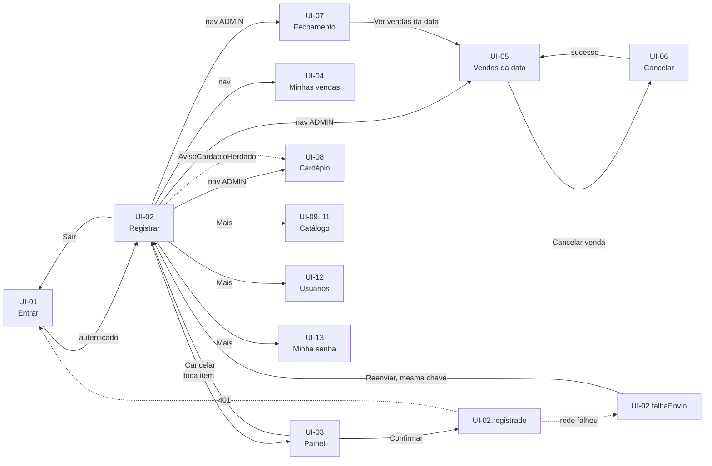

# SPEC-UI-001: Controle de vendas de PF e marmitas com fechamento diário

> **PRD de referência:** `docs/prds/PRD-001-controle-vendas-pf-marmitas.md`
> **Arquitetura de referência:** `docs/architecture/proposta-arquitetural.md`
> **Modo:** Geração
> **Artefato visual:** `docs/prototype/assets/prototipo-001-visual-v2.html` — **única referência visual para implementar** (paleta, tipografia, acabamento). A v1, `prototipo-001-visual-v1.html`, foi descartada e não deve ser usada (ver seção 9). O wireframe `docs/prototype/assets/prototipo-001.html` continua como referência de estrutura e é a base de onde as versões visuais partem. Nos dois, o painel lateral troca tela, estado e perfil; deep link por `#UI-XX.estado@Perfil` (ex.: `#UI-07.default@ADMIN`). A versão visual tem ainda o seletor Celular / Computador
> **Fidelidade:** Alta fidelidade visual sobre a estrutura do wireframe. A passada de UI/UX (skill `ui-ux-pro-max`, 2026-09-29) trocou só o tratamento visual — telas, estados e fluxos são os mesmos do wireframe (ver seção 10)
> **Autor:** Thiago Barcelos
> **Data:** 2026-09-28
> **Status:** Aprovada (2026-09-29) — revisado em 2026-09-28: RN-54 (Sair), RN-55 (fechamento do mês) e todas as lacunas da seção 8 decididas (RN-56 a RN-61 no PRD); revisado em 2026-09-29: tokens de design e comportamento no computador definidos na passada de UI/UX (pendências 17 e 18)

---

## 1. Contexto de interface

**Arquétipo:** App de operação (registro no balcão) + área administrativa leve (cardápio, catálogo, vendas, fechamento, usuários)

**Dispositivo alvo:** Mobile-first — celular, em pé, uma mão (arquitetura 2.4; PRD §14). As telas do ADMIN também são desenhadas para celular. No computador, todas as telas (inclusive as do ADMIN) ficam numa **coluna central de até 480 px**, sem layout largo próprio (decisão de 2026-09-29)

**Stack de frontend:** Next.js (App Router) + TypeScript; telas do app autenticado como client components, sem renderização no servidor (ADR-002). API same-origin via rewrite `/api/*`, sessão em cookie httpOnly (ADR-006). Nenhuma biblioteca de componentes declarada

**Origem das informações deste documento:**

| Fonte | O que veio dela |
|---|---|
| Protótipo | Nenhum pré-existente — o protótipo foi gerado nesta fase |
| PRD | Todas as telas e quase todos os estados: personas (§5), fluxos (§7), regras (§8), cenários Gherkin (§9), permissionamento (§10), ciclo de vida do cardápio (§12), riscos (§15) |
| Arquitetura | Stack, client components, uso com uma mão, retorno otimista e reenvio com a mesma chave (7.1), sessão por cookie |
| Entrevista (2026-09-28) | Fidelidade wireframe; direção visual B ("Quente de restaurante"); contraste WCAG AA; somente PT-BR; inclusão da ação **Sair** e do **fechamento do mês** — ambas levadas ao PRD como RN-54 e RN-55; decisão das 16 lacunas da seção 8 |
| Gerado nesta fase | Padrão de navegação (barra inferior + menu "Mais"), disposição da grade de registro (uma linha por prato, colunas fixas PF / Marmita), copy curta das mensagens |
| Passada de UI/UX (2026-09-29) | Skill `ui-ux-pro-max`: tokens de design (seção 2), fonte, acabamento e comportamento no computador. Duas versões geradas; a v1 (`prototipo-001-visual-v1.html`, cor só nas ações) foi achada pálida, e a **v2** (`prototipo-001-visual-v2.html`, estrutura colorida) foi **aprovada pelo usuário** |

> **Todo estado desta SPEC é "Derivado" ou "Gerado"**. A direção visual foi aprovada na v2, mas os estados mantêm a estrutura do wireframe e não foram revistos um a um em design. A coluna Origem de cada tabela indica de onde veio.

---

## 2. Tokens de design

Não havia design system no repositório (greenfield). Os tokens abaixo vieram da passada de UI/UX de 2026-09-29 e estão aplicados como variáveis CSS no `:root` de `docs/prototype/assets/prototipo-001-visual-v2.html`, que é a fonte a copiar na implementação.

**Direção visual escolhida na entrevista — B. Quente de restaurante:** tons terrosos com acento laranja/tomate, cantos arredondados, tipografia amigável, mantendo alvos grandes. Na passada de UI/UX virou **"tomate suave" com estrutura colorida**: tomate dessaturado no topo, na ação principal e na seleção, fundo areia, cartões brancos. Suave, sem ser chamativo, por pedido do usuário. **Tema claro único**: o app é usado no salão iluminado, e ninguém pediu modo escuro.

| Token | Valor | Origem |
|---|---|---|
| Direção | B — Quente de restaurante, "tomate suave" com estrutura colorida | Entrevista + passada de UI/UX |
| Contraste mínimo | WCAG AA em todo texto e controle; bordas de campo e botão ≥ 3:1 | Entrevista |
| Alvo de toque mínimo | 44 px; itens da UI-02 e botão Confirmar da UI-03 ≥ 64 px | Derivado de arquitetura 2.4 / 3.1 |
| Fonte | **Nunito Sans** (Google Fonts), pesos 400, 600, 700 e 800; fallback `system-ui, -apple-system, "Segoe UI", Roboto, sans-serif`. Corpo 16 px, entrelinha 1,45 | Passada de UI/UX |
| `--pri` | `#A5452F` tomate apagado: barra do topo, botão principal, seleção. Texto branco sobre ele: 6,0:1 | Passada de UI/UX |
| `--pri-press` | `#8A3824` toque ou hover no principal; texto da aba ativa | Passada de UI/UX |
| `--on-pri` / `--on-pri-sub` | `#FFFFFF` / `#F6DCD2` texto principal e secundário sobre tomate (4,6:1) | Passada de UI/UX |
| `--canvas` | `#F3E3D3` fundo areia das telas | Passada de UI/UX |
| `--paper` | `#FFFFFF` cartões, navegação, campos | Passada de UI/UX |
| `--ink` / `--muted` | `#2E2622` texto (11,8:1 no fundo) / `#66574D` texto secundário (5,5:1 no fundo) | Passada de UI/UX |
| `--line` / `--strong` | `#E6D2C3` divisória decorativa / `#86766A` borda de campo e botão (3,5:1 no fundo) | Passada de UI/UX |
| `--soft` / `--press` / `--tabs-bg` | `#F8DCCD` realce e aba ativa / `#F1CCB9` toque em botão claro / `#EBD2C0` trilho das abas | Passada de UI/UX |
| Semânticas (texto / fundo / borda) | Falha `#A3302A` / `#FBEAE7` / `#E7B7B0` · Sucesso `#2E6A3A` / `#E7F1E5` / `#B5D3B3` · Aviso `#7A5200` / `#FBF0D6` / `#E6CE92` · Informação `#2E5570` / `#E6EEF3` / `#B4CAD8` — todas ≥ 5,5:1 | Passada de UI/UX |
| Raio | 10 px (pequeno) · 12 px (botão, campo) · 14 px (cartão, item) · 18 px (cartão de prato) · 24 px (painel inferior) · pílula nas etiquetas | Passada de UI/UX |
| Sombra | Leve em cartões (`0 1px 2px` + `0 2px 8px`, marrom a 5–6 %); nenhuma em elemento plano | Passada de UI/UX |
| Movimento | Transições de cor de 160 ms; nenhuma animação no caminho do registro além disso; tudo desligado com `prefers-reduced-motion` | Passada de UI/UX |
| Espaçamento | Margem de tela 16 px; ritmo de 4/8 px (gaps de 6, 8, 10, 12, 14 px) | Passada de UI/UX |

---

## 3. Inventário de telas

| ID | Tela | Rota | Persona | Implementa (RN) | Valida (CA) |
|---|---|---|---|---|---|
| UI-01 | Entrar | `/login` | Todos | RN-34, RN-36, RN-37, RN-38, RN-54 | CA-24, CA-25, CA-27, CA-32, CA-34, CA-35, CA-51, CA-53, CA-56 |
| UI-02 | Registrar venda | `/registrar` | ADMIN, Operador | RN-07, RN-08, RN-09, RN-11, RN-12, RN-13, RN-18, RN-19, RN-36, RN-40, RN-50, RN-56 | CA-01, CA-04, CA-06, CA-07, CA-08, CA-09, CA-10, CA-13, CA-48, CA-55, CA-58, CA-59, CA-60 |
| UI-03 | Painel de confirmação (sobre UI-02) | `/registrar` (painel) | ADMIN, Operador | RN-13, RN-14, RN-18 | CA-01, CA-02, CA-05 |
| UI-04 | Minhas vendas de hoje | `/minhas-vendas` | ADMIN, Operador | RN-17, RN-21, RN-27, RN-40 | CA-15, CA-36, CA-54 |
| UI-05 | Vendas da data | `/vendas?data=` | ADMIN | RN-16, RN-20, RN-21, RN-22, RN-27, RN-28, RN-51 | CA-14, CA-18, CA-31, CA-50 |
| UI-06 | Cancelar venda (diálogo sobre UI-05) | `/vendas` (diálogo) | ADMIN | RN-21, RN-23, RN-24, RN-25, RN-26 | CA-14, CA-16, CA-17, CA-18, CA-31 |
| UI-07 | Fechamento (dia e mês) | `/fechamento?data=` · `/fechamento?mes=` | ADMIN | RN-04, RN-27, RN-28, RN-29, RN-30, RN-31, RN-32, RN-33, RN-55, RN-61 | CA-11, CA-12, CA-13, CA-18, CA-21, CA-22, CA-23, CA-37, CA-57, CA-67 |
| UI-08 | Cardápio da data | `/cardapio?data=` | ADMIN | RN-07, RN-08, RN-09, RN-10, RN-11, RN-12, RN-50, RN-57 | CA-07, CA-08, CA-09, CA-10, CA-47, CA-48, CA-49, CA-61 |
| UI-09 | Catálogo · Proteínas | `/catalogo/proteinas` | ADMIN | RN-01, RN-04, RN-49, RN-58, RN-59 | CA-29, CA-62 |
| UI-10 | Catálogo · Pratos | `/catalogo/pratos` | ADMIN | RN-02, RN-04, RN-06, RN-49, RN-58, RN-59 | CA-12, CA-26, CA-30, CA-63 |
| UI-11 | Catálogo · Itens de cardápio | `/catalogo/itens` | ADMIN | RN-03, RN-04, RN-05, RN-12, RN-49, RN-59 | CA-11, CA-13, CA-30, CA-47, CA-64 |
| UI-12 | Usuários | `/usuarios` | ADMIN | RN-34, RN-37, RN-52, RN-60 | CA-27, CA-51, CA-53, CA-65, CA-66 |
| UI-13 | Trocar minha senha | `/conta/senha` | ADMIN | RN-53, RN-60 | CA-52, CA-66 |

Elementos transversais, sem ID de tela (ver seção 5): `AppShell` (topo com usuário e **Sair** — RN-54, CA-56 —, navegação inferior por perfil, menu "Mais"), `AvisoCardapioHerdado` (RN-09), `AcessoNegado` (RN-39, CA-26 — estado `.semPermissao` de UI-05 a UI-13).

---

## 4. Telas em detalhe

### UI-01 — Entrar

**Propósito:** autenticar com usuário e senha.
**Rota:** `/login` · **Persona:** todos

| Regra | Como aparece na tela |
|---|---|
| RN-38 | Uma única mensagem para usuário inexistente, senha errada, conta bloqueada por tentativas e conta desativada |
| RN-37 | Bloqueio por conta é indistinguível de senha errada (RN-38). Limite por origem tem mensagem própria, que não fala da conta |
| RN-36 | Quem chega por expiração de sessão vê o motivo |
| RN-34 | Operador desativado não entra — mesma mensagem genérica |
| RN-54 | Destino da ação Sair, com a confirmação "Você saiu." |

| Estado | ID | Quando ocorre | O que o usuário vê | Origem |
|---|---|---|---|---|
| Padrão | `UI-01.default` | Acesso sem sessão | Usuário, Senha, botão Entrar (≥ 64 px) | Derivado do PRD |
| Validação | `UI-01.validacao` | Campo vazio | Erro por campo | Derivado de RN-46 |
| Enviando | `UI-01.enviando` | Autenticando | Botão desabilitado "Entrando…"; texto "a primeira conexão do dia pode levar alguns segundos" | Derivado do PRD §15 (cold start) |
| Credencial inválida | `UI-01.credencialInvalida` | 401 por qualquer motivo | "Usuário ou senha inválidos. Se o problema continuar, fale com o responsável." | Derivado de RN-38, CA-35, CA-24, CA-27 |
| Limite de ritmo | `UI-01.limiteRitmo` | 429 da borda | "Muitas tentativas em pouco tempo. Aguarde alguns segundos e tente de novo." | Derivado de RN-37 (camada 2), CA-34 |
| Sessão expirada | `UI-01.sessaoExpirada` | Redirecionado após 401 em outra tela | Aviso informativo + formulário | Derivado de RN-36, CA-32 |
| Saiu | `UI-01.saiu` | Após a ação Sair (`POST`; sessão invalidada no servidor) | "Você saiu." + formulário | Derivado de RN-54, CA-56 |
| Erro | `UI-01.erro` | Servidor inalcançável | Mensagem sem detalhe técnico | Derivado de RN-48 |

**Navegação:** sucesso → `UI-02`, para os dois perfis (lacuna 6: o ADMIN também vende no balcão, e o aviso de cardápio herdado aparece em qualquer tela).
**Observações:** "Se o problema continuar, fale com o responsável" é o único caminho para um operador bloqueado, já que a tela não pode revelar o bloqueio (RN-38) e a saída é a RN-52.

---

### UI-02 — Registrar venda

**Propósito:** o caminho crítico. Tocar no item e confirmar (dois toques).
**Rota:** `/registrar` · **Persona:** Operador e ADMIN no balcão

| Regra | Como aparece na tela |
|---|---|
| RN-13 | Toque em PF ou Marmita de um prato abre o painel UI-03 |
| RN-03 | Uma linha por prato, em **ordem alfabética estável**; cada botão é um item de cardápio (prato × formato). Colunas fixas: PF à esquerda, Marmita à direita, célula vazia quando o formato não existe |
| RN-40 | O botão mostra o **preço unitário** abaixo do formato ("PF / R$ 18,00"), para o operador cobrar (lacuna 1) |
| §7.2 | A tela **não se atualiza sozinha**: botão "↻ Atualizar" ao lado do título; o cardápio novo só aparece ao atualizar (lacuna 2) |
| RN-56 | Venda com falha fica pendente no aparelho, com Reenviar e Descartar; pendência de outro usuário ou de outro dia operacional é descartada com aviso, nunca reenviada |
| RN-19 | Só aparecem itens do cardápio vigente (próprio ou herdado) |
| RN-08, RN-12 | Herdado: exibe os itens da data de origem sem os desativados, com marca "Herdado de DD/MM" |
| RN-09 | ADMIN vê, além da marca, o aviso `AvisoCardapioHerdado` com a ação "Revisar cardápio" |
| RN-11 | Sem cardápio algum: estado vazio, nenhum item tocável |
| RN-18 | Reenvio após falha usa a mesma chave de idempotência gerada no painel |
| RN-36 | Sessão renovada em uso; expiração só por inatividade |

| Estado | ID | Quando ocorre | O que o usuário vê | Origem |
|---|---|---|---|---|
| Carregando | `UI-02.carregando` | Busca do cardápio vigente | Skeleton de linhas | Derivado do PRD |
| Padrão | `UI-02.default` | Cardápio próprio de hoje | "Cardápio de hoje · seg 28/09" + grade | Derivado de RN-13, §7.1 |
| Herdado | `UI-02.herdado` | Sem próprio, com anterior | Grade do herdado + marca "Herdado de 26/09"; ADMIN vê aviso com ação | Derivado de CA-07, CA-08 |
| Vazio | `UI-02.vazio` | Nenhum cardápio jamais montado | Operador: "Chame o responsável para montar o cardápio do dia." ADMIN: botão "Montar cardápio" → `UI-08.vazio` | Derivado de RN-11, CA-10 |
| Erro | `UI-02.erro` | Falha ao carregar o cardápio | Mensagem + "Tentar de novo" | Derivado de RN-48 |
| Registrado | `UI-02.registrado` | Logo após Confirmar, **antes** da resposta | Toast "✓ Registrado: 1× Frango grelhado · PF" | Derivado de CA-01, arquitetura 7.1 |
| Falha de envio | `UI-02.falhaEnvio` | Rede falhou após o retorno otimista | Aviso vermelho **persistente**: "Venda NÃO registrada — sem conexão" + item + "Não feche esta aba enquanto houver venda pendente" + **Reenviar** e **Descartar**. A grade continua utilizável. A pendência sobrevive a recarregar a página; fechar a aba com pendência dispara o aviso do navegador | Derivado de CA-04, CA-03, RN-18, RN-56 |
| Reenviando | `UI-02.reenviando` | Reenvio em curso | Aviso com botão desabilitado "Reenviando…" | Derivado de §7.1 |
| Confirmar descarte | `UI-02.confirmarDescarte` | Tocou Descartar | Painel: "Descartar esta venda? … não será registrada e não entra no fechamento." + "Descartar venda" (destrutivo) + Voltar | Derivado de RN-56, CA-58 |
| Pendência descartada | `UI-02.pendenciaDescartada` | Ao abrir a tela, havia pendência de outro dia operacional ou de outro usuário | Aviso amarelo: "Uma venda pendente foi descartada sem ser registrada" + item + origem ("ficou pendente em dom 27/09") + "Se ela aconteceu, avise o responsável." + Entendi | Derivado de RN-56, CA-59, CA-60 |
| Recusado | `UI-02.recusado` | API recusou (422): item saiu do cardápio (RN-19) ou quantidade inválida (RN-14) | "Venda NÃO registrada" + motivo + "o cardápio desta tela está desatualizado" + **Atualizar cardápio**; sem Reenviar (seria recusado de novo) | Derivado de CA-06, CA-05, §7.2 |
| Sessão expirada | `UI-02.sessaoExpirada` | Envio voltou 401 | "Sua sessão expirou. A venda NÃO foi registrada." + "ficou pendente neste aparelho. Entre de novo com o mesmo usuário para reenviar." + Entrar novamente; grade desabilitada. Depois de entrar, o mesmo usuário volta a `.falhaEnvio`; outro usuário vê `.pendenciaDescartada` | Derivado de RN-36, RN-56, CA-59 |

**Navegação:** item → `UI-03`; nav inferior → `UI-04` (Operador) ou `UI-05`, `UI-07`, `UI-08`, "Mais" (ADMIN).
**Observações:**
- CA-55 (ADMIN não é deslogado vendendo) não tem estado próprio: é a **ausência** de interrupção. A verificação é por teste de sessão.
- Vários envios podem estar em voo ao mesmo tempo — o operador não espera um para tocar o próximo. O aviso de falha lista cada venda pendente, com Reenviar em cada uma.
- A tela cabe sem rolagem com até 6 pratos (12 itens) em 375 × 667 (PRD §14). Acima disso, rola; o cardápio não tem teto.
- A pendência é guardada na sessão da aba (sobrevive a recarregar, some ao fechar) junto com a chave de idempotência, o usuário e o dia operacional em que foi confirmada. O dia operacional vem do servidor (a resposta do cardápio traz a data), nunca do relógio do aparelho (RN-17).

---

### UI-03 — Painel de confirmação

**Propósito:** segundo toque. Evita o toque acidental e ajusta a quantidade.
**Rota:** painel inferior sobre `/registrar` · **Persona:** Operador, ADMIN

| Regra | Como aparece na tela |
|---|---|
| RN-13 | Abre com quantidade 1; Confirmar é o segundo toque |
| RN-14 | Só `−` / `+`, sem teclado numérico: o teclado não chega a 21. Em 20, `+` desabilita e aparece a orientação |
| RN-18 | A chave de idempotência nasce no toque em Confirmar; o botão desabilita no primeiro toque |

| Estado | ID | Quando ocorre | O que o usuário vê | Origem |
|---|---|---|---|---|
| Padrão | `UI-03.default` | Painel aberto | Nome do item, quantidade 1, `−` desabilitado, Confirmar (≥ 64 px), Cancelar | Derivado de RN-13, CA-01 |
| Ajustando | `UI-03.ajustando` | Quantidade entre 2 e 19 | Quantidade grande no centro, "N unidades" | Derivado de CA-02 |
| Limite | `UI-03.limite` | Quantidade = 20 | `+` desabilitado; "Máximo de 20 por lançamento. Para mais, confirme este e faça outro lançamento." | Derivado de RN-14, CA-05 |

**Navegação:** Confirmar → `UI-02.registrado` (fecha na hora — retorno otimista); Cancelar → `UI-02.default`.
**Observações:** tocar fora do painel **não** deve confirmar nada. Fechar por toque fora é aceitável, mas a skill de UI/UX pode preferir fechar só com Cancelar, para resistir a toque acidental.

---

### UI-04 — Minhas vendas de hoje

**Propósito:** o operador aponta ao ADMIN qual lançamento corrigir.
**Rota:** `/minhas-vendas` · **Persona:** Operador; o ADMIN também acessa, pelo menu "Mais"

| Regra | Como aparece na tela |
|---|---|
| RN-40 | Só vendas do próprio usuário no dia operacional; horário, item, formato, quantidade. **Sem preço e sem faturamento** |
| RN-21 | Nenhuma ação de cancelar; rodapé "Lançou errado? Chame o responsável e aponte a venda nesta lista." |
| RN-17, RN-27 | Horário do servidor, exibido no fuso `America/Sao_Paulo` |

| Estado | ID | Quando ocorre | O que o usuário vê | Origem |
|---|---|---|---|---|
| Carregando | `UI-04.carregando` | Busca | Skeleton | Derivado do PRD |
| Padrão | `UI-04.default` | Há vendas | Lista mais recente primeiro + contagem de lançamentos | Derivado de RN-40, CA-36, CA-15 |
| Com cancelada | `UI-04.comCancelada` | ADMIN cancelou uma | Linha riscada + marca "Cancelada" | Derivado de RN-40, CA-54 |
| Vazio | `UI-04.vazio` | Nenhuma venda hoje | "Nenhuma venda sua hoje." + "Registrar venda" | Derivado do PRD |
| Erro | `UI-04.erro` | Falha | Mensagem + tentar de novo | Derivado de RN-48 |

**Observações:** vendas com falha de envio (`UI-02.falhaEnvio`) **não** aparecem aqui, porque não foram registradas. Isso reforça que o aviso da UI-02 precisa ser inequívoco.

---

### UI-05 — Vendas da data

**Propósito:** ver todas as vendas de uma data e cancelar a errada.
**Rota:** `/vendas?data=AAAA-MM-DD` · **Persona:** ADMIN

| Regra | Como aparece na tela |
|---|---|
| RN-51 | Todas as vendas da data, de todos os usuários: horário, autor, item, formato, quantidade, preço unitário, valor |
| RN-16 | Valor = quantidade × preço do snapshot, exibido como "2 × R$ 18,00 = R$ 36,00" |
| RN-28 | Resumo "N lançamentos · 1 cancelado · X un. · R$ Y" com totais **sem** as canceladas |
| RN-22 | Navegador de data sem limite para trás; não passa de hoje |
| RN-21 | Botão "Cancelar venda" em cada venda ativa |
| RN-23 | Cancelada: marca + "Cancelada por Carla às 12:10 · motivo: lançado em dobro" |

| Estado | ID | Quando ocorre | O que o usuário vê | Origem |
|---|---|---|---|---|
| Carregando | `UI-05.carregando` | Busca | Skeleton | Derivado do PRD |
| Padrão | `UI-05.default` | Há vendas | Cartões de venda com ação Cancelar | Derivado de RN-51, CA-50 |
| Com cancelada | `UI-05.comCancelada` | Há cancelada | Cartão acinzentado, sem ação, com quem, quando e motivo; fora do resumo | Derivado de RN-51, RN-28, CA-50 |
| Vazio | `UI-05.vazio` | Data sem vendas | "Nenhuma venda em DD/MM." | Derivado do PRD |
| Erro | `UI-05.erro` | Falha | Mensagem + tentar de novo | Derivado de RN-48 |
| Sem permissão | `UI-05.semPermissao` | Operador acessa a rota | `AcessoNegado` | Derivado de RN-39, CA-26 |

**Navegação:** Cancelar venda → `UI-06.confirmacao`.

---

### UI-06 — Cancelar venda

**Propósito:** cancelamento lógico com motivo.
**Rota:** diálogo sobre `/vendas` · **Persona:** ADMIN

| Regra | Como aparece na tela |
|---|---|
| RN-24 | Texto: "A venda inteira sai dos totais… Para corrigir a quantidade, cancele e registre de novo." |
| RN-26 | Campo Motivo obrigatório |
| RN-25 | Venda já cancelada não oferece a ação; se houver corrida, estado `.jaCancelada` |
| RN-23 | Nada é apagado; a venda continua na lista, marcada |

| Estado | ID | Quando ocorre | O que o usuário vê | Origem |
|---|---|---|---|---|
| Confirmação | `UI-06.confirmacao` | Aberto | Resumo da venda, aviso, Motivo, botão destrutivo "Cancelar venda", Voltar | Derivado de RN-23, RN-24, RN-26, CA-14 |
| Validação | `UI-06.validacao` | Motivo vazio | "Informe o motivo do cancelamento." | Derivado de RN-26, CA-16 |
| Processando | `UI-06.processando` | Envio | Controles desabilitados, "Cancelando…" | Derivado do PRD |
| Já cancelada | `UI-06.jaCancelada` | 409: outro ADMIN cancelou antes | "Esta venda já foi cancelada por … (motivo: …). Nada foi alterado." + Voltar à lista | Derivado de RN-25, CA-17 |
| Erro | `UI-06.erro` | Falha no servidor | Mensagem; **motivo digitado preservado** | Derivado de RN-48 |
| Sucesso | `UI-06.sucesso` | 200 | Diálogo fecha; venda marcada; resumo recalculado; toast "Venda cancelada. Totais atualizados." | Derivado de CA-14, RN-28 |
| Sem permissão | `UI-06.semPermissao` | Operador | `AcessoNegado` | Derivado de CA-15, RN-21 |

---

### UI-07 — Fechamento (dia e mês)

**Propósito:** o número do fim do dia, de qualquer data passada e do mês — base da compra de proteína.
**Rota:** `/fechamento?data=AAAA-MM-DD` (modo Dia) · `/fechamento?mes=AAAA-MM` (modo Mês) · **Persona:** ADMIN

| Regra | Como aparece na tela |
|---|---|
| RN-55 | Seletor **Dia \| Mês** no topo. No modo Mês, o navegador passa a andar de mês em mês, o mês corrente aparece como "(parcial)", os mesmos blocos do dia vêm somados sobre o mês e, ao final, a tabela **Por dia** (dia, unidades, faturamento). Tocar em um dia abre o fechamento daquela data |
| RN-29, RN-31 | Faturamento: PF e Marmita lado a lado, Total em destaque abaixo |
| RN-29 | Unidades: PF, Marmita, Total; tabela por prato (PF, Marm., Total); tabela por item |
| RN-30 | Proteína consumida por tipo, rotulada "estimada", em gramas com kg ao lado ("2.100 g (2,1 kg)"), porque a compra é feita em kg |
| RN-28 | Canceladas fora de tudo |
| RN-27 | Data do dia operacional; hoje marcado "(parcial)" |
| RN-33 | Navegador de data para qualquer data passada |
| RN-04 | Item desativado continua listado pelo nome nas datas em que vendeu |
| RN-32, RN-61 | Número de data passada pode mudar por cancelamento tardio; o fechamento do dia informa esses cancelamentos (`.cancelamentoPosterior`) |

| Estado | ID | Quando ocorre | O que o usuário vê | Origem |
|---|---|---|---|---|
| Carregando | `UI-07.carregando` | Busca | Skeleton | Derivado do PRD |
| Padrão | `UI-07.default` | Modo Dia, hoje | Blocos na ordem: Faturamento, Unidades, Proteína, Por prato, Por item + "Ver vendas desta data" | Derivado de RN-29, CA-21, CA-22, CA-37 |
| Mês | `UI-07.mes` | Modo Mês | Mesmos blocos somados sobre o mês + tabela Por dia; sem "Ver vendas desta data" (a lista de vendas é por dia — use a quebra por dia) | Derivado de RN-55, CA-57 |
| Data passada | `UI-07.dataPassada` | Data < hoje | Mesmo layout; itens hoje desativados aparecem pelo nome | Derivado de RN-33, CA-23, CA-13 |
| Cancelamento posterior | `UI-07.cancelamentoPosterior` | Houve cancelamento feito depois da data | Aviso informativo com quem, quando, motivo e link para UI-05 | Derivado de RN-61, CA-67, RN-32 |
| Vazio | `UI-07.vazio` | Nenhuma venda na data ou no mês | Zeros explícitos ("R$ 0,00 · 0 unidades · 0 g"), não tela em branco | Derivado do PRD |
| Erro | `UI-07.erro` | Falha | Mensagem + tentar de novo | Derivado de RN-48 |
| Sem permissão | `UI-07.semPermissao` | Operador | `AcessoNegado` | Derivado de RN-39 |

**Observações:**
- CA-11 e CA-12 aparecem aqui como **números que não mudam** depois de reajuste de preço ou de gramagem. Não há estado visual próprio; a verificação é por teste.
- O modo escolhido (Dia ou Mês) pode ser lembrado por aparelho, como conveniência — nunca como dado.
- `UI-07.cancelamentoPosterior` só se aplica ao modo Dia. No modo Mês, o cancelamento tardio já está refletido nos totais (RN-32).
- Intervalo livre de datas e comparação mês contra mês estão fora do escopo (PRD §4.2).

---

### UI-08 — Cardápio da data

**Propósito:** montar, confirmar ou consultar o cardápio de uma data.
**Rota:** `/cardapio?data=AAAA-MM-DD` · **Persona:** ADMIN

| Regra | Como aparece na tela |
|---|---|
| RN-07 | Um cardápio por data; navegador de data |
| RN-08, RN-09 | Sem próprio: mostra o herdado com a data de origem e o rótulo "ainda não confirmado" |
| RN-10 | "Confirmar este cardápio" grava o herdado como próprio; ao editar hoje, aviso "As vendas já registradas hoje (N) não mudam" |
| RN-12 | Herdado lista o que foi removido por desativação; na edição, desativados não aparecem |
| RN-50 | Data corrente e futuras editáveis; passadas somente leitura |
| RN-11 | Primeiro uso: estado vazio com "Montar cardápio" |
| RN-57 | Salvar exige pelo menos um item selecionado |
| §7.2 | Ao salvar, orienta o ADMIN a avisar o balcão: a tela de registro só mostra o cardápio novo quando for atualizada |

| Estado | ID | Quando ocorre | O que o usuário vê | Origem |
|---|---|---|---|---|
| Carregando | `UI-08.carregando` | Busca | Skeleton | Derivado do PRD |
| Próprio | `UI-08.proprio` | Data com cardápio gravado | Lista item · formato · preço; marca "Próprio"; "Editar cardápio" (se data ≥ hoje) | Derivado de RN-07 |
| Herdado | `UI-08.herdado` | Hoje sem próprio | Aviso "Herdado de sáb 26/09 — ainda não confirmado"; lista; nota do item removido; "Confirmar este cardápio" e "Editar antes de confirmar" | Derivado de RN-08, RN-09, RN-10, RN-12, CA-07, CA-08 |
| Vazio | `UI-08.vazio` | Nunca houve cardápio | "Os operadores não conseguem registrar vendas até você montar o primeiro." + Montar | Derivado de RN-11, CA-10 |
| Futuro sem cardápio | `UI-08.futuroSemCardapio` | Data futura sem próprio | "Se nada for montado, nesse dia vale o cardápio mais recente anterior, como herdado." + Montar | Derivado de RN-50, RN-08 |
| Editando | `UI-08.editando` | Montar / editar | Lista de todos os itens **ativos** com checkbox e preço; contador de selecionados; aviso de vendas já registradas (hoje); Salvar / Descartar | Derivado de RN-10, RN-12, CA-09, CA-48 |
| Validação | `UI-08.validacao` | Salvar sem nenhum item | "Selecione pelo menos um item. Um cardápio não pode ficar vazio." | Derivado de RN-57, CA-61 |
| Salvando | `UI-08.salvando` | Envio | Controles desabilitados | Derivado do PRD |
| Erro de envio | `UI-08.erroEnvio` | Falha | Mensagem; **seleção preservada** | Derivado de RN-48 |
| Sucesso | `UI-08.sucesso` | Gravado | Volta a `.proprio`; toast "Cardápio salvo. Avise o balcão: ele aparece quando a tela de registro for atualizada." | Derivado de RN-10, CA-09, §7.2 |
| Somente leitura | `UI-08.somenteLeitura` | Data passada com próprio | Lista, marca "Somente leitura", sem ações | Derivado de RN-50, CA-49 |
| Somente leitura sem próprio | `UI-08.somenteLeituraSemProprio` | Data passada sem próprio | "Nenhum cardápio foi montado nesta data. Nesse dia valeu o cardápio herdado." | Derivado de RN-08, RN-50 |
| Sem permissão | `UI-08.semPermissao` | Operador | `AcessoNegado` | Derivado de RN-39 |

**Observações:** a tela não mostra o `AvisoCardapioHerdado` global, porque ela própria é o destino do aviso.

---

### UI-09, UI-10, UI-11 — Catálogo (Proteínas, Pratos, Itens de cardápio)

**Propósito:** cadastro base. As três telas compartilham estrutura (abas no topo, lista, filtro "Mostrar desativados", formulário em painel inferior) e são implementadas com os mesmos componentes da seção 5.
**Rotas:** `/catalogo/proteinas`, `/catalogo/pratos`, `/catalogo/itens` · **Persona:** ADMIN · **Acesso:** menu "Mais"

| Regra | Tela | Como aparece |
|---|---|---|
| RN-01 | UI-09 | Nome repetido recusado (`.duplicado`) |
| RN-02 | UI-10 | Form: Nome, Proteína (só ativas), Gramagem por porção (g); nota "A mesma gramagem vale para PF e marmita" |
| RN-03 | UI-11 | Form: Prato (só ativos), Formato (PF / Marmita, seletor segmentado), Preço (R$). Na edição, **só o preço** muda: prato e formato são a identidade do item |
| RN-04 | UI-09, 10, 11 | "Desativar" com confirmação; nunca "Excluir" |
| RN-05 | UI-11 | `.editarPreco`: aviso "O novo preço vale para vendas registradas a partir de agora. As anteriores continuam com R$ 18,00." |
| RN-06 | UI-10 | `.editarGramagem`: aviso equivalente para gramagem |
| RN-12 | UI-11 | Confirmação de desativar: "Ele sai do cardápio e da tela de registro imediatamente." |
| RN-49 | UI-09, 10, 11 | Desativados visíveis pelo filtro, com "Reativar"; nome duplicado de um desativado oferece "Reativar" em vez de criar |
| RN-58 | UI-09, 10 | Desativar proteína usada por prato ativo, ou prato com item ativo, é recusado com a lista dos dependentes e atalho para a aba deles (`.desativarBloqueado`). A linha já mostra quantos dependentes ativos o cadastro tem ("1 prato ativo", "2 itens") |
| RN-59 | UI-09, 10, 11 | Nome de proteína e de prato único, sem diferenciar maiúsculas; no máximo um item por prato × formato |
| — | UI-09, 10, 11 | Listas em ordem alfabética; nomes até 60 caracteres (lacuna 16) |

**Estados comuns às três** (prefixo `UI-09.`, `UI-10.`, `UI-11.`):

| Estado | Quando ocorre | O que o usuário vê | Origem |
|---|---|---|---|
| `.carregando` | Busca | Abas + skeleton | Derivado do PRD |
| `.default` | Há cadastros ativos | Lista com Editar / Desativar | Derivado do PRD |
| `.vazio` | Nenhum cadastro | Mensagem que educa + botão Novo (ex.: "Cadastre as proteínas antes dos pratos: todo prato usa exatamente uma.") | Derivado do PRD |
| `.comDesativados` | Filtro ligado | Desativados com marca e "Reativar" | Derivado de RN-04, RN-49 |
| `.formulario` | Novo | Painel inferior com campos | Derivado do PRD |
| `.validacao` | Campo inválido | Erro por campo | Derivado de RN-46 |
| `.salvando` | Envio | Controles desabilitados | Derivado do PRD |
| `.erroEnvio` | Falha | Mensagem; **dados preservados** | Derivado de RN-48 |
| `.confirmarDesativar` | Desativar | Diálogo com a consequência em uma frase | Derivado de RN-04 |
| `.sucesso` | Salvo / desativado / reativado | Lista atualizada + toast | Derivado do PRD |
| `.erro` | Falha ao carregar | Mensagem + tentar de novo | Derivado de RN-48 |
| `.semPermissao` | Operador | `AcessoNegado` | Derivado de RN-39, CA-26 |

**Estados específicos:**

| Estado | ID | Quando ocorre | O que o usuário vê | Origem |
|---|---|---|---|---|
| Duplicado | `UI-09.duplicado` | Nome igual ao de proteína ativa (ignorando maiúsculas) | "Já existe uma proteína “Frango”." | Derivado de RN-01, RN-59, CA-29 |
| Duplicado desativado | `UI-09.duplicadoDesativado` | Nome igual ao de desativada | "“Carne suína” já existe e está desativada." + Reativar | Derivado de RN-49 |
| Desativação bloqueada | `UI-09.desativarBloqueado` | Proteína usada por prato ativo | "Não é possível desativar “Frango”" + lista dos pratos + "Ir para Pratos" | Derivado de RN-58, CA-62 |
| Duplicado | `UI-10.duplicado` | Nome igual ao de prato ativo (ignorando maiúsculas) | "Já existe um prato “Frango grelhado”." | Derivado de RN-59, CA-63 |
| Duplicado desativado | `UI-10.duplicadoDesativado` | Nome igual ao de prato desativado | "“Feijoada” já existe e está desativado." + Reativar | Derivado de RN-49, RN-59 |
| Desativação bloqueada | `UI-10.desativarBloqueado` | Prato com item ativo | "Não é possível desativar “Frango grelhado”" + lista dos itens + "Ir para Itens" | Derivado de RN-58 |
| Editar gramagem | `UI-10.editarGramagem` | Edição de prato | Form + aviso RN-06 | Derivado de RN-06, CA-12 |
| Duplicado | `UI-11.duplicado` | Prato × formato já existe ativo | "“Frango grelhado” já tem item Marmita. Edite o existente." | Derivado de RN-59, CA-64 |
| Duplicado desativado | `UI-11.duplicadoDesativado` | Prato × formato existe desativado | "“Feijoada · PF” já existe e está desativado." + Reativar | Derivado de RN-49, CA-47 |
| Editar preço | `UI-11.editarPreco` | Edição de item | Prato e formato só leitura; Preço editável; aviso RN-05 | Derivado de RN-05, CA-11 |

---

### UI-12 — Usuários

**Propósito:** cadastrar, desativar e reativar operadores; redefinir a senha deles.
**Rota:** `/usuarios` · **Persona:** ADMIN · **Acesso:** menu "Mais"

| Regra | Como aparece na tela |
|---|---|
| RN-34 | Novo operador (nome, usuário, senha inicial); Desativar / Reativar; nunca excluir. O formulário **não tem campo de perfil**: a interface só cadastra Operador (lacuna 12) |
| RN-52 | "Redefinir senha": a senha anterior deixa de funcionar e o bloqueio da conta é liberado na hora. Conta bloqueada aparece com a marca "Bloqueado até HH:MM" (lacuna 11) |
| RN-60 | Usuário único, sem diferenciar maiúsculas (até 30 caracteres, sem espaços); senha com no mínimo 8 caracteres, indicado no próprio rótulo do campo |
| — | A linha do próprio ADMIN aparece como "(você)", sem ações |

| Estado | ID | Quando ocorre | O que o usuário vê | Origem |
|---|---|---|---|---|
| Carregando | `UI-12.carregando` | Busca | Skeleton | Derivado do PRD |
| Padrão | `UI-12.default` | Há operadores | Nome, usuário, perfil; Redefinir senha, Desativar | Derivado de RN-34, RN-52 |
| Com desativados | `UI-12.comDesativados` | Filtro ligado | Desativados com Reativar | Derivado de RN-34, CA-53 |
| Com bloqueado | `UI-12.comBloqueado` | Operador bloqueado por tentativas | Marca "Bloqueado até 12:40" na linha; ação Redefinir senha continua disponível | Derivado de RN-52, RN-37 |
| Vazio | `UI-12.vazio` | Só o ADMIN | "Nenhum operador cadastrado." + Novo operador | Derivado do PRD |
| Formulário | `UI-12.formulario` | Novo operador | Nome, Usuário, Senha inicial; "Entregue a senha ao operador pessoalmente." | Derivado de RN-34, RN-52 (sem canal externo) |
| Validação | `UI-12.validacao` | Usuário já em uso (ignorando maiúsculas) | "Este usuário já está em uso." | Derivado de RN-60, CA-65 |
| Senha curta | `UI-12.senhaCurta` | Senha inicial com menos de 8 | "A senha precisa ter pelo menos 8 caracteres." | Derivado de RN-60, CA-66 |
| Salvando | `UI-12.salvando` | Envio | Desabilitado | Derivado do PRD |
| Erro de envio | `UI-12.erroEnvio` | Falha | Dados preservados | Derivado de RN-48 |
| Confirmar desativar | `UI-12.confirmarDesativar` | Desativar | "Ele deixa de conseguir entrar. As vendas que ele registrou continuam atribuídas a ele." | Derivado de RN-34, CA-27 |
| Redefinir senha | `UI-12.redefinirSenha` | Ação na linha | Nova senha + explicação | Derivado de RN-52, CA-51 |
| Redefinição concluída | `UI-12.redefinirSucesso` | 200 | Toast "Entregue a nova senha a ele." | Derivado de CA-51 |
| Sucesso | `UI-12.sucesso` | Salvo / desativado / reativado | Toast | Derivado do PRD |
| Erro | `UI-12.erro` | Falha ao carregar | Mensagem + tentar de novo | Derivado de RN-48 |
| Sem permissão | `UI-12.semPermissao` | Operador | `AcessoNegado` | Derivado de RN-39 |

---

### UI-13 — Trocar minha senha

**Propósito:** o ADMIN troca a própria senha.
**Rota:** `/conta/senha` · **Persona:** ADMIN · **Acesso:** menu "Mais"

| Estado | ID | Quando ocorre | O que o usuário vê | Origem |
|---|---|---|---|---|
| Padrão | `UI-13.default` | Aberto | Senha atual, Nova senha, Repita a nova senha | Derivado de RN-53 |
| Validação | `UI-13.validacao` | Repetição não confere | Erro no campo | Derivado de RN-46 |
| Senha curta | `UI-13.senhaCurta` | Nova senha com menos de 8 | "A senha precisa ter pelo menos 8 caracteres." | Derivado de RN-60, CA-66 |
| Enviando | `UI-13.enviando` | Envio | Desabilitado | Derivado do PRD |
| Senha atual incorreta | `UI-13.senhaAtualIncorreta` | Recusado | Erro no campo "Senha atual" | Derivado de RN-53, CA-52 |
| Sucesso | `UI-13.sucesso` | Trocada | "Senha alterada." | Derivado de CA-52 |
| Erro de envio | `UI-13.erroEnvio` | Falha | Mensagem | Derivado de RN-48 |
| Sem permissão | `UI-13.semPermissao` | Operador | `AcessoNegado` | Derivado de RN-39, RN-53 |

---

## 5. Componentes reutilizáveis

| Componente | Usado em | Descrição | Estados |
|---|---|---|---|
| `AppShell` | UI-02 a UI-13 | Topo com título, usuário · perfil e **Sair** (POST, RN-42); navegação inferior por perfil. Operador: Registrar, Minhas vendas. ADMIN: Registrar, Vendas, Fechamento, Cardápio, Mais | por perfil; menu "Mais" aberto/fechado |
| `MenuMais` | AppShell (ADMIN) | Painel com Minhas vendas de hoje, Proteínas, Pratos, Itens, Usuários, Trocar minha senha, Sair | aberto, fechado |
| `AvisoCardapioHerdado` | AppShell (ADMIN), UI-02 | Aviso "Cardápio de hoje herdado de DD/MM" + "Revisar cardápio" → UI-08. Some quando o ADMIN confirma ou substitui (RN-09) | visível, oculto |
| `AcessoNegado` | `.semPermissao` de UI-05 a UI-13 | Tela inteira bloqueada + "Voltar ao registro" (RN-39) | — |
| `GradeCardapio` / `BotaoItem` | UI-02 | Uma linha por prato em ordem alfabética, colunas fixas PF / Marmita, preço abaixo do formato, alvo ≥ 64 px; botão "↻ Atualizar" | habilitado, desabilitado, célula vaga |
| `PainelInferior` | UI-03, UI-06, formulários de UI-09 a UI-12, MenuMais | Bottom sheet com fundo escurecido | aberto, processando |
| `SeletorQuantidade` | UI-03 | `−` valor `+`, faixa 1–20, sem teclado | mínimo, intermediário, máximo |
| `NavegadorData` | UI-05, UI-07, UI-08 | ‹ data › + escolha de data; limite superior configurável (hoje em UI-05/07; livre em UI-08); granularidade dia ou mês (mês só na UI-07) | padrão, limite atingido |
| `SeletorPeriodo` | UI-07 | Controle segmentado Dia \| Mês (RN-55) | dia, mês |
| `Aviso` (banner) | todas | Variantes falha / aviso / informação / sucesso; falha com `role="alert"` | — |
| `Toast` | UI-02, UI-06, UI-08, UI-09 a UI-12 | Confirmação curta de sucesso | — |
| `AvisoFalhaEnvio` | UI-02 | Lista de vendas pendentes (NÃO registradas), cada uma com Reenviar (mesma chave, RN-18) e Descartar (com confirmação); guardada na sessão da aba com usuário e dia operacional (RN-56); aviso do navegador ao fechar com pendência | falha, reenviando, confirmar descarte, pendência descartada |
| `EstadoVazio` | UI-02, UI-04, UI-05, UI-07, UI-08, UI-09 a UI-12 | Mensagem + ação sugerida | — |
| `ErroCarregamento` | todas as telas que buscam dados | Mensagem sem detalhe técnico (RN-48) + "Tentar de novo" | — |
| `Skeleton` | todas as telas que buscam dados | Linhas cinzas na forma do conteúdo | — |
| `LinhaVenda` | UI-04, UI-05 | Horário, item, formato, quantidade; variante ADMIN com autor, preço e valor; variante cancelada | ativa, cancelada |
| `Etiqueta` | UI-02, UI-04, UI-05, UI-08, catálogo, UI-12 | Cancelada, Desativado, Herdado, Próprio, Somente leitura | — |
| `ListaCadastro` | UI-09, UI-10, UI-11, UI-12 | Lista + filtro "Mostrar desativados" + Reativar | ativos, com desativados |
| `CampoFormulario` | UI-01, UI-06, UI-08, UI-09 a UI-13 | Rótulo, campo, erro por campo | normal, erro, desabilitado |
| `DialogoConfirmacao` | UI-06, desativações de UI-09 a UI-12 | Consequência em uma frase + ação + Voltar | confirmação, processando |

---

## 6. Fluxo de navegação



---

## 7. Cobertura do PRD

### Regras de negócio

| RN | Manifesta em | Status |
|---|---|---|
| RN-01 | UI-09 (`.duplicado`) | ✅ Coberta |
| RN-02 | UI-10 (formulário) | ✅ Coberta |
| RN-03 | UI-11 (formulário, `.duplicado`), UI-02 (botão por formato) | ✅ Coberta |
| RN-04 | UI-09 a UI-11 (`.confirmarDesativar`, `.comDesativados`), UI-07 (`.dataPassada`) | ✅ Coberta |
| RN-05 | UI-11 (`.editarPreco`) | ✅ Coberta |
| RN-06 | UI-10 (`.editarGramagem`) | ✅ Coberta |
| RN-07 | UI-08, UI-02 | ✅ Coberta |
| RN-08 | UI-02 (`.herdado`), UI-08 (`.herdado`, `.futuroSemCardapio`) | ✅ Coberta |
| RN-09 | `AvisoCardapioHerdado`, UI-02 (`.herdado`), UI-08 (`.herdado`) | ✅ Coberta |
| RN-10 | UI-08 (`.herdado`, `.editando`, `.sucesso`) | ✅ Coberta |
| RN-11 | UI-02 (`.vazio`), UI-08 (`.vazio`) | ✅ Coberta |
| RN-12 | UI-08 (`.herdado`, `.editando`), UI-02 (`.herdado`), UI-11 (`.confirmarDesativar`) | ✅ Coberta |
| RN-13 | UI-02 → UI-03 | ✅ Coberta |
| RN-14 | UI-03 (`.limite`), UI-02 (`.recusado`) | ✅ Coberta |
| RN-15 | — | ⚠️ Regra de backend (snapshot). A interface só exibe os dados do snapshot em UI-04, UI-05, UI-07 |
| RN-16 | UI-05 (valor da linha) | ✅ Coberta (cálculo no backend) |
| RN-17 | UI-04, UI-05 (horário do servidor) | ⚠️ Regra de backend — o cliente **não envia** instante |
| RN-18 | UI-03 (chave gerada no Confirmar), UI-02 (`.falhaEnvio`, `.reenviando`) | ✅ Coberta |
| RN-19 | UI-02 (só itens vigentes, `.recusado`) | ✅ Coberta |
| RN-20 | UI-05 (autor) | ✅ Coberta (gravação no backend) |
| RN-21 | UI-05, UI-06; ausência de ação em UI-04 | ✅ Coberta |
| RN-22 | UI-05 (`NavegadorData` sem limite para trás) | ✅ Coberta |
| RN-23 | UI-05 (`.comCancelada`), UI-06 | ✅ Coberta |
| RN-24 | UI-06 (`.confirmacao`, texto) | ✅ Coberta |
| RN-25 | UI-06 (`.jaCancelada`), UI-05 (sem ação na cancelada) | ✅ Coberta |
| RN-26 | UI-06 (`.validacao`) | ✅ Coberta |
| RN-27 | UI-04, UI-05, UI-07 (data e horário no fuso do dia operacional) | ✅ Coberta (cálculo no backend) |
| RN-28 | UI-05 (resumo), UI-07 | ✅ Coberta |
| RN-29 | UI-07 | ✅ Coberta |
| RN-30 | UI-07 (proteína por tipo) | ✅ Coberta |
| RN-31 | UI-07 (faturamento por formato e total) | ✅ Coberta |
| RN-32 | UI-07 (`.cancelamentoPosterior`) | ✅ Coberta |
| RN-33 | UI-07 (`.dataPassada`) | ✅ Coberta |
| RN-34 | UI-12 | ✅ Coberta |
| RN-35 | — | ⚠️ Regra de backend (hash bcrypt) |
| RN-36 | UI-01 (`.sessaoExpirada`), UI-02 (`.sessaoExpirada`) | ✅ Coberta |
| RN-37 | UI-01 (`.credencialInvalida`, `.limiteRitmo`), UI-12 (`.redefinirSenha` libera bloqueio) | ✅ Coberta |
| RN-38 | UI-01 (`.credencialInvalida`) | ✅ Coberta |
| RN-39 | Navegação por perfil + `AcessoNegado` | ✅ Coberta |
| RN-40 | UI-04 | ✅ Coberta |
| RN-41 | — | ⚠️ Regra de backend (filtro por estabelecimento) |
| RN-42 | — | ⚠️ Regra de backend. Implicação de interface: Sair e toda ação são `POST`/`PATCH`; abrir UI-02 e UI-08 não grava nada |
| RN-43 | — | ⚠️ Borda / backend (cabeçalhos) |
| RN-44 | — | ⚠️ Infraestrutura (HTTPS) |
| RN-45 | — | ⚠️ Regra de backend (log) |
| RN-46 | Erros por campo nos formulários | ⚠️ Regra de backend. A validação no cliente é conveniência e não substitui a do schema |
| RN-47 | — | ⚠️ Repositório (segredos) |
| RN-48 | `ErroCarregamento`, todos os `.erro` / `.erroEnvio` | ✅ Coberta |
| RN-49 | UI-09 a UI-11 (`.comDesativados`, `.duplicadoDesativado`) | ✅ Coberta |
| RN-50 | UI-08 (`.futuroSemCardapio`, `.somenteLeitura`) | ✅ Coberta |
| RN-51 | UI-05 | ✅ Coberta |
| RN-52 | UI-12 (`.redefinirSenha`) | ✅ Coberta |
| RN-53 | UI-13 | ✅ Coberta |
| RN-54 | `AppShell` (Sair), UI-01 (`.saiu`) | ✅ Coberta (invalidação da sessão no backend) |
| RN-55 | UI-07 (`.mes`, `SeletorPeriodo`) | ✅ Coberta |
| RN-56 | UI-02 (`.falhaEnvio`, `.confirmarDescarte`, `.pendenciaDescartada`, `.sessaoExpirada`), `AvisoFalhaEnvio` | ✅ Coberta |
| RN-57 | UI-08 (`.validacao`) | ✅ Coberta |
| RN-58 | UI-09, UI-10 (`.desativarBloqueado`) | ✅ Coberta |
| RN-59 | UI-09, UI-10, UI-11 (`.duplicado`, `.duplicadoDesativado`) | ✅ Coberta |
| RN-60 | UI-12 (`.validacao`, `.senhaCurta`), UI-13 (`.senhaCurta`) | ✅ Coberta |
| RN-61 | UI-07 (`.cancelamentoPosterior`) | ✅ Coberta |

**Resumo:** 51 de 61 regras se manifestam em tela. As 10 restantes (RN-15, 17, 35, 41, 42, 43, 44, 45, 46, 47) são de backend ou de infraestrutura. Nenhuma regra de interface ficou sem manifestação.

### Cenários Gherkin

| CA | Acontece em | Status |
|---|---|---|
| CA-01 | UI-02 → UI-03.default → UI-02.registrado | ✅ Coberto |
| CA-02 | UI-03.ajustando | ✅ Coberto |
| CA-03 | UI-02.falhaEnvio → .reenviando (mesma chave) | ✅ Coberto (deduplicação é do backend) |
| CA-04 | UI-02.falhaEnvio | ✅ Coberto |
| CA-05 | UI-03.limite; UI-02.recusado | ✅ Coberto |
| CA-06 | UI-02.recusado | ✅ Coberto (cenário é de API; a tela trata a recusa) |
| CA-07 | UI-02.herdado, UI-08.herdado, `AvisoCardapioHerdado` | ✅ Coberto |
| CA-08 | UI-02.herdado, UI-08.herdado | ✅ Coberto |
| CA-09 | UI-08.editando → .sucesso; UI-02 mostra o novo ao ser atualizada (↻ Atualizar) | ✅ Coberto |
| CA-10 | UI-02.vazio | ✅ Coberto |
| CA-11 | UI-11.editarPreco; UI-07 | ✅ Coberto |
| CA-12 | UI-10.editarGramagem; UI-07 | ✅ Coberto |
| CA-13 | UI-11.confirmarDesativar; UI-02; UI-07.dataPassada | ✅ Coberto |
| CA-14 | UI-05 → UI-06.confirmacao → .sucesso | ✅ Coberto |
| CA-15 | UI-04 (sem ação); `AcessoNegado` | ✅ Coberto (recusa na API) |
| CA-16 | UI-06.validacao | ✅ Coberto |
| CA-17 | UI-06.jaCancelada | ✅ Coberto |
| CA-18 | UI-05 (data passada) → UI-06; UI-07.cancelamentoPosterior | ✅ Coberto |
| CA-19 | — | ⚠️ Cenário de backend (dia operacional); UI-07 apenas exibe |
| CA-20 | — | ⚠️ Cenário de backend |
| CA-21 | UI-07.default | ✅ Coberto |
| CA-22 | UI-07.default | ✅ Coberto |
| CA-23 | UI-07.dataPassada | ✅ Coberto |
| CA-24 | UI-01.credencialInvalida | ✅ Coberto (lógica no backend) |
| CA-25 | — | ⚠️ Cenário de backend (progressão do bloqueio; a tela é a mesma de CA-24) |
| CA-26 | `AcessoNegado` (UI-10.semPermissao) | ✅ Coberto |
| CA-27 | UI-12.confirmarDesativar; UI-01.credencialInvalida | ✅ Coberto |
| CA-28 | — | ⚠️ Cenário de backend (instante do servidor) |
| CA-29 | UI-09.duplicado | ✅ Coberto |
| CA-30 | UI-10.formulario, UI-11.formulario; UI-02 | ✅ Coberto |
| CA-31 | UI-06 → UI-02 → UI-05.comCancelada | ✅ Coberto |
| CA-32 | UI-01.sessaoExpirada | ✅ Coberto |
| CA-33 | — | ⚠️ Cenário de backend (isolamento por estabelecimento) |
| CA-34 | UI-01.limiteRitmo | ✅ Coberto |
| CA-35 | UI-01.credencialInvalida | ✅ Coberto |
| CA-36 | UI-04.default | ✅ Coberto |
| CA-37 | UI-07.default | ✅ Coberto |
| CA-38 | — | ⚠️ Cenário de backend |
| CA-39 | — | ⚠️ Cenário de backend |
| CA-40 | — | ⚠️ Cenário de backend |
| CA-41 | — | ⚠️ Borda / backend |
| CA-42 | — | ⚠️ Infraestrutura |
| CA-43 | — | ⚠️ Cenário de backend |
| CA-44 | — | ⚠️ Cenário de backend |
| CA-45 | — | ⚠️ Cenário de backend |
| CA-46 | `ErroCarregamento` | ⚠️ Cenário de backend; a tela só garante não exibir detalhe |
| CA-47 | UI-11.duplicadoDesativado, UI-11.comDesativados; UI-08.editando | ✅ Coberto |
| CA-48 | UI-08.futuroSemCardapio → .editando | ✅ Coberto |
| CA-49 | UI-08.somenteLeitura | ✅ Coberto |
| CA-50 | UI-05.comCancelada | ✅ Coberto |
| CA-51 | UI-12.redefinirSenha | ✅ Coberto |
| CA-52 | UI-13.senhaAtualIncorreta, .sucesso | ✅ Coberto |
| CA-53 | UI-12.comDesativados (Reativar) | ✅ Coberto |
| CA-54 | UI-04.comCancelada | ✅ Coberto |
| CA-55 | UI-02 (ausência de interrupção) | ✅ Coberto (verificação por teste de sessão) |
| CA-56 | `AppShell` (Sair) → UI-01.saiu | ✅ Coberto (recusa do cookie antigo é do backend) |
| CA-57 | UI-07.mes | ✅ Coberto |
| CA-58 | UI-02.falhaEnvio → .confirmarDescarte | ✅ Coberto |
| CA-59 | UI-02.sessaoExpirada → UI-01 → UI-02.falhaEnvio (mesmo usuário) ou .pendenciaDescartada (outro usuário) | ✅ Coberto |
| CA-60 | UI-02.pendenciaDescartada | ✅ Coberto |
| CA-61 | UI-08.validacao | ✅ Coberto |
| CA-62 | UI-09.desativarBloqueado | ✅ Coberto |
| CA-63 | UI-10.duplicado | ✅ Coberto |
| CA-64 | UI-11.duplicado | ✅ Coberto |
| CA-65 | UI-12.validacao | ✅ Coberto |
| CA-66 | UI-12.senhaCurta, UI-13.senhaCurta | ✅ Coberto (redefinição de senha pela API) |
| CA-67 | UI-07.cancelamentoPosterior | ✅ Coberto |

**Resumo:** 53 de 67 cenários acontecem em tela. Os 14 restantes (CA-19, 20, 25, 28, 33, 38, 39, 40 a 46) são de backend ou de infraestrutura. **Nenhum cenário ficou sem tela por falta de tela.**

**Cruzamento reverso — telas e elementos sem RN nem CA:**
- **Menu "Mais"**: é navegação e não pede regra.
- *(Resolvidos em 2026-09-28: a ação **Sair**, o **fechamento do mês** e o **aviso de cancelamento posterior** nasceram nesta fase e foram levados ao PRD como RN-54/CA-56, RN-55/CA-57 e RN-61/CA-67.)*

---

## 8. Lacunas e pendências

Todas as lacunas levantadas nesta fase foram decididas: de 1 a 16 **em 2026-09-28**, e as pendências visuais de 17 a 19 **em 2026-09-29**, na passada de UI/UX. As que são regra de negócio foram levadas ao PRD; as que são só de tela ficam registradas aqui. Não há pendência aberta.

### Decisões

| # | Lacuna | Decisão | Onde ficou |
|---|---|---|---|
| 1 | Preço no botão do item | **Mostrar**, pequeno abaixo do formato. A RN-40 restringe a lista e o faturamento, não o preço unitário | PRD RN-40 (esclarecimento); UI-02 |
| 2 | Como a UI-02 fica sabendo de um cardápio novo | **Só ao atualizar a tela** (botão "↻ Atualizar"). Sem consulta periódica. O ADMIN é orientado a avisar o balcão ao salvar; venda de item que saiu do cardápio é recusada com orientação de atualizar | PRD §7.2 e CA-09; UI-02, UI-08.sucesso, UI-02.recusado |
| 3 | Venda com falha que nunca é reenviada | **Reenviar + Descartar com confirmação**; pendência sobrevive a recarregar a página (sessão da aba), aviso do navegador ao fechar com pendência | PRD RN-56, CA-58; UI-02 |
| 4 | Venda pendente quando a sessão expira | **Continua pendente para o mesmo usuário**, que reenvia após entrar de novo; outro usuário ou virada do dia descartam com aviso, nunca reenviam (RN-17, RN-20) | PRD RN-56, CA-59, CA-60; UI-02 |
| 5 | Ação Sair | **Incluída** | PRD RN-54, CA-56; `AppShell`, UI-01.saiu |
| 6 | Tela inicial do ADMIN | **Registrar venda**, igual ao operador | UI-01 (navegação) |
| 7 | Cardápio sem nenhum item | **Proibido**: pelo menos um item | PRD RN-57, CA-61; UI-08.validacao |
| 8 | Desativação com dependentes ativos | **Bloqueada**, listando os dependentes | PRD RN-58, CA-62; UI-09, UI-10 `.desativarBloqueado` |
| 9 | Unicidade além da proteína | **Nome de prato único** e **no máximo um item por prato × formato**; nomes comparados sem diferenciar maiúsculas | PRD RN-59, CA-63, CA-64; UI-09 a UI-11 |
| 10 | Login único e senha mínima | **Usuário único** (sem diferenciar maiúsculas) e **senha com no mínimo 8 caracteres**, sem regra de composição | PRD RN-60, CA-65, CA-66; UI-12, UI-13 |
| 11 | Bloqueio visível ao ADMIN | **Mostrar** "Bloqueado até HH:MM" na lista de usuários | PRD RN-52 (esclarecimento); UI-12.comBloqueado |
| 12 | ADMIN cadastra outro ADMIN | **Não**: a interface só cadastra Operador; ADMIN adicional por operação técnica | PRD RN-34 (esclarecimento); UI-12 |
| 13 | Aviso de cancelamento posterior | **Mantido e virou regra** | PRD RN-61, CA-67; UI-07.cancelamentoPosterior |
| 14 | "Sem rolagem" × cardápio sem limite | **Sem teto**; a meta vale até 6 pratos (12 itens) em 375 × 667; pratos em ordem alfabética estável | PRD §14; UI-02 |
| 15 | "Minhas vendas" do ADMIN | **Igual ao operador, sem preço**; preço e valor ficam em UI-05 | UI-04 |
| 16 | Limites de texto | **Nomes** (proteína, prato, pessoa) até **60** caracteres; **motivo** de cancelamento até **200**; **usuário** até **30**, sem espaços. Fixados no schema (RN-46) | Seção 9 |
| 17 | Validação visual dos estados | **Direção visual aprovada** pelo usuário na v2 (2026-09-29). A passada não mudou tela, estado nem fluxo, então as seções 3 a 7 continuam valendo sem alteração | Cabeçalho; `prototipo-001-visual-v2.html` |
| 18 | Tokens de design | **Definidos** na passada de UI/UX: paleta "tomate suave" com estrutura colorida, Nunito Sans, raios, sombra e movimento | Seção 2 |
| 19 | Layout no computador | **Coluna central de até 480 px** em todas as telas, inclusive as do ADMIN; sem layout largo por enquanto | Seção 1 (Dispositivo alvo); seção 9 |

---

## 9. Restrições de interface

> **Qual arquivo usar na implementação das telas:**
>
> | Arquivo | Papel |
> |---|---|
> | `docs/prototype/assets/prototipo-001-visual-v2.html` | **Única referência visual.** Paleta, fonte, raios, sombras e acabamento saem daqui e da seção 2 |
> | `docs/prototype/assets/prototipo-001.html` | Wireframe: referência de estrutura (telas, estados, campos). **Não** é referência visual |
> | `docs/prototype/assets/prototipo-001-visual-v1.html` | v1, **descartada** (achada pálida). Só histórico: **não usar** |

- **Contraste mínimo WCAG AA** em todo texto e controle, inclusive nas cores semânticas de falha, sucesso e aviso (entrevista)
- **Alvos de toque ≥ 44 px**; itens da UI-02 e o Confirmar da UI-03 ≥ 64 px — uso em pé, com uma mão (arquitetura 2.4)
- **Ações principais na metade inferior da tela** (painel de confirmação, navegação) — alcance do polegar
- **Somente português (PT-BR)**, sem i18n; moeda `R$ 1.234,56` com separador de milhar, data `dd/mm`, mês por extenso ("setembro 2026"), gramas com separador de milhar e kg ao lado a partir de 1.000 g (entrevista)
- **Client components** em todo o app autenticado, sem SSR (ADR-002)
- **Nenhum token ou dado de sessão em JavaScript**: sessão só por cookie httpOnly (ADR-006)
- **Nenhuma alteração de estado por `GET`**: Sair, confirmar cardápio, cancelar e salvar são `POST`/`PATCH`; abrir UI-02 e UI-08 não grava nada (RN-42, RN-08)
- **Falha nunca é silenciosa**: aviso de falha de envio é persistente e usa `role="alert"` (CA-04); fechar a aba com venda pendente dispara o aviso do navegador (RN-56)
- **Sem instante do dispositivo**: o cliente não envia data nem hora de venda (RN-17); o dia operacional de uma pendência vem do servidor
- **Pendência só na sessão da aba** (`sessionStorage` ou equivalente), com chave de idempotência, usuário e dia operacional — nunca armazenamento que sobreviva ao fechamento da aba (RN-56)
- **Limites de texto** (RN-46, lacuna 16): nomes até 60 caracteres, motivo até 200, usuário até 30 sem espaços; senha com mínimo de 8 (RN-60). O `maxlength` do campo espelha o schema, que é quem valida
- **Computador**: todas as telas numa coluna central de até 480 px, com o fundo `--desk` ao redor; nenhuma tela ganha layout largo próprio (lacuna 19)
- **Cor via tokens**: nenhum componente usa cor literal; tudo sai das variáveis da seção 2

---

## 10. Briefing para a passada de UI/UX

> **Passada feita em 2026-09-29** com a skill `ui-ux-pro-max`, a partir do wireframe, que não foi alterado. A primeira versão, `prototipo-001-visual-v1.html`, punha cor só nas ações e foi achada pálida. A segunda, `prototipo-001-visual-v2.html`, com a estrutura colorida, foi aprovada. Nenhum item de "Exige atualizar esta SPEC" foi tocado. O resultado está nas seções 1, 2, 8 e 9. O briefing abaixo fica como registro e serve para passadas futuras.

Para entregar à skill de UI/UX junto com `docs/prototype/assets/prototipo-001.html`:

```
Arquétipo: app de operação (registro no balcão) + área administrativa leve
Dispositivo: mobile-first (celular, em pé, uma mão); telas do ADMIN também no celular
Fidelidade desejada: alta fidelidade
Stack: Next.js App Router + TypeScript, client components; sem biblioteca de componentes definida
Tokens existentes: nenhum
Direção visual: B — Quente de restaurante (tons terrosos, acento laranja/tomate, cantos arredondados, tipografia amigável)
Densidade: baixa na UI-02/UI-03 (botões grandes); média nas telas do ADMIN
Tom: direto e curto, PT-BR, sem jargão técnico
Restrições: WCAG AA; alvos ≥ 44 px (≥ 64 px no registro); somente PT-BR

Telas: UI-01 a UI-13 (seção 3) — todos os estados da seção 4
Componentes: seção 5
```

**Pode mudar livremente**, sem atualizar esta SPEC: paleta, tipografia, raio, espaçamento, ícones, sombras, microcopy equivalente, animações. Nas animações vale uma condição: o retorno do registro continua abaixo de 1 s.

**Exige atualizar esta SPEC** (e reconferir a seção 7): juntar ou separar telas, criar ou remover estado, mudar o fluxo de dois toques, mover uma ação de uma tela para outra, esconder informação que uma RN manda exibir (ou exibir o que ela manda esconder, como preço na UI-04), trocar a navegação por perfil.

**Não negociável:** falha de envio inequívoca e persistente, com Reenviar e Descartar — descarte sempre confirmado (CA-04, RN-56); painel de confirmação antes de todo registro (RN-13); quantidade só por `−`/`+` com teto 20 (RN-14); mensagem única de login (RN-38); sem preço na lista e sem faturamento para o Operador (RN-40); colunas fixas PF / Marmita e pratos em ordem alfabética na tela de registro (lacuna 14).
